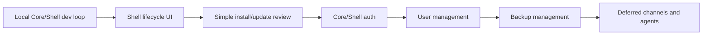

# Core Shell Stabilization

## Description

Core Shell Stabilization is the active implementation plan for the current architecture branch. The goal is to make the local Core and Shell development loop reliable, restore the Core-owned management workflows in the new Shell, and keep old lifecycle and user-management capabilities available while the final Core/Shell split matures.

Update channels, runtime app channel switching, and Agent Bridge remain valid architecture concepts, but they are deferred for this branch. Current stabilization work should preserve narrow extension points where they already exist, without adding channel generation, pull request channels, or agent-editable app flows.

The active priority order is:

1. Stabilize local Core/Shell development and documentation.
2. Restore Shell lifecycle management UI for system and runtime apps.
3. Simplify install and update review screens.
4. Stabilize Core/Shell authentication and app launch flows.
5. Restore user management in Shell.
6. Add backup management controls after Shell and auth are usable.
7. Defer channels and Agent Bridge to separate future feature branches.

## Milestones

### Phase 1 - Stabilize local Core and Shell development

**Status**: Completed

- Make `npm run core:dev` start Core in the development environment.
- Allow the default local Shell origin `http://127.0.0.1:3000` in Core CORS during development.
- Keep `HOST_SHELL_PUBLIC_ORIGIN` as the explicit override for non-default Shell origins.
- Document the split-process workflow: Core on `http://127.0.0.1:3001`, Shell on `http://127.0.0.1:3000`.
- Validate `/api/core/status`, `/api/apps`, Shell session loading, and the Core login link in the browser.

Completed browser smoke on 2026-06-03:

- Core dev starts through `npm run core:dev` with `Development` hosting and listens on `http://127.0.0.1:3001`.
- Core status reports the default local Shell origin and honors `HOST_SHELL_PUBLIC_ORIGIN` for an alternate Shell origin.
- Shell loads Core status and unauthenticated session state without calling `/api/apps` before a Core session exists.
- Core exposes a development-only `/login` form that creates a normal Core session cookie for existing enabled local users and redirects back to Shell.
- Authenticated Shell loading calls `/api/apps`, shows the active `host.admin` session, and renders the Core-managed `hosty.shell` system app.
- Shell Next.js development config allows loopback dev resources for `127.0.0.1` and `localhost`, so browser hydration works on the loopback host required by Core cookies.

Notes:

- Browser credentialed auth must keep Core and Shell on the same loopback host in local HTTP development. `localhost` Shell with `127.0.0.1` Core can validate CORS/status, but the Core `SameSite=Lax` session cookie is not sent on cross-site browser fetches.
- The development login helper is local development plumbing only. Production authentication remains Core-owned and belongs to Phase 4.

### Phase 2 - Restore Shell lifecycle management

**Status**: Completed

- Show system apps and runtime apps with current runtime state, operation status, selected runtime, version, and last error.
- Add Shell actions for start, stop, restart, open, update, logs, backup, restore, configure, and remove where each action is allowed.
- Hide self-stop and remove actions for the active `hosty.shell` app.
- Keep legacy module and app-native runtime app management flows covered by the new Shell UI.
- Test old CLI/control lifecycle flows against the new Shell-visible app state.

Completed implementation:

- Core exposes public browser lifecycle endpoints for Shell under `/api/apps/{appId}/start`, `/api/apps/{appId}/stop`, `/api/apps/{appId}/restart`, `/api/apps/{appId}/logs`, and `/api/apps/{appId}/backups`.
- Core exposes Shell-facing browser endpoints for configure, update plan/apply, remove, backup restore, and backup delete with the same Core session, admin, CORS, and CSRF rules as lifecycle mutations.
- Core `/api/apps` now requires an active Core session and filters system/runtime app summaries by role and app assignment.
- Core app summaries include safe setting metadata for Shell configure forms. Secret setting values are not returned.
- Public browser lifecycle mutations require an active Core session, `host.admin`, and a matching `X-Hosty-CSRF` token.
- Shell app cards can start, stop, restart, open, create manual backups, open logs, list backups, configure settings, review update plans, and open remove controls for manageable runtime apps.
- Shell backup details can create, list, restore, and delete backups. Restore is disabled while the app is running.
- Shell hides self-stop, self-restart, and self-remove controls for the active `hosty.shell` app while leaving safe diagnostics such as logs visible.
- Shell update details show the app identity, version change, runtime change, backup behavior, plan digest, and changes before applying an update.

Completed browser smoke on 2026-06-03:

- Installed the repository demo app through the Core control install endpoint and verified it appeared in Shell app state.
- Verified Shell unauthenticated loading, Core login, authenticated `/api/apps`, and runtime app action rendering.
- Opened logs, backups, configure, update, and remove details for a runtime app without framework overlay or console errors.
- Created a manual backup through Shell and verified the backup row, restore control, and delete control.
- Saved demo app settings through Shell configure and verified Core returned the updated app state.
- Loaded an update plan through Shell and verified digest/change rendering without applying the destructive update.
- Installed a temporary local command smoke app through Core control and verified Shell start and stop switched runtime state between `stopped` and `running`.
- Verified logs for the smoke app included process output after Shell start/stop.
- Confirmed `hosty.shell` exposes logs/open only and does not expose self-start, self-stop, self-restart, or self-remove controls.

### Phase 3 - Simplify install and update review

**Status**: Completed

- Replace highly technical install/update plan views with a concise review surface.
- Show the app/package identity, current digest, target digest, selected runtime, version change, and primary action.
- Show a settings form only when the target app declares settings, with defaults pre-filled.
- Hide storage mappings, mount details, dependency internals, and endpoint internals unless the target app declares user-configurable storage or a real conflict needs attention.
- Preserve technical details behind diagnostics or an expandable advanced section for administrators.

Completed implementation:

- Core exposes `/api/apps/install/plan` for admin Shell review before install. The plan returns app identity, action, current and target versions, selected runtime, runtime type, available runtime profiles, manifest path, current and target manifest digests, selected channel, and safe setting defaults.
- Core exposes `/api/apps/install` for admin Shell install apply with CSRF validation.
- Install apply accepts reviewed setting values and stores them in the installed app state.
- Shell exposes an `Install app` review panel for administrators.
- Shell install review shows identity, version, runtime, digest, and a settings form only when the manifest declares settings.
- Shell update review uses the same concise surface pattern: version/runtime changes, backup behavior, digest, and changes.
- Existing low-level storage mappings, dependency internals, endpoint internals, and advanced runtime details stay out of the primary Shell review surface.

Completed browser smoke on 2026-06-03:

- Reviewed a temporary install manifest through Shell and verified identity, digest, runtime, and settings rendering.
- Applied the install through Shell and verified the new runtime app appeared in the app list without framework overlay or console errors.

### Phase 4 - Stabilize Core/Shell authentication

**Status**: Completed

- Keep Core-owned auth pages and sessions.
- Ensure split-origin Shell-to-Core requests work with credentials, CSRF expectations, and CORS configuration.
- Make Shell display active session state and redirect to Core login/logout flows cleanly.
- Validate app-scoped identity, Shell launch links, and standalone open links with existing Host users.
- Keep runtime apps from receiving Hosty browser cookies directly.

Completed implementation:

- Core owns the development login helper and creates normal Core session cookies for local browser smoke tests.
- Core remains authoritative for authentication pages and session creation. Shells redirect or open a Core-owned auth webview instead of owning provider logic.
- Shell loads Core status and session state before requesting authenticated app data.
- Core CORS and Shell development origins are validated for split-process local development.
- Core `/logout` now revokes the active Core session cookie and redirects back to Shell, matching the Shell logout link.
- Browser app authorization and launch-code endpoints issue app-scoped codes only for the active Core session user. Explicit user selection is limited to trusted local control/CLI endpoints.
- Core validates app auth redirect URIs against installed app endpoint origins before issuing one-time codes.
- Shell runtime `Open` uses Core `/api/apps/{appId}/launch-code` with CSRF instead of navigating directly to the raw app endpoint.
- Runtime browser-facing local endpoints default to the `app.localhost` host while Core/Shell local auth stays on `127.0.0.1`, avoiding Hosty cookie leakage to runtime apps in the default local loop.
- Core exposes invitation acceptance through a Core-owned `/setup/invite` page and API, keeping auth surface ownership in Core.

Completed browser smoke on 2026-06-03:

- Browser smoke verified Shell logout returns to `No active Core session` without surfacing an `/api/apps` 401 error.
- Shell opens a runtime app through Core `/api/apps/{appId}/launch-code`; the app receives a one-time `code` query parameter.
- The smoke runtime app on `http://app.localhost:3199` rendered `cookies=none`, confirming default local Core cookies were not sent to the runtime app origin.
- Shell stayed free of framework overlays and relevant console warnings while rendering the authenticated app list.

### Phase 5 - Restore user management in Shell

**Status**: Completed

- Rebuild the user list, invitations, role changes, disabled-user state, account switching entry points, and app access assignments in Shell.
- Keep Core authoritative for all user mutations and audit records.
- Preserve existing user-management behavior while removing legacy UI coupling to the old combined Host app.
- Test administrator and non-administrator access boundaries.

Completed implementation:

- Core exposes admin `/api/auth/users`, `/api/auth/invitations`, `/api/auth/users/{userId}`, and `/api/auth/users/{userId}/assignments` endpoints with Core session and CSRF protection for mutations.
- Core invitation creation stores only a token hash, returns the raw setup token once, and creates Core-owned setup URLs under `/setup/invite`.
- Core invitation acceptance creates a normal Core session after consuming a valid one-time setup token.
- Core user mutations preserve the two-role model, prevent self-disable, prevent removing the last active administrator, revoke sessions on role changes/disable, remove assignments on disable, and append audit records.
- Shell adds an administrator Users view for user list, pending invitations, invitation creation, role changes, disable, and runtime app access assignments.
- Existing app assignment filtering continues to control non-admin Shell app visibility and app identity issuance.

Completed unit coverage:

- Core tests cover invitation token-hash storage, self-disable protection, last-admin protection, and assignment replacement.

Completed browser smoke on 2026-06-03:

- Shell rendered the administrator Users view after Core login.
- The invitation form generated a Core-owned setup URL and one-time token.
- The runtime app assignment editor saved access for an existing `host.user` account and Shell refreshed the assigned app count.

### Phase 6 - Add backup management controls

**Status**: Completed

- Add Shell views for backup lists, manual backup creation, restore, and deletion.
- Show retention behavior plainly: manual backups are explicit and automatic backups are policy-managed.
- Keep destructive backup actions behind confirmation.
- Add CLI parity only where Core APIs already exist or where local recovery needs it.

Completed implementation:

- Shell backup details can list backups, create manual backups, restore stopped apps from a backup, and delete one backup.
- Restore and delete actions require browser confirmation and Core CSRF validation.
- Shell backup details show retention behavior plainly. Stage 4 later added cleanup preview/apply and scheduled retention.
- Core and trusted local control APIs retain list/create/restore/delete backup parity for local recovery.

Completed browser smoke on 2026-06-03:

- Shell backup details rendered the retention note.
- Manual backup creation through Shell created a visible `manual` backup row with restore and delete controls.

### Phase 7 - Keep channels and Agent Bridge deferred

**Status**: Deferred

- Do not implement channel generation, product channel publishing, runtime channel UI, switch-channel UI, pull request channels, or Agent Bridge in this branch.
- Keep existing channel-related Core/CLI code as a narrow compatibility/architecture placeholder.
- Revisit channels only after Core/Shell management, auth, users, and backups are stable.
- Revisit Agent Bridge only after repository-backed source workflows and pull request validation are ready.

## Open Questions And Answers

- Question: Should channels be removed from the architecture?
  Answer: No. They remain useful for future release validation and pull request validation, but they are not part of the current stabilization implementation.
  Recommendation: Keep the existing contracts documented and avoid building UI or generation workflows until the main Core/Shell experience is stable.

- Question: Should Shell expose all technical install/update details by default?
  Answer: No. Most users need package identity, version/digest changes, settings, and a clear install/update action.
  Recommendation: Keep technical details available through diagnostics or an advanced section, not in the primary path.

- Question: What old behavior must be protected while rebuilding Shell?
  Answer: Lifecycle operations, user management, app access assignment, identity/open helpers, legacy module compatibility, runtime apps, and backups.
  Recommendation: Add a smoke checklist for old CLI/control flows before each major Shell UI milestone.

- Question: Where should authentication live after Core and Shell split?
  Answer: Core owns authentication pages, provider logic, session creation, logout, invitation acceptance, and app-scoped authorization. Shell clients may redirect or open a Core-owned webview, but they should not implement provider-specific auth logic.
  Recommendation: Keep Shell auth behavior to session display plus Core login/logout/authorize navigation for browser, desktop, mobile, and future alternate Shells.

- Question: Can Shell request an app launch code for an arbitrary user?
  Answer: No. Browser Shell launch uses the active Core session user only. Trusted local control and CLI helpers may select a specific existing user for diagnostics while still enforcing disabled-user and assignment checks.
  Recommendation: Keep explicit user selection out of browser APIs and require CSRF for launch-code issuance.
