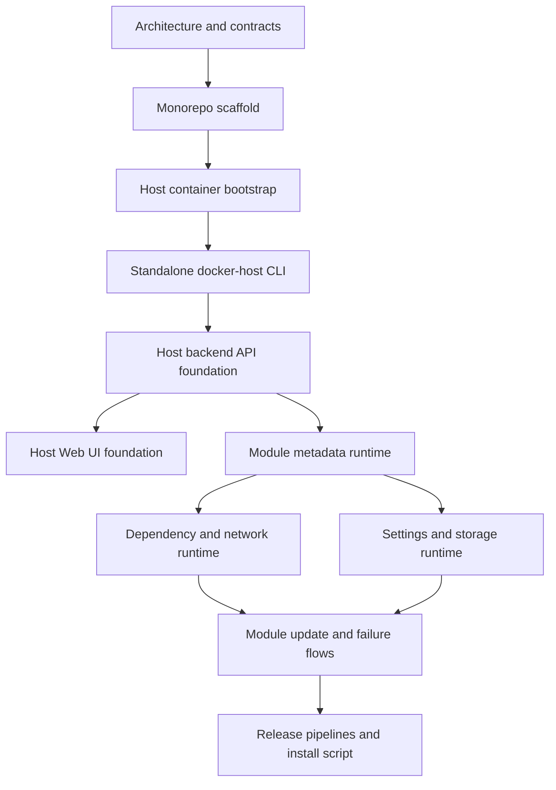

# Docker Host MVP implementation plan

Этот план описывает реализацию Docker Host на основе текущей документации. Текущий код repository считается прототипом и не является архитектурным ограничением. Источник правды для первой реализации:

- [Host launch model](../features/host-launch.md)
- [Repository and release model](../features/repository-release-model.md)
- [Module metadata files](../features/module-metadata.md)

## Phase 0/1 decisions

- Host Web UI and backend API are implemented as one full-stack Next.js application.
- Use Next.js 16 as the current implementation baseline. At implementation time, use the latest stable Next.js 16.x release or the latest stable Next.js release if the stable baseline has moved forward; do not use canary releases.
- Scaffold and maintain the Host app with the Next.js recommended stack: App Router, React and React DOM versions paired with the selected Next.js release, TypeScript, Tailwind CSS, ESLint, Turbopack, `src/` directory, and `@/*` import alias.
- Use the Node.js version recommended by the selected Next.js release. Current Next.js documentation lists Node.js `20.9` as the minimum supported version; the Docker image should use a current Node.js LTS line that satisfies that requirement.
- Use Tailwind CSS and shadcn/ui for the Host Web UI.
- Use `npm` as the package manager. `pnpm` can be reconsidered later if dependency install speed or disk usage becomes a real issue.
- Choose the Host Docker base image from a current Node.js LTS line that satisfies the selected Next.js version requirements.
- The initial Host API contract is documented as a human-readable endpoint catalog in [Docker Host API](../features/host-api.md). Executable OpenAPI generation is deferred until the endpoint model stabilizes.
- `.NET net10.0` is used only for the standalone `docker-host` CLI. Host backend code stays inside the Next.js application.
- CLI project file: `Haas.DockerHost.Cli.csproj`; root namespace: `Haas.DockerHost.Cli`; published command name: `docker-host` via project `AssemblyName` or release artifact rename.
- Add the CLI test project immediately, alongside the CLI project.
- CLI Host lifecycle operations use Docker Engine API directly over the local Docker socket. The `docker` CLI executable is not a runtime dependency for `docker-host`.
- The rewrite happens directly in the current working tree. The current prototype can be overwritten. Prototype capabilities that should not be forgotten are tracked in [Prototype feature inventory](prototype-feature-inventory.md).
- Implement the standalone `docker-host` CLI first and make it reliably manage the Host container lifecycle before module metadata runtime work starts.
- For the first CLI milestone, the Host container may continue running the existing Host application code. The current Next.js Docker container management UI remains a valid launch target and smoke-test example while CLI bootstrap is built.
- The CLI default Host image is the image produced by the current repository workflow: `ghcr.io/alex-de-haas/docker-host:latest`.
- `HOST_IMAGE` is a persisted launch setting. It defaults to the workflow image above and can later be changed through `docker-host config`.
- MVP uses a root-level `modules.json` as the installed module registry and persistent module state file. It stores the list of installed modules, source metadata URLs used for install/update, module settings values, install/update status, failure state, last error details, computed storage mappings, and resolved dependency URLs. Runtime container status is still read from Docker daemon, not from `modules.json`.
- There is no per-module `module-state.json`, `module-installation.json`, or `module-settings.json` in the MVP. Each module directory contains its local `metadata.json` and storage directories.
- MVP module settings are stored in `modules.json` as key/value pairs for each installed module. All module settings are treated as environment variable values in the first implementation; the storage schema can expand later if non-env setting targets are introduced.
- Initial Host API scope is intentionally small: list installed modules, return module statuses, and perform module start, stop, and restart actions. Install plans, update plans, module install/update/remove flows, settings APIs, and storage APIs come later.
- Module install, update, and remove are required product capabilities, but they belong to a later module management slice after the initial list/status/start/stop/restart API is in place.
- Host API authorization is out of scope for the MVP. The Host is expected to be reachable only from the local machine or a trusted local/private network. Public exposure requires a separate future feature and must revisit authentication/authorization.
- No Phase 0/1 planning questions remain open. `modules.json` is the MVP persistent module state file; exact field-level schema should be introduced in the implementation slice that first writes or reads it.

## Цель MVP

Собрать минимальную production-like версию Docker Host, где:

- Host запускается как Docker container;
- standalone `docker-host` CLI устанавливает, запускает и обновляет Host container;
- Web UI является основным интерфейсом ежедневного управления модулями;
- Host backend API владеет всей module management logic;
- CLI использует Host backend API для module commands и напрямую работает с Docker только для lifecycle самого Host container;
- module metadata JSON URL становится основным способом установки модулей после завершения bootstrap-слоя.

## Принципы реализации

- Проект реализуется как rewrite по документации, без обязательной совместимости с текущим прототипом.
- Сначала делается надежный bootstrap Host container через CLI, затем module metadata runtime.
- Business logic установки, обновления, зависимостей, storage mappings и settings живет в Host backend, а не в CLI.
- Shared API contract должен быть явно описан в документации, чтобы Web UI и будущие CLI module commands не расходились. Executable OpenAPI artifact можно добавить позже, когда endpoint model стабилизируется.
- Docker operations должны иметь диагностируемые ошибки и не скрывать Docker Engine error payloads, status codes и operation context от администратора.
- Первый module install/update flow использует optimistic fail-fast без automatic rollback.

## Целевая последовательность



## Phase 0 - Implementation baseline

Purpose: превратить документацию в точные engineering contracts перед массовой разработкой.

Tasks:

- Зафиксировать `apps/host`, `apps/cli`, `packages/contracts`, `scripts`, `docs`, `.github/workflows` как целевую структуру repository.
- Использовать Next.js как single full-stack Host application, не опираясь на текущий прототип.
- Описать первый Host API endpoint catalog в документации.
- Зафиксировать первый API slice: module list, module status, module start, module stop, module restart.
- Описать domain model для installed modules, lifecycle states, settings, storage mappings, dependency resolution и install/update plans.
- Зафиксировать список MVP persistent files и их responsibilities:
  - `~/.docker-host/config/launch.env`;
  - `~/.docker-host/modules.json`;
  - `~/.docker-host/modules/<module-id>/metadata.json`.

Exit criteria:

- Repository skeleton согласован с release model.
- API contract достаточно полный, чтобы CLI и Web UI могли разрабатываться независимо.
- Нет ссылок на текущий prototype как на обязательную runtime-модель.

## Phase 1 - Monorepo and artifact skeleton

Purpose: подготовить repository к независимой сборке Host image и CLI executable.

Tasks:

- Создать `apps/host` для Host Web UI и backend API.
- Создать `apps/host` на Next.js 16 baseline через recommended `create-next-app@latest` options: TypeScript, Tailwind CSS, ESLint, App Router, Turbopack, `src/` directory и `@/*` import alias.
- Создать `apps/cli` для standalone `docker-host` CLI.
- Перенести существующее Next.js приложение в `apps/host` как Host application area.
- Оставить `packages/contracts` как будущую область для generated OpenAPI/clients после стабилизации API.
- Определить shared API contract между Web UI, Host backend API и будущими CLI module commands при введении CLI-facing Host API surface.
- Перенести Dockerfile Host image в границы Host artifact или обновить root Dockerfile согласно выбранной структуре.
- Выполнять rewrite прямо поверх текущей реализации. Текущий prototype можно удалять или заменять по мере scaffold/implementation work.
- Использовать [Prototype feature inventory](prototype-feature-inventory.md), чтобы не потерять важные prototype capabilities при rewrite.
- Подготовить базовые CI checks для Host, CLI и contracts.
- Настроить path filters для будущих workflows:
  - Host image build;
  - CLI `cli-dev` release asset publishing;
  - common CI;
  - docs checks, если понадобятся.

Exit criteria:

- Host и CLI собираются независимо.
- Contract changes запускают проверки и Host, и CLI.
- Docs-only changes не публикуют runtime artifacts.

## Phase 2 - CLI bootstrap MVP

Purpose: сделать `docker-host` CLI надежным recovery path для Host container lifecycle.

Required stack:

- `.NET net10.0`;
- project file `Haas.DockerHost.Cli.csproj`;
- root namespace `Haas.DockerHost.Cli`;
- published command name `docker-host` via project `AssemblyName` or release artifact rename;
- test project from the first scaffold;
- self-contained single-file executable;
- Spectre.Console для commands, prompts, status output, tables и progress indicators;
- Direct Docker Engine API client over the local Docker socket.

Commands:

```text
docker-host install
docker-host start
docker-host stop
docker-host restart
docker-host update
docker-host status
docker-host logs
docker-host open
docker-host config
```

Tasks:

- Создать CLI scaffold:
  - `apps/cli/src/Haas.DockerHost.Cli/Haas.DockerHost.Cli.csproj`;
  - `apps/cli/src/Haas.DockerHost.Cli/Program.cs`;
  - `apps/cli/src/Haas.DockerHost.Cli/Commands/`;
  - `apps/cli/src/Haas.DockerHost.Cli/Configuration/`;
  - `apps/cli/src/Haas.DockerHost.Cli/Docker/`;
  - `apps/cli/tests/Haas.DockerHost.Cli.Tests/Haas.DockerHost.Cli.Tests.csproj`.
- Реализовать configuration model для `~/.docker-host/config/launch.env`.
- Добавить defaults:
  - `HOST_IMAGE=ghcr.io/alex-de-haas/docker-host:latest`;
  - `HOST_CONTAINER_NAME=docker-host`;
  - `HOST_DATA_ROOT_HOST=$HOME/.docker-host`;
  - `HOST_DATA_ROOT_CONTAINER=/data`;
  - `HOST_UI_PORT=auto`;
  - `HOST_RESTART_POLICY=unless-stopped`;
  - `HOST_DOCKER_SOCKET=/var/run/docker.sock`;
  - `HOST_MODULE_NETWORK=docker-host-modules`.
- Реализовать Docker Engine API adapter в `Haas.DockerHost.Cli.Docker`:
  - low-level transport abstraction for Docker Engine HTTP over local socket;
  - Unix socket transport for `/var/run/docker.sock` in the first implementation;
  - high-level `DockerEngineClient` или equivalent adapter с typed methods для Host lifecycle operations;
  - request/response models для container, image, network, logs и error payloads;
  - typed inspect models для Docker Engine JSON responses.
- High-level Docker adapter должен покрывать:
  - image pull;
  - container create;
  - container start;
  - container stop;
  - container remove;
  - container inspect;
  - container logs;
  - network create/inspect/connect.
- Commands не должны знать Docker Engine endpoint paths напрямую. Они вызывают typed methods adapter layer, а adapter отвечает за конкретные HTTP endpoints, request bodies и response parsing.
- Реализовать automatic free port selection для `HOST_UI_PORT=auto`.
- Гарантировать, что Host container получает:
  - `/var/run/docker.sock:/var/run/docker.sock`;
  - `<HOST_DATA_ROOT_HOST>:<HOST_DATA_ROOT_CONTAINER>`;
  - `HOST_DATA_ROOT_HOST`;
  - `HOST_DATA_ROOT_CONTAINER`;
  - shared module network.
- Сделать `docker-host update` как combined CLI + Host update:
  - download matching CLI artifact from rolling GitHub Release `cli-dev`;
  - verify `SHA256SUMS` when available;
  - replace installed `docker-host` executable safely;
  - pull Host image;
  - stop/recreate Host container while preserving volumes/env/ports/restart policy.
- Сделать `HOST_IMAGE` изменяемым через `docker-host config` и сохраняемым в `launch.env`.
- Сделать `docker-host open` как best-effort browser open с fallback на печать URL.
- Показывать Docker Engine failures с operation name, HTTP status/code, Docker error message и понятным next step.

Exit criteria:

- Новый пользователь может выполнить `docker-host install`, `docker-host start`, `docker-host open`.
- Host container переживает restart/update без потери `~/.docker-host`.
- CLI не требует установленного .NET runtime.
- CLI не строит shell command strings для Docker operations.

## Phase 3 - Host container and backend foundation

Purpose: поднять Host API как единственный владелец module management logic.

Tasks:

- Реализовать Host backend API по contract из Phase 0.
- При старте читать:
  - `HOST_DATA_ROOT_HOST`;
  - `HOST_DATA_ROOT_CONTAINER`;
  - Docker socket path внутри container.
- Создавать и проверять Host data root structure.
- Создавать и проверять shared module network.
- Реализовать persistent store для installed modules и host settings на файловой системе.
- Реализовать Docker adapter внутри Host backend для module containers.
- Реализовать базовый module status через Docker daemon container state.
- Не добавлять module health checks/readiness probes в MVP.

Exit criteria:

- Host API стартует внутри Host container, видит Docker daemon и data root.
- Host API возвращает status самого Host, Docker daemon и installed modules store.
- Host backend не зависит от CLI для module operations.

## Phase 4 - Web UI foundation

Purpose: дать администратору основной рабочий интерфейс поверх Host backend API.

Tasks:

- Реализовать список installed modules.
- Показать Docker container status для каждого module.
- Добавить первый UI slice для start/stop/restart и logs.
- Оставить add module by metadata URL, install/update plan review, settings, storage mappings и remove UI для более поздних module management phases.
- Не добавлять альтернативную desktop/local UI модель. Web UI остается основным интерфейсом.
- Не раскрывать secret setting values в UI.

Exit criteria:

- Все UI actions идут через Host backend API.
- UI не содержит module install business logic.
- Secret settings отображаются как write-only values.

## Phase 5 - Module metadata validation and install plan

Purpose: реализовать установку модуля из прямого JSON metadata URL без запуска контейнеров до подтверждения плана.

Tasks:

- Добавить versioned JSON Schema для metadata draft `schemaVersion: "0.1"`.
- Реализовать metadata downloader:
  - обычный HTTP(S) JSON resource;
  - без repository-specific assumptions;
  - без MVP allow-list/signature/latest-tag warnings.
- Валидировать обязательные поля:
  - `schemaVersion`;
  - `id`;
  - `name`;
  - `version`;
  - `image`;
  - `runtime.ports`.
- Применить defaults:
  - `dependencies=[]`;
  - `settings=[]`;
  - `image.pullPolicy=ifNotPresent`;
  - optional storage fields as documented.
- Рекурсивно читать required dependencies через `dependencies[].metadataUrl`.
- Проверять dependency id и major version compatibility.
- Рассчитывать install plan:
  - module directory;
  - local metadata copy path;
  - Docker image references;
  - required dependencies;
  - settings prompts/defaults;
  - module-owned storage mappings;
  - external mount collection requirements;
  - container ports;
  - Docker network aliases;
  - potential conflicts.
- Сделать API и UI review screen для install plan.

Exit criteria:

- Metadata URL можно загрузить, провалидировать и превратить в install plan.
- До подтверждения администратора Host не создает containers или mounts.
- Plan redacts secret values.

## Phase 6 - Module install runtime

Purpose: применить подтвержденный install plan и запустить module containers.

Tasks:

- Создавать `<HOST_DATA_ROOT_CONTAINER>/modules/<module-id>/`.
- Сохранять локальную копию metadata как `metadata.json`.
- Сохранять module settings values в root-level `modules.json`.
- Создавать module-owned directories.
- Pull images согласно `pullPolicy`.
- Создавать и запускать required dependency containers.
- Вычислять internal Docker-network base URLs:
  - network alias из module id;
  - selected dependency endpoint;
  - `http://<network-alias>:<containerPort>`.
- Inject dependency URLs в consumer env vars через `dependencies[].connection.baseUrlEnv`.
- Inject settings в runtime env vars. В MVP все module settings считаются environment variables.
- Создавать consumer container с storage mappings, resources hints и shared network.
- Сохранять computed mappings и resolved dependency URLs.
- При ошибке ставить status `failed` и не делать automatic rollback.

Exit criteria:

- Required dependency module и consumer module запускаются в shared network.
- Consumer получает dependency base URL через env var.
- Partial failures сохраняют диагностику и не удаляют данные автоматически.

## Phase 7 - Module lifecycle and update

Purpose: закрыть полный lifecycle установленного module.

Tasks:

- Реализовать lifecycle states:
  - `installing`;
  - `installed`;
  - `failed`;
  - `removing`.
- Не добавлять disable state/action в MVP lifecycle model.
- Реализовать start/stop/restart/remove.
- Реализовать explicit retry для failed install/update.
- Реализовать explicit cleanup/remove failed install с предупреждением о data directories.
- Реализовать update flow:
  - refresh stored metadata URL;
  - validate new metadata;
  - require same module `id`;
  - compare with local `metadata.json`;
  - show update plan;
  - apply container/settings/storage/dependency changes after confirmation;
  - save new `metadata.json`;
  - mark failed on partial failure without rollback.

Exit criteria:

- Module update не является только `docker pull`; он всегда refreshes metadata URL.
- Failed states можно увидеть, retry или cleanup явно запустить из UI/API.
- Removing не удаляет data directories без понятного подтверждения.

## Phase 8 - Release and install script

Purpose: сделать установку воспроизводимой для пользователя без локальной сборки.

Tasks:

- Реализовать Host image workflow:
  - `ghcr.io/alex-de-haas/docker-host:<version>`;
  - `ghcr.io/alex-de-haas/docker-host:latest`;
  - `ghcr.io/alex-de-haas/docker-host:sha-<commit>`.
- Реализовать CLI release workflow:
  - publish to rolling GitHub prerelease tag `cli-dev`;
  - overwrite existing `cli-dev` assets on each development build;
  - `docker-host-darwin-arm64`;
  - `docker-host-darwin-x64`;
  - `docker-host-linux-arm64`;
  - `docker-host-linux-x64`;
  - `docker-host-windows-x64.exe`;
  - `SHA256SUMS`.
- Add Unix `scripts/install.sh` as shell-only bootstrap:
  - installable through `curl -fsSL https://raw.githubusercontent.com/alex-de-haas/docker-host/main/scripts/install.sh | sh`;
  - check that Docker is installed/running by verifying the local Docker socket or by delegating the check to the installed `docker-host` CLI;
  - detect OS/architecture;
  - download matching CLI artifact from GitHub Release `cli-dev`;
  - verify `SHA256SUMS` when available;
  - install to `~/.docker-host/bin/docker-host`;
  - chmod executable on Unix-like systems;
  - create default data root;
  - prepare `launch.env`;
  - print PATH instructions and next commands.
- Support explicit start mode:
  - `sh -s -- --start`;
  - `DOCKER_HOST_INSTALL_START=1`.

Exit criteria:

- Пользователь может установить CLI через Unix `install.sh` over curl и поднять Host без локального repository checkout.
- Host image и CLI artifacts публикуются независимо.
- CLI default Host image reference соответствует repository image path.

## Out of scope for MVP

- Optional dependencies.
- Metadata signatures and trusted domain allow-lists.
- SSRF protection beyond normal local MVP assumptions.
- Warnings for `latest` tags.
- Public host port assignment for modules.
- External module exposure outside Host-managed Docker network.
- Module health checks/readiness probes.
- Encrypted secret storage, OS keychain integration или external secret managers.
- `DOCKER_HOST` и non-standard Docker daemon endpoints.
- Multiple installed versions of the same module id.
- SemVer ranges or dependency version solver.
- Host API authentication/authorization.

## Recommended implementation milestones

1. Repository skeleton and contracts.
2. `docker-host` CLI can install/start/open Host container.
3. Host backend starts in container and persists Host state under `/data`.
4. Web UI can read Host/module status through backend API.
5. Metadata URL produces validated install plan.
6. Required dependency and consumer modules launch in shared network.
7. Module lifecycle/update/failure handling is complete.
8. Release workflows and install script are complete.

## Documentation updates during implementation

- Keep this file as the milestone tracker until MVP completion.
- Move completed, stable behavior into feature docs:
  - Host lifecycle details to `docs/features/host-launch.md`;
  - release workflow details to `docs/features/repository-release-model.md`;
  - metadata/runtime details to `docs/features/module-metadata.md`.
- Remove or archive planning sections once they become implemented behavior.
