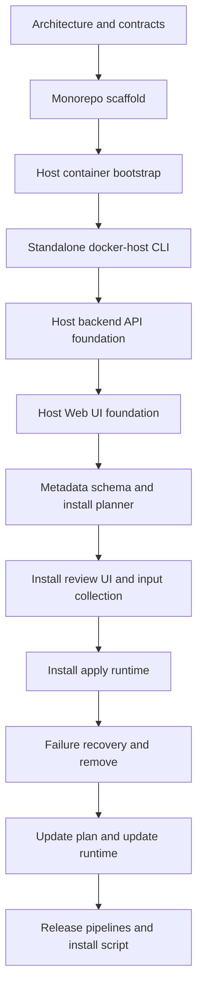

# Docker Host MVP implementation plan

Этот план описывает реализацию Docker Host на основе текущей документации. Текущий код repository считается прототипом и не является архитектурным ограничением. Источник правды для первой реализации:

- [Host launch model](../features/host-launch.md)
- [Repository and release model](../features/repository-release-model.md)
- [Module metadata files](../features/module-metadata.md)

## Phase 0/1 decisions

- Host Web UI and backend API are implemented as one full-stack Next.js application.
- Use Next.js 16 as the current implementation baseline. At implementation time, use the latest stable Next.js 16.x release or the latest stable Next.js release if the stable baseline has moved forward; do not use canary releases.
- Scaffold and maintain the Host app with the Next.js recommended stack: App Router, React and React DOM versions paired with the selected Next.js release, TypeScript, Tailwind CSS, ESLint, Turbopack, `src/` directory, and `@/*` import alias.
- Use the Node.js version recommended by the selected Next.js release. Current Next.js documentation lists Node.js `20.9` as the minimum supported version; the Docker image should use a current Node.js LTS line that satisfies that requirement.
- Use Tailwind CSS and shadcn/ui for the Host Web UI.
- Use `npm` as the package manager. `pnpm` can be reconsidered later if dependency install speed or disk usage becomes a real issue.
- Choose the Host Docker base image from a current Node.js LTS line that satisfies the selected Next.js version requirements.
- The Host API contract is documented as a human-readable endpoint catalog in [Docker Host API](../features/host-api.md). The MVP does not maintain a separate contracts package, generated OpenAPI artifact, or generated API clients.
- `.NET net10.0` is used only for the standalone `docker-host` CLI. Host backend code stays inside the Next.js application.
- CLI project file: `Haas.DockerHost.Cli.csproj`; root namespace: `Haas.DockerHost.Cli`; published command name: `docker-host` via project `AssemblyName` or release artifact rename.
- Add the CLI test project immediately, alongside the CLI project.
- CLI Host lifecycle operations use Docker Engine API directly over the local Docker endpoint. The `docker` CLI executable is not a runtime dependency for `docker-host`.
- Phase 2 supports local Unix sockets on macOS/Linux/WSL and Docker Desktop named pipe on native Windows. Windows containers mode is unsupported; Windows users must use Docker Desktop Linux containers through WSL 2.
- The rewrite happens directly in the current working tree. The current prototype can be overwritten. Prototype capabilities that should not be forgotten are tracked in [Prototype feature inventory](prototype-feature-inventory.md).
- Implement the standalone `docker-host` CLI first and make it reliably manage the Host container lifecycle before module metadata runtime work starts.
- For the first CLI milestone, the Host container may continue running the existing Host application code. The current Next.js Docker container management UI remains a valid launch target and smoke-test example while CLI bootstrap is built.
- The CLI default Host image is the image produced by the current repository workflow: `ghcr.io/alex-de-haas/docker-host:latest`.
- `HOST_IMAGE` is a persisted launch setting. It defaults to the workflow image above and can later be changed through `docker-host config`.
- MVP uses a root-level `modules.json` as the installed module registry, persistent module state file, and place for any MVP Host-owned settings. It stores the list of installed modules, source metadata URLs used for install/update, module settings values, install/update status, failure state, last error details, computed storage mappings, resolved dependency URLs, and Host settings that are not CLI launch settings. Runtime container status is still read from Docker daemon, not from `modules.json`.
- There is no per-module `module-state.json`, `module-installation.json`, or `module-settings.json` in the MVP. Each module directory contains its local `metadata.json` and storage directories.
- There is no separate `host-settings.json` in the MVP. Host container launch settings stay in CLI-owned `launch.env`; Host backend-owned settings, if introduced, are stored in `modules.json`.
- MVP module settings are stored in `modules.json` as key/value pairs for each installed module. All module settings are treated as environment variable values in the first implementation; the storage schema can expand later if non-env setting targets are introduced.
- Initial Host API scope is intentionally small: list installed modules, return module statuses, and perform module start, stop, and restart actions. Install plans, update plans, module install/update/remove flows, settings APIs, and storage APIs come later.
- Module install, update, and remove are required product capabilities, but they belong to a later module management slice after the initial list/status/start/stop/restart API is in place.
- Host API authorization is out of scope for the MVP. The Host is expected to be reachable only from the local machine or a trusted local/private network. Public exposure requires a separate future feature and must revisit authentication/authorization.
- No Phase 0/1 planning questions remain open. `modules.json` is the MVP persistent module state file; exact field-level schema should be introduced in the implementation slice that first writes or reads it.

## Цель MVP

Собрать минимальную production-like версию Docker Host, где:

- Host запускается как Docker container;
- standalone `docker-host` CLI устанавливает, запускает и обновляет Host container;
- Web UI является основным интерфейсом ежедневного управления модулями;
- Host backend API владеет всей module management logic;
- CLI использует Host backend API для module commands и напрямую работает с Docker только для lifecycle самого Host container;
- module metadata JSON URL становится основным способом установки модулей после завершения bootstrap-слоя.

## Принципы реализации

- Проект реализуется как rewrite по документации, без обязательной совместимости с текущим прототипом.
- Сначала делается надежный bootstrap Host container через CLI, затем module metadata runtime.
- Business logic установки, обновления, зависимостей, storage mappings и settings живет в Host backend, а не в CLI.
- Host API contract должен быть явно описан в документации, чтобы Web UI и будущие CLI module commands не расходились. Отдельный package contract, generated OpenAPI artifact и generated clients не входят в MVP.
- Docker operations должны иметь диагностируемые ошибки и не скрывать Docker Engine error payloads, status codes и operation context от администратора.
- Первый module install/update flow использует optimistic fail-fast без automatic rollback.

## Целевая последовательность



## Phase 0 - Implementation baseline

Purpose: превратить документацию в точные engineering contracts перед массовой разработкой.

Status: completed for the MVP rewrite baseline. The authoritative Phase 0 artifacts are [Repository and release model](../features/repository-release-model.md), [Docker Host API](../features/host-api.md), [Docker Host domain model](../features/domain-model.md), [Host launch model](../features/host-launch.md), and [Module metadata files](../features/module-metadata.md).

Tasks:

- Зафиксировать `apps/host`, `apps/cli`, `scripts`, `docs`, `.github/workflows` как целевую структуру repository.
- Использовать Next.js как single full-stack Host application, не опираясь на текущий прототип.
- Описать первый Host API endpoint catalog в документации.
- Зафиксировать первый API slice: module list, module status, module start, module stop, module restart.
- Описать domain model для installed modules, lifecycle states, settings, storage mappings, dependency resolution и install/update plans.
- Зафиксировать список MVP persistent files и их responsibilities:
  - `~/.docker-host/config/launch.env`;
  - `~/.docker-host/modules.json`;
  - `~/.docker-host/modules/<module-id>/metadata.json`.

Exit criteria:

- Repository skeleton согласован с release model.
- API contract достаточно полный, чтобы CLI и Web UI могли разрабатываться независимо.
- Нет ссылок на текущий prototype как на обязательную runtime-модель.

## Phase 1 - Monorepo and artifact skeleton

Purpose: подготовить repository к независимой сборке Host image и CLI executable.

Status: completed for the initial artifact skeleton. The repository now has `apps/host`, `apps/cli`, npm workspace scripts, Host image workflow path filters, CLI release asset workflow path filters, and common CI checks. The CLI is a buildable .NET 10 scaffold; lifecycle implementation remains Phase 2 scope.

Tasks:

- Создать `apps/host` для Host Web UI и backend API.
- Создать `apps/host` на Next.js 16 baseline через recommended `create-next-app@latest` options: TypeScript, Tailwind CSS, ESLint, App Router, Turbopack, `src/` directory и `@/*` import alias.
- Создать `apps/cli` для standalone `docker-host` CLI.
- Перенести существующее Next.js приложение в `apps/host` как Host application area.
- Определить Host API contract в [Docker Host API](../features/host-api.md) между Web UI, Host backend API и будущими CLI module commands при введении CLI-facing Host API surface.
- Перенести Dockerfile Host image в границы Host artifact или обновить root Dockerfile согласно выбранной структуре.
- Выполнять rewrite прямо поверх текущей реализации. Текущий prototype можно удалять или заменять по мере scaffold/implementation work.
- Использовать [Prototype feature inventory](prototype-feature-inventory.md), чтобы не потерять важные prototype capabilities при rewrite.
- Подготовить базовые CI checks для Host, CLI и contracts.
- Настроить path filters для будущих workflows:
  - Host image build;
  - CLI `cli-dev` release asset publishing;
  - common CI;
  - docs checks, если понадобятся.

Exit criteria:

- Host и CLI собираются независимо.
- Contract changes запускают проверки и Host, и CLI.
- Docs-only changes не публикуют runtime artifacts.

## Phase 2 - CLI bootstrap MVP

Status: first implementation slice completed. The CLI now has typed `install`, `start`, `stop`, `restart`, `update`, `status`, `logs`, `open`, and `config` commands; `launch.env` defaults and validation; direct Docker Engine transport over Unix socket or Windows named pipe; Host lifecycle create/start/stop/remove/log/network/image operations; auto host-port selection; best-effort browser open; and rolling `cli-dev` release workflow support. Follow-up hardening remains for native Windows executable replacement and full end-to-end release validation on published artifacts.

Purpose: сделать `docker-host` CLI надежным recovery path для Host container lifecycle.

Required stack:

- `.NET net10.0`;
- project file `Haas.DockerHost.Cli.csproj`;
- root namespace `Haas.DockerHost.Cli`;
- published command name `docker-host` via project `AssemblyName` or release artifact rename;
- test project from the first scaffold;
- self-contained single-file executable;
- Spectre.Console для commands, prompts, status output, tables и progress indicators;
- Direct Docker Engine API client over the local Docker endpoint.

Commands:

```text
docker-host install
docker-host start
docker-host stop
docker-host restart
docker-host update
docker-host status
docker-host logs
docker-host open
docker-host config
```

Tasks:

- Создать CLI scaffold:
  - `apps/cli/src/Haas.DockerHost.Cli/Haas.DockerHost.Cli.csproj`;
  - `apps/cli/src/Haas.DockerHost.Cli/Program.cs`;
  - `apps/cli/src/Haas.DockerHost.Cli/Commands/`;
  - `apps/cli/src/Haas.DockerHost.Cli/Configuration/`;
  - `apps/cli/src/Haas.DockerHost.Cli/Docker/`;
  - `apps/cli/tests/Haas.DockerHost.Cli.Tests/Haas.DockerHost.Cli.Tests.csproj`.
- Реализовать configuration model для `~/.docker-host/config/launch.env`.
- Добавить defaults:
  - `HOST_IMAGE=ghcr.io/alex-de-haas/docker-host:latest`;
  - `HOST_CONTAINER_NAME=docker-host`;
  - `HOST_DATA_ROOT_HOST=$HOME/.docker-host`;
  - `HOST_DATA_ROOT_CONTAINER=/data`;
  - `HOST_UI_PORT=auto`;
  - `HOST_RESTART_POLICY=unless-stopped`;
  - `HOST_DOCKER_ENDPOINT=unix:///var/run/docker.sock` on macOS/Linux/WSL;
  - `HOST_DOCKER_ENDPOINT=npipe:////./pipe/docker_engine` on native Windows;
  - `HOST_DOCKER_SOCKET=/var/run/docker.sock`;
  - `HOST_MODULE_NETWORK=docker-host-modules`.
- Реализовать Docker Engine API adapter в `Haas.DockerHost.Cli.Docker`:
  - transport abstraction for Docker Engine API over local endpoint;
  - Unix socket transport for `/var/run/docker.sock`;
  - Windows named pipe transport for `npipe:////./pipe/docker_engine`;
  - prefer `Docker.DotNet` or equivalent library support for Unix socket and Windows named pipe transport while keeping commands behind a Host-specific adapter;
  - high-level `DockerEngineClient` или equivalent adapter с typed methods для Host lifecycle operations;
  - request/response models для container, image, network, logs и error payloads;
  - typed inspect models для Docker Engine JSON responses.
- High-level Docker adapter должен покрывать:
  - image pull;
  - container create;
  - container start;
  - container stop;
  - container remove;
  - container inspect;
  - container logs;
  - network create/inspect/connect.
- Commands не должны знать Docker Engine endpoint paths напрямую. Они вызывают typed methods adapter layer, а adapter отвечает за конкретные HTTP endpoints, request bodies и response parsing.
- Реализовать automatic free port selection для `HOST_UI_PORT=auto`.
- Гарантировать, что Host container получает:
  - `/var/run/docker.sock:/var/run/docker.sock`;
  - `<HOST_DATA_ROOT_HOST>:<HOST_DATA_ROOT_CONTAINER>`;
  - `HOST_DATA_ROOT_HOST`;
  - `HOST_DATA_ROOT_CONTAINER`;
  - shared module network.
- Добавить Windows preflight для native Windows CLI:
  - Docker Engine доступен через `npipe:////./pipe/docker_engine`;
  - Docker Engine reports Linux container mode;
  - Windows containers mode fails with a clear unsupported-mode diagnostic;
  - `HOST_DATA_ROOT_HOST` resolved to a platform-native absolute path that Docker Desktop can bind mount into the Linux Host container.
- Сделать `docker-host update` как combined CLI + Host update:
  - download matching CLI artifact from rolling GitHub Release `cli-dev`;
  - verify `SHA256SUMS` when available;
  - replace installed `docker-host` executable safely;
  - pull Host image;
  - stop/recreate Host container while preserving volumes/env/ports/restart policy.
- Перенести в Phase 2 минимальный rolling CLI release channel, который нужен для `docker-host update`:
  - final `cli-release.yml` job downloads matrix build artifacts;
  - generates `SHA256SUMS`;
  - creates or updates GitHub prerelease tag `cli-dev`;
  - uploads `docker-host-darwin-arm64`, `docker-host-darwin-x64`, `docker-host-linux-arm64`, `docker-host-linux-x64`, `docker-host-windows-x64.exe`, and `SHA256SUMS` with overwrite semantics.
- Сделать known launch settings изменяемыми через typed `docker-host config` interface и сохраняемыми в `launch.env`:
  - `docker-host config list`;
  - `docker-host config get <KEY>`;
  - `docker-host config set <KEY> <VALUE>`;
  - `docker-host config set <KEY>=<VALUE>`;
  - `docker-host config reset <KEY>`.
- Сделать `docker-host open` как best-effort browser open с fallback на печать URL.
- Показывать Docker Engine failures с operation name, HTTP status/code, Docker error message и понятным next step.

Exit criteria:

- Новый пользователь может выполнить `docker-host install`, `docker-host start`, `docker-host open`.
- Host container переживает restart/update без потери `~/.docker-host`.
- CLI не требует установленного .NET runtime.
- CLI не строит shell command strings для Docker operations.

## Phase 3 - Host container and backend foundation

Status: first implementation slice completed. The Host backend now reads Host runtime environment values, creates/verifies the data root, `modules/`, `modules.json`, and shared module network, exposes `GET /api/host/status`, reads installed modules from `modules.json`, reads local module `metadata.json`, resolves Docker runtime state through Docker daemon, and exposes module list/detail/start/stop/restart API routes. End-to-end validation inside a published Host container remains part of release hardening.

Purpose: поднять Host API как единственный владелец module management logic.

Tasks:

- Реализовать Host backend API по contract из Phase 0.
- При старте читать:
  - `HOST_DATA_ROOT_HOST`;
  - `HOST_DATA_ROOT_CONTAINER`;
  - Docker socket path внутри container.
- Создавать и проверять Host data root structure.
- Создавать и проверять shared module network.
- Реализовать persistent store для installed modules и host settings на файловой системе.
- Реализовать Docker adapter внутри Host backend для module containers.
- Реализовать базовый module status через Docker daemon container state.
- Не добавлять module health checks/readiness probes в MVP.

Exit criteria:

- Host API стартует внутри Host container, видит Docker daemon и data root.
- Host API возвращает status самого Host, Docker daemon и installed modules store.
- Host backend не зависит от CLI для module operations.

## Phase 4 - Web UI foundation

Status: completed. The Host Web UI now uses the installed modules API for the main dashboard, renders empty and installed-module states, displays Docker runtime status, and performs start/stop/restart actions through Host backend module routes. Module install/update/settings/storage/remove/log UI remains intentionally deferred to later phases.

Purpose: дать администратору основной рабочий интерфейс поверх Host backend API.

Tasks:

- Переписать основной dashboard вокруг installed modules, не сохраняя текущую raw-container UI модель.
- Текущие prototype UI components, hooks, raw-container API routes и Host logic можно удалять или заменять по мере реализации нового module dashboard; отдельный backup/archive не нужен, Git history считается достаточным recovery path.
- Реализовать список installed modules.
- Показать Docker container status для каждого module.
- Добавить первый UI slice для start/stop/restart.
- Не реализовывать logs UI в Phase 4; module logs остаются future diagnostics/API slice.
- Оставить add module by metadata URL, install/update plan review, settings display/editing, storage mappings и remove UI для более поздних module management phases.
- Не добавлять альтернативную desktop/local UI модель. Web UI остается основным интерфейсом.
- Не показывать module settings в Phase 4.
- Для ручной проверки non-empty UI использовать manually seeded module data, а не production install flow. Конкретный nginx-based recipe описан в [Local development and testing](../features/local-development.md#phase-4-manual-module-seed).

Manual validation data:

- Empty-state проверяется на автоматически созданном пустом `modules.json`.
- Non-empty UI проверяется ручным добавлением одного lightweight fixture module в `modules.json`, например `com.example.nginx`, с `image.reference` на публичный небольшой образ `nginx:alpine`.
- Для fixture module нужно вручную создать `modules/<module-id>/metadata.json` с тем же `id`, `name`, `version`, `image` и минимальным `runtime.ports`.
- Для успешной проверки `start/stop/restart` до Phase 7 нужно вручную создать Docker container с ожидаемым module container name, например `mod-com-example-nginx`, потому что Phase 4 не реализует container creation/install runtime из metadata.
- Seed data является только validation aid для Phase 4 и не становится production API, install flow или долгосрочным fixture contract.

Exit criteria:

- Все UI actions идут через Host backend API.
- UI не содержит module install business logic.
- UI не зависит от prototype `/api/containers` routes для основного dashboard.
- Secret setting values не отображаются, потому что settings UI отложен.
- Empty and manually seeded non-empty module states can both be exercised through the Web UI.

## Phase 5 - Metadata schema and install planner

Status: completed. The Host backend now exposes `POST /api/modules/install/plan`, downloads HTTP(S) metadata JSON with size and timeout limits, validates and normalizes strict `schemaVersion: "0.1"` metadata, recursively resolves required dependencies, computes metadata and plan digests, derives storage paths, Docker names, network aliases, settings prompts, dependency connection URLs, and performs read-only Host/Docker conflict checks without creating files, directories, images, containers, or networks.

Purpose: сделать read-only backend слой, который превращает прямой metadata JSON URL в детерминированный install plan без filesystem и Docker side effects.

Tasks:

- Реализовать executable validation для metadata draft `schemaVersion: "0.1"` внутри Host backend. Source of truth для metadata contract остается [Module metadata files](../features/module-metadata.md); отдельный shared contract package не создается.
- Сделать schema строгой для поддерживаемого MVP-контракта:
  - поддерживаемые object fields описаны явно;
  - documented reserved fields, such as `runtime.healthcheck`, may validate but must be marked ignored by MVP runtime;
  - unknown fields are rejected in `schemaVersion: "0.1"`;
  - MVP does not support extension namespaces such as `x-*`; future extensions must use a new schema version or a separately documented namespace.
- Реализовать metadata downloader:
  - обычный HTTP(S) JSON resource;
  - maximum response size: 1 MiB per metadata JSON file;
  - request timeout: 10 seconds per metadata JSON fetch;
  - без repository-specific assumptions;
  - без MVP allow-list, signatures, SSRF policy и latest-tag warnings.
- Валидировать и нормализовать metadata:
  - `schemaVersion`, `id`, `name`, `version`, `image.repository`, `image.tag`, `runtime.ports`;
  - `dependencies=[]`;
  - `settings=[]`;
  - `storage.directories=[]`;
  - `storage.mountCollections=[]`;
  - `image.pullPolicy=ifNotPresent`;
  - setting `target` default: `{ "type": "env", "name": "<setting.key>" }`;
  - supported setting types are `string`, `number`, `boolean`, `url`, and `secret`;
  - reject unsupported setting types, unsupported setting targets, optional dependencies, unsupported port protocols, unsupported storage mount types, and unsafe module-owned paths.
- Рекурсивно читать only required dependencies через `dependencies[].metadataUrl`.
- Проверять dependency graph:
  - maximum graph size: root metadata plus at most 32 unique dependency nodes;
  - downloaded dependency `id` matches declaration;
  - dependency major version matches declaration;
  - requested `connection.endpoint` exists in dependency `runtime.ports`;
  - no cycles;
  - no conflicting metadata URLs or major versions for the same dependency id.
- Рассчитывать deterministic install plan:
  - `metadataUrl`;
  - normalized metadata and dependency tree;
  - `metadataDigest` for the downloaded root metadata JSON bytes;
  - `planDigest` for canonical JSON of the normalized plan, including dependency tree and computed install decisions, excluding timestamps and transient fields;
  - module directory and local metadata copy path;
  - Docker image references;
  - required dependencies and topological install order;
  - setting prompts, defaults, and secret redaction markers;
  - module-owned storage mappings;
  - external mount collection requirements, not concrete external paths yet;
  - container ports without host publication;
  - Docker container names and network aliases;
  - conflicts against existing `modules.json`, Docker container names, network aliases, environment variable targets, storage mappings, and dependency graph.
- Perform mandatory read-only Docker conflict checks:
  - Docker daemon must be reachable before returning a successful plan;
  - if Docker daemon is unavailable, return a failure such as HTTP `503` rather than a degraded successful plan;
  - check generated container names, Host-managed network presence, and network aliases;
  - do not create or mutate files, module directories, images, containers, or Docker networks;
  - keep Docker conflict observations outside `planDigest`, and repeat Docker checks in the later apply endpoint before mutation.
- Add `POST /api/modules/install/plan`.
- Use the minimal install plan request body `{ "metadataUrl": "..." }`; do not add Phase 5 request flags for refresh behavior, diagnostics toggles, or conflict-check bypasses.
- Use a shared error envelope for `422` and `409`: top-level `error.code`, `error.message`, `error.validationErrors[]`, and `error.conflicts[]`; `409` may also return a top-level partial `plan`.
- Do not persist pending install plans in MVP. The later apply endpoint must recompute the plan from submitted metadata URL and compare the reviewed `planDigest` before changing state. `metadataDigest` is returned for source transparency and diagnostics.

Exit criteria:

- Metadata URL can be loaded, validated, normalized, and converted into an install plan.
- The plan API performs no module directory creation, metadata writes, image pulls, container creation, or Docker bind mount validation.
- Plan output never includes raw secret values.
- Validation and conflict errors are structured enough for the Web UI to point the administrator at the failing field or graph node.

## Phase 6 - Install review UI and input collection

Purpose: дать администратору понятный review screen для install plan и собрать значения, которые не должны приходить из metadata.

Implementation decisions:

- The install flow lives on a dedicated Web UI route instead of a dashboard dialog.
- The Phase 7 request payload shape is documented in the Host API docs and represented by a shared Host app TypeScript type.
- The backend install planner decides which settings and external mount collections require administrator input. Reused dependencies should not produce input prompts.
- External mount selections include item key, optional label, host path, computed container path, and access mode.
- Secret settings use uncontrolled inputs and are read only during submit through `FormData`; plan summaries and previews must redact them.
- Install plan conflicts block confirmation. The UI may still show the partial plan returned with HTTP `409`.
- Local development should include a metadata fixture served by the Host app so Phase 6 can be tested without an external metadata URL.
- Phase 6 should add unit tests for pure install request helpers such as setting coercion, external mount item validation, and redacted payload previews.

Tasks:

- Add module entry point in the Web UI from the installed modules dashboard.
- Implement metadata URL input and call `POST /api/modules/install/plan`.
- Show plan sections:
  - module identity and metadata URL;
  - image reference and pull policy;
  - dependency tree and install order;
  - dependency connection mappings and resolved internal URLs;
  - setting prompts and defaults;
  - module-owned storage mappings;
  - external mount collection requirements;
  - runtime ports and resource hints;
  - generated container names and network aliases;
  - conflicts and validation errors.
- Collect setting values for install:
  - default non-secret values can be shown and edited;
  - secret values are accepted as write-only fields and are never echoed back in API responses or plan summaries;
  - required settings without defaults must block confirmation until filled.
- Collect concrete external mounts only for declared `storage.mountCollections`:
  - require at least `minItems` when collection is required;
  - validate item keys as safe path segments;
  - compute container paths from `itemContainerPathTemplate`;
  - do not check external host paths through the Host process filesystem.
- Build the install request payload expected by Phase 7, including `metadataUrl`, reviewed `planDigest`, settings values, and external mount selections.

Exit criteria:

- An administrator can paste a metadata URL, review the complete plan, see conflicts, and provide required settings and external mount selections.
- The UI keeps install business logic in the backend plan API and only renders/collects user decisions.
- Secret inputs are not stored in React state longer than needed for submit and are not rendered in summaries, error messages, or debug output.

## Phase 7 - Module install apply runtime

Status: completed. The Host now has the install apply API route, server-side request validation, per-module state writes, Docker container creation helpers, Web UI submit wiring, install-time network creation, and reusable dependency preflight checks.

Purpose: применить подтвержденный install request и запустить required dependency modules plus consumer module.

Implementation decisions:

- `POST /api/modules/install` returns HTTP `201` on success with the installed root module summary, installed module ids, and reused dependency ids. Apply failures use the same top-level `error.code`, `error.message`, `error.validationErrors[]`, and `error.conflicts[]` envelope as install planning.
- The apply endpoint must treat the Web UI payload as untrusted input. It validates submitted settings and external mount selections server-side against the recomputed install plan before any filesystem, store, image, or container mutation.
- `modules.json` records the reviewed `metadataDigest` and `planDigest`, typed setting values, module-owned `storageMappings`, selected `externalMounts`, resolved dependency base URLs, and operation errors. Docker environment variables are stringified only when creating containers.
- `pullPolicy` behavior in install apply:
  - `ifNotPresent` inspects the local image first and pulls only when missing;
  - `always` pulls before container creation;
  - `manual` requires the image to already exist locally and fails with an administrator next step if it is missing.
- A reusable dependency must be present in `modules.json` with `operationStatus=installed`, must have compatible local metadata major version, and must have a startable Docker container. Failed or missing-container dependencies are not healed by Phase 7; explicit recovery remains Phase 8 scope.
- Operation state is written per module before mutating that module's files or Docker resources. Successfully installed dependency modules remain installed if a later consumer install fails.
- The local `metadata.json` copy stores the raw downloaded metadata bytes that produced the reviewed plan digest, not a reserialized normalized object.
- Phase 7 creates module containers through a dedicated module Docker helper. It does not use the prototype raw-container helper because module containers must avoid host port publication and must attach to the Host-managed network with the planned alias.
- The apply endpoint ensures the shared module network exists at mutation time. Network existence is not part of `planDigest`.
- Resource hints are applied during container creation: `runtime.resources.cpus` maps to Docker `NanoCpus`, and `runtime.resources.memory` supports byte, `k`, `m`, and `g` suffixes.
- Install apply uses an in-process mutex around mutating work. A durable cross-process file lock can be added later if the Host runs multiple backend processes.
- The Web UI keeps the redacted payload preview and adds an explicit install submit step once the payload validates locally.

Tasks:

- Add `POST /api/modules/install`.
- Recompute the install plan from submitted `metadataUrl` and administrator decisions, then compare the reviewed `planDigest`; if the recomputed plan digest changed, reject the request and require review again.
- Persist operation state before mutating Docker:
  - create or update the module record with `operationStatus=installing`;
  - preserve previous installed modules;
  - keep operation errors with operation name, Docker status, Docker message, and next step.
- Create `<HOST_DATA_ROOT_CONTAINER>/modules/<module-id>/`.
- Save local metadata copy as `metadata.json` after the reviewed `planDigest` is accepted.
- Save module setting values, including write-only secret values, in root-level `modules.json`.
- Create module-owned directories for `storage.directories`.
- Store computed module-owned storage mappings and selected external mounts in `modules.json`.
- Pull images according to `pullPolicy`.
- Resolve required dependencies:
  - already installed compatible dependencies are reused and started when needed;
  - missing required dependencies from the reviewed dependency tree are installed before the consumer;
  - conflicting installed dependencies fail the install before container mutation.
- Create and start containers in topological order.
- Attach every module container to the shared module network with the planned alias.
- Compute internal dependency base URLs as `http://<network-alias>:<containerPort>` for `http` endpoints.
- Inject dependency URLs through `dependencies[].connection.baseUrlEnv`.
- Inject settings through environment variables. In MVP all module settings are environment variables.
- Create consumer container with storage mappings, external mounts, resource hints, restart policy, and shared network.
- Mark modules `installed` after successful creation/start. On partial failure, mark the affected module `failed` and do not automatically roll back files, directories, images, or containers.

Exit criteria:

- A reviewed install request can install and start a module with required dependencies.
- Required dependency and consumer modules can communicate on the shared Docker network through injected base URL env vars.
- Module-owned storage and selected external mounts are reflected in Docker container configuration and persisted state.
- Partial failures preserve diagnostics and created artifacts for explicit recovery.

## Phase 8 - Failure recovery and module removal

Status: completed. The Host now has failed install retry, cleanup/remove preview plans, explicit cleanup/remove apply routes, `removing` operation status, lifecycle hardening for persistent broken state, dashboard actions, and focused recovery helper tests.

Purpose: закрыть operational gaps после install runtime: failed install recovery, cleanup, and explicit remove.

Tasks:

- Add `removing` operation status with the remove flow only.
- Add retry for failed installs:
  - recompute plan from stored metadata URL or original install request data available in `modules.json`;
  - tolerate existing module directory, metadata copy, pulled images, and partially created containers when safe;
  - keep new failure diagnostics if retry fails.
- Add cleanup/remove plan for failed installs:
  - show containers, images, metadata files, module-owned directories, and external mount references that may be affected;
  - default to preserving data directories;
  - require explicit administrator confirmation before deleting module-owned data.
- Add remove for installed modules:
  - stop and remove module container;
  - remove module registry entry;
  - preserve or delete module-owned data according to explicit user choice;
  - never delete external host paths, only remove their mappings from Host state.
- Harden start/stop/restart after real install:
  - ensure network alias before start/restart;
  - surface missing storage mappings and missing containers as actionable errors;
  - keep Docker runtime state read from Docker daemon.
- Add Web UI actions for retry, cleanup failed install, and remove.

Implemented scope:

- Host API exposes direct failed install retry and plan/apply endpoints for cleanup and remove.
- `ModuleOperationStatus` includes `removing`, used only while remove is in progress.
- Retry uses local `metadata.json` and the stored install record, recreates the failed module container, preserves module-owned data, and records fresh diagnostics if retry fails.
- Cleanup applies only to the selected failed module. Successfully installed dependencies stay installed and can be removed separately.
- Installed module removal is blocked when other installed modules depend on the target.
- Remove/cleanup plans list containers, images, metadata files, module-owned directories, external mount references, dependents, warnings, and conflicts.
- `deleteModuleData` defaults to `false`. External host paths and Docker images are never deleted by Phase 8.
- Start/restart lifecycle preflight marks missing containers and missing required storage mappings as persistent `failed` state; transient Docker errors remain action errors.
- The Web UI exposes retry as a row action and remove/cleanup as backend-generated confirmation dialogs.
- Recovery helper tests cover dependent detection, stored mapping normalization, and Host data-root path mapping.

Implementation decisions:

- API shape: use plan/apply endpoints for destructive actions and a direct retry endpoint. Cleanup and remove use backend-generated preview plans: `POST /api/modules/{moduleId}/cleanup/plan`, `POST /api/modules/{moduleId}/cleanup`, `POST /api/modules/{moduleId}/remove/plan`, and `POST /api/modules/{moduleId}/remove`. Failed install retry uses `POST /api/modules/{moduleId}/retry` because it is not a data-deleting action.
- Failed install retry source of truth: default retry uses the local `metadata.json` bytes and the stored install record for deterministic behavior. A separate explicit refresh-and-review path can recompute from the stored `metadataUrl` and route the administrator back through the install review UI.
- Partial Docker containers during retry: remove and recreate the failed module container, while preserving module-owned data directories by default.
- Failed install cleanup scope: cleanup only the selected failed module. Successfully installed dependencies stay installed and can be removed separately.
- Installed module remove dependency handling: block removal when other installed modules depend on the target, and return the dependent module list in the remove plan/conflict response.
- Module-owned data deletion: use one `deleteModuleData` boolean, default `false`. The plan must list all module-owned directories and show whether they will be preserved or deleted.
- Docker image cleanup: Phase 8 does not remove Docker images. Plans may list image references as preserved artifacts for administrator visibility.
- Failed remove representation: use `operationStatus=removing` only while removal is in progress. If removal fails before the registry entry is deleted, restore `operationStatus=installed` and set `lastError`.
- Lifecycle hardening state changes: missing container and missing required storage mappings mark the module `failed` with `lastError`. Transient Docker daemon, network, stop, or restart errors remain action errors and do not change persistent `operationStatus`.
- Mutation locking: replace the install-only mutex with a shared in-process module mutation mutex for install retry, cleanup, remove, and install apply.
- Web UI placement: use a hybrid flow. Retry is a row action. Remove and cleanup open compact backend-generated plan dialogs with explicit confirmation.
- Test bar: add file-store integration tests with temporary directories and mocked Docker helper boundaries, plus manual Docker verification for the full recovery/remove flow.

#### Open Questions

No Phase 8 recovery/remove questions remain open before implementation starts.

Exit criteria:

- Failed installs are visible and can be retried or cleaned up explicitly.
- Removing a module does not delete data directories or external data without a clear confirmation.
- Lifecycle actions work against containers created by the install runtime, not only manually seeded containers.

## Phase 9 - Module update plan and update runtime

Purpose: реализовать update как metadata refresh plus reviewed change plan, not just `docker pull`.

Status: first implementation slice completed. Host backend exposes update plan/apply/retry endpoints, update plans refresh the stored metadata URL and preserve compatible settings/storage decisions, the Web UI has a dedicated update review route, and dashboard rows expose update/update-retry actions. Manual Docker end-to-end validation with a real installed module remains useful before treating the flow as release-ready.

Tasks:

- Add update plan API:
  - refresh stored metadata URL;
  - validate new metadata with the same schema/resolver as install;
  - require the same module `id`;
  - compare refreshed metadata with local `metadata.json`;
  - show image, settings schema, storage, dependency, runtime port/resource, and generated container configuration changes;
  - preserve existing setting values when compatible;
  - prompt for new required settings;
  - keep secret values redacted.
- Add update review UI.
- Add update apply API:
  - recompute update plan and compare reviewed update plan digest;
  - set `operationStatus=updating`;
  - pull images according to refreshed `pullPolicy`;
  - apply dependency changes before recreating the consumer;
  - recreate or replace container configuration when image, env, mounts, ports, resources, or network aliases change;
  - save refreshed `metadata.json` and updated computed mappings after successful apply;
  - mark `failed` on partial failure without automatic rollback.
- Add explicit retry for failed updates.

Implementation decisions:

- API shape: use separate update endpoints, `POST /api/modules/{moduleId}/update/plan` and `POST /api/modules/{moduleId}/update`. The update plan reads the stored `metadataUrl`; changing a module's metadata URL is out of scope for Phase 9.
- Plan shape: introduce a dedicated `ModuleUpdatePlan` type with current and proposed state, change groups, prompts, replacement steps, warnings, conflicts, refreshed metadata digest, and `updatePlanDigest`. Reuse install planner internals where practical, but do not expose update as an install plan variant.
- Digest semantics: cover proposed normalized metadata, dependency tree, computed paths, Docker names, runtime configuration, preserved compatible decisions, and submitted administrator decisions that affect runtime configuration. Exclude timestamps, transient Docker observations, and raw secret values.
- Settings preservation: keep existing values only when `key`, `type`, and environment target remain compatible. Prompt for new required values. Remove deleted settings from runtime and the installed record after successful update.
- Secret handling: preserve stored secret values only when `key`, `type: "secret"`, and target are unchanged. Never return raw secret values in update plans, responses, errors, or diagnostics.
- Storage preservation: preserve module-owned storage mappings by stable key when compatible. Create new required directories during apply. Do not automatically delete removed module-owned directories or external host paths.
- External mounts: preserve compatible mount selections by collection key and mount key. Prompt only for new or insufficient required external mounts.
- Dependency changes: install missing new required dependencies, reuse/start compatible installed dependencies, and block incompatible, failed, or missing-container dependencies. Do not recursively update already installed dependencies in Phase 9.
- Container replacement: use a simple stop/remove/create flow under the shared module mutation lock when runtime configuration changes. Metadata-only updates may skip replacement. `pullPolicy=always` should pull and recreate even when the image reference is unchanged.
- Failed update retry: distinguish failed install retry from failed update retry with stored failure context. Retry update from the stored update attempt when the recomputed digest still matches; otherwise require review again.
- Web UI: add a dedicated update review route, reusing install review components where practical. Dashboard rows expose update for installed modules and update-specific recovery for failed updates.
- Test bar: cover update plan digest behavior, same-id validation, settings and secret preservation, storage/external mount preservation, dependency conflicts, partial failure state, and update retry routing with mocked Docker boundaries plus manual Docker verification.

#### Open Questions

No Phase 9 update design questions remain open before implementation starts. Detailed behavior is captured in [Module update flow](../features/module-update.md).

Exit criteria:

- Module update always refreshes metadata URL and displays a reviewed update plan.
- Existing compatible settings and storage mappings survive update.
- Failed updates are visible and can be retried explicitly.

## Phase 10 - Release and install script

Purpose: сделать установку воспроизводимой для пользователя без локальной сборки.

Tasks:

- Реализовать Host image workflow:
  - `ghcr.io/alex-de-haas/docker-host:<version>`;
  - `ghcr.io/alex-de-haas/docker-host:latest`;
  - `ghcr.io/alex-de-haas/docker-host:sha-<commit>`.
- Финализировать CLI distribution поверх rolling `cli-dev` channel, перенесенного в Phase 2:
  - keep `cli-dev` compatible with `docker-host update` and `scripts/install.sh`;
  - introduce immutable stable CLI releases when the project needs stable public versions;
  - keep release documentation and artifact naming aligned with the implemented workflow.
- Add Unix `scripts/install.sh` as shell-only bootstrap:
  - installable through `curl -fsSL https://raw.githubusercontent.com/alex-de-haas/docker-host/main/scripts/install.sh | sh`;
  - check that Docker is installed/running by verifying the local Docker endpoint or by delegating the check to the installed `docker-host` CLI;
  - detect OS/architecture;
  - download matching CLI artifact from GitHub Release `cli-dev`;
  - verify `SHA256SUMS` when available;
  - install to `~/.docker-host/bin/docker-host`;
  - chmod executable on Unix-like systems;
  - create default data root;
  - prepare `launch.env`;
  - print PATH instructions and next commands.
- Support explicit start mode:
  - `sh -s -- --start`;
  - `DOCKER_HOST_INSTALL_START=1`.

Exit criteria:

- Пользователь может установить CLI через Unix `install.sh` over curl и поднять Host без локального repository checkout.
- Host image и CLI artifacts публикуются независимо.
- CLI default Host image reference соответствует repository image path.
- Published Host image is validated end-to-end against the module install, remove, and update MVP flows before being treated as release-ready.

## Out of scope for MVP

- Optional dependencies.
- Metadata signatures and trusted domain allow-lists.
- SSRF protection beyond normal local MVP assumptions.
- Warnings for `latest` tags.
- Public host port assignment for modules.
- External module exposure outside Host-managed Docker network.
- Module health checks/readiness probes.
- Encrypted secret storage, OS keychain integration или external secret managers.
- Windows containers mode and Windows module containers.
- `DOCKER_HOST`, TCP, SSH, TLS и other non-standard or remote Docker daemon endpoints.
- Multiple installed versions of the same module id.
- SemVer ranges or dependency version solver.
- Host API authentication/authorization.

## Recommended implementation milestones

1. Repository skeleton and contracts.
2. `docker-host` CLI can install/start/open Host container.
3. Host backend starts in container and persists Host state under `/data`.
4. Web UI can read Host/module status through backend API.
5. Metadata URL produces a read-only validated install plan.
6. Web UI can review the plan and collect settings/external mount decisions.
7. Confirmed install request creates storage, pulls images, and starts dependency plus consumer modules.
8. Failed installs can be retried or cleaned up, and installed modules can be removed explicitly.
9. Updates refresh metadata URL, show a diff plan, and apply after confirmation.
10. Release workflows and install script are complete.

## Documentation updates during implementation

- Keep this file as the milestone tracker until MVP completion.
- Move completed, stable behavior into feature docs:
  - Host lifecycle details to `docs/features/host-launch.md`;
  - release workflow details to `docs/features/repository-release-model.md`;
  - metadata/runtime details to `docs/features/module-metadata.md`.
- Remove or archive planning sections once they become implemented behavior.
