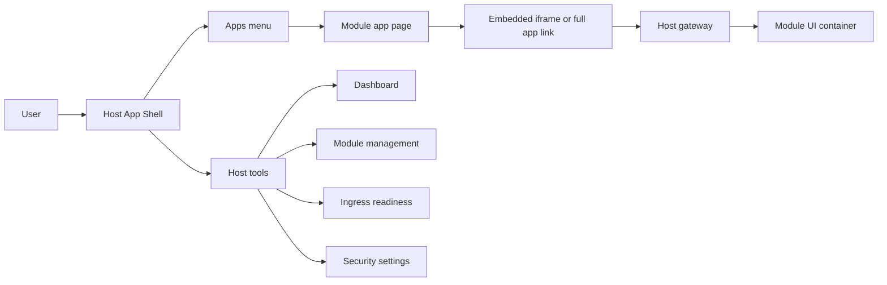

# Host App Shell and Module App Portal

## Description

Docker Host should evolve from a standalone module-management dashboard into an authenticated application shell for Host-owned tools and installed module UIs.

The target experience is a persistent Host layout with a sidebar and topbar:

- Host navigation for dashboard, module management, external ingress readiness, and security settings.
- Apps navigation for installed modules that expose a UI through the Host gateway.
- Optional nested app navigation for module-defined sections.
- Embedded module opening inside the Host shell where practical, with a full-app subdomain fallback.

The current architecture already supports the core transport model through the Host gateway. Module UIs are routed by dedicated subdomains, protected by Host-owned authentication and authorization, and proxied to module containers or developer targets. This feature should build on that model instead of introducing path-based module routing.

Reference UI direction: [TailwindAdmin React](https://react.tailwind-admin.com/)-style admin layout with fixed/collapsible sidebar, sticky header, grouped navigation, and responsive mobile drawer behavior. The related [TailAdmin app layout documentation](https://tailadmin.com/docs/app-layout) describes the same shell shape: sidebar plus sticky header plus scrollable main content.



## Milestones

### Phase 1 - App shell foundation

**Status**: Not Started

Create a reusable Host application shell that can wrap current Host pages without changing existing backend behavior.

Tasks:

- Add shared shell components for sidebar, topbar, mobile sidebar drawer, page content, and navigation sections.
- Move the current dashboard page into the shell while preserving existing module lifecycle behavior.
- Move install, update, and security pages into the same shell or align their headers with the shell navigation model.
- Define Host navigation groups:
  - Host
  - Modules
  - Apps
  - Settings
- Keep admin-only routes protected by existing `host.admin` checks.
- Add responsive behavior matching the TailwindAdmin reference pattern:
  - static sidebar on desktop;
  - hidden drawer sidebar on tablet/mobile;
  - sticky topbar for refresh, account, and app context actions.

Acceptance criteria:

- Existing dashboard, install, update, external ingress readiness, and security workflows still work.
- Sidebar navigation does not require module app registry data to render.
- Mobile layout has no horizontal overflow and can open/close the sidebar.

### Phase 2 - Principal-aware app registry API

**Status**: Not Started

Add a Host API that returns only app navigation data that the current authenticated principal is allowed to see.

Tasks:

- Add `GET /api/apps`.
- Authenticate any Host principal, not only `host.admin`.
- Build app entries from enabled gateway exposures, installed module records, local module metadata, and runtime status.
- Include only exposures that point to a public runtime port and whose module is installed.
- Apply Host module access rules before returning an app to the caller.
- Return enough data for navigation without leaking raw Docker/container internals:
  - app id;
  - module id;
  - display name;
  - description;
  - version;
  - status;
  - hostname;
  - entry path;
  - full app URL;
  - embedded URL;
  - nested navigation items.
- Add tests for:
  - `public`;
  - `loginRequired`;
  - `assignedUsersOnly`;
  - `host.admin` visibility;
  - `host.user` visibility;
  - disabled exposures;
  - missing metadata;
  - unavailable modules.

Acceptance criteria:

- `host.user` can discover only apps they can open.
- `host.admin` can discover all routable apps, including enough status to diagnose unavailable app entries.
- `/api/modules` remains admin-focused and does not become the user-facing app registry.

### Phase 3 - Module UI metadata contract

**Status**: Not Started

Extend module metadata with optional UI navigation data. This keeps app navigation predictable and avoids guessing routes from running modules.

Proposed metadata shape:

```json
{
  "ui": {
    "category": "Apps",
    "icon": "boxes",
    "entrypoint": {
      "portKey": "http",
      "path": "/"
    },
    "navigation": [
      {
        "label": "Overview",
        "path": "/"
      },
      {
        "label": "People",
        "path": "/people"
      },
      {
        "label": "Settings",
        "path": "/settings"
      }
    ]
  }
}
```

Tasks:

- Add `ui` types to module metadata TypeScript models.
- Update metadata validation to accept and normalize optional `ui`.
- Validate that `ui.entrypoint.portKey` references a `runtime.ports[]` item with `public: true`.
- Validate that `ui.entrypoint.path` and `ui.navigation[].path` are absolute same-origin paths beginning with `/`.
- Validate navigation labels and reject empty or excessively long labels.
- Define fallback behavior:
  - if `ui` is absent but a gateway exposure exists, show a single app entry using module name and `/`;
  - if `ui.navigation` is absent, show no nested submenu.
- Update demo module metadata to include a basic UI contract.
- Update module metadata documentation.

Acceptance criteria:

- Existing modules without `ui` still install and appear as single-entry apps when exposed.
- Invalid UI metadata is rejected during install/update planning before runtime exposure.
- Demo module can populate an Apps submenu through metadata.

### Phase 4 - Apps sidebar and app host page

**Status**: Not Started

Render the Apps group in the Host sidebar and provide a Host route that opens selected module UIs.

Tasks:

- Add a client hook for `/api/apps`.
- Render Apps as a grouped sidebar section.
- Render module app entries with nested disclosure items when `ui.navigation` exists.
- Add Host route for app opening, for example `/apps/[moduleId]`.
- Preserve selected app and selected nested navigation state.
- Use an iframe for embedded mode:
  - iframe source is the module gateway URL plus selected path;
  - Host topbar includes app name, status, refresh, and open-full-app action;
  - full app action opens the module subdomain directly.
- Add fallback behavior when embedded rendering is blocked:
  - show a concise error panel;
  - keep the full app link available.
- Do not introduce `/apps/{moduleId}` path proxying to module containers.

Acceptance criteria:

- Clicking an Apps sidebar item opens the module UI through the Host gateway.
- Host shell remains visible around embedded module UI.
- Full app link opens the same module subdomain without Host shell.
- Nested app navigation updates the embedded URL.
- Existing Host pages continue to work when no apps are configured.

### Phase 5 - Gateway exposure management UX

**Status**: Not Started

Expose the currently low-level gateway exposure APIs through Host UI so administrators can publish app UIs without manual API calls.

Tasks:

- Add an admin view for gateway exposures.
- Let administrators create, edit, disable, and delete exposures.
- Let administrators choose:
  - module;
  - public runtime port;
  - hostname;
  - exposure policy;
  - identity mode.
- Add assignment editing for `assignedUsersOnly`.
- Link exposure records with external ingress readiness.
- Show whether an exposure is eligible to appear in Apps navigation.

Acceptance criteria:

- Admins can create the data needed for Apps navigation from the Web UI.
- External ingress readiness still works with the same exposure records.
- Exposure changes are reflected by `/api/apps`.

### Phase 6 - User portal behavior

**Status**: Not Started

Make the shell useful for non-admin users while keeping Host management actions admin-only.

Tasks:

- Let authenticated `host.user` principals load the shell.
- Hide Host admin navigation items from non-admin users.
- Route non-admin users to the Apps view by default.
- Keep module install/update/remove/lifecycle, gateway exposure management, external ingress management, and security settings admin-only.
- Add empty states for:
  - no assigned apps;
  - apps unavailable;
  - login required;
  - access denied.

Acceptance criteria:

- `host.user` can use the Host shell as an app launcher/portal.
- `host.user` cannot access Host admin APIs or admin UI actions.
- `host.admin` keeps the full Host management experience.

### Phase 7 - Developer mode integration

**Status**: Not Started

Integrate module developer targets into the same Apps portal behavior when `HOST_MODULE_DEV_MODE=enabled`.

Tasks:

- Include enabled developer targets in `/api/apps` when developer mode is active.
- Mark developer app entries clearly in the UI.
- Keep developer targets inert when developer mode is disabled.
- Support local target URLs through existing gateway dev-target proxying.
- Add tests for enabled and disabled developer mode.

Acceptance criteria:

- Module authors can open a local module dev server through the Host shell.
- Developer app entries do not leak into production gateway exposure state.

### Phase 8 - Verification, hardening, and documentation

**Status**: Not Started

Complete end-to-end verification and move stable knowledge from planning into feature documentation.

Tasks:

- Add unit tests for app registry construction and access filtering.
- Add route tests for `/api/apps`.
- Add UI smoke coverage for:
  - empty app list;
  - one app;
  - nested app navigation;
  - blocked iframe fallback;
  - admin vs user sidebar.
- Verify WebSocket/SSE module traffic still works through the gateway when opened from the shell.
- Verify module identity token behavior is unchanged.
- Verify Host session cookies are still stripped before proxied traffic reaches modules.
- Update `docs/features/web-ui-dashboard.md`, `docs/features/auth-gateway.md`, and `docs/features/module-metadata.md`.
- When implementation is complete, move the durable feature explanation to `docs/features/host-app-shell.md` and remove this planning document.

Acceptance criteria:

- Existing tests pass.
- New app portal tests cover the main authorization and navigation paths.
- Documentation describes the implemented app shell behavior and module UI metadata contract.

## Recommended Implementation Order

1. Build the shell around existing admin pages.
2. Add `/api/apps` with access-filtered app entries.
3. Add optional `ui` metadata support.
4. Render Apps sidebar and embedded app route.
5. Add gateway exposure management UI.
6. Enable non-admin user portal behavior.
7. Integrate developer targets.
8. Harden tests and documentation.

This order keeps the highest-risk access-control work isolated before iframe embedding and before exposing the shell to regular users.

## Non-Goals

- Do not implement a path-based module proxy under `/apps/{moduleId}`.
- Do not replace the existing subdomain gateway model.
- Do not require modules to use React, Next.js, or shared frontend dependencies.
- Do not implement Module Federation or remote React component loading in the first version.
- Do not centralize module-owned permissions inside Docker Host.
- Do not expose raw Docker/container details through the user-facing app registry API.

## Open Questions and Answers

- **Question**: Should `host.user` principals see the Host shell?
  **Answer**: Yes. The shell should become both an admin console and an app portal, with navigation filtered by role.
  **Recommendation**: Let `host.user` load the shell, but expose only Apps and non-sensitive account actions. Keep Host management pages and APIs admin-only.

- **Question**: Should the Apps menu be derived from installed modules or gateway exposures?
  **Answer**: Gateway exposures should be the source of routable apps. An installed module may have no externally reachable UI.
  **Recommendation**: Build Apps from enabled gateway exposures joined with module metadata and access policy.

- **Question**: Where should nested app navigation live?
  **Answer**: Start with module metadata because it is reviewed during install/update and does not require runtime probing.
  **Recommendation**: Add optional `ui.navigation` metadata. Consider a runtime manifest later only if modules need dynamic navigation.

- **Question**: Should module UIs open inside the Host shell or as full-page subdomain apps?
  **Answer**: Use embedded mode as the default shell experience, but keep full-page subdomain opening as a first-class fallback.
  **Recommendation**: Implement iframe embedding first, then detect blocked/failed embedded loads and show a full-app action.

- **Question**: Should Docker Host support path-based routing for module UIs?
  **Answer**: No. The accepted gateway model uses dedicated subdomains, and many module UIs assume they run at `/`.
  **Recommendation**: Keep subdomain routing and use Host routes only as shell state around the embedded subdomain app.

- **Question**: Should adding `ui` metadata require a schema version bump?
  **Answer**: It depends on compatibility expectations. The current validator rejects unknown fields, so older Host versions would reject new metadata containing `ui`.
  **Recommendation**: If the metadata format is not yet treated as stable, extend schema `0.1` now. If published backwards compatibility matters, introduce schema `0.2` and document the Host version requirement.

## Risks and Mitigations

- **Iframe blocking**: Module responses may include `X-Frame-Options` or restrictive `Content-Security-Policy`.
  **Mitigation**: Keep full-app subdomain opening as a supported path. Later, define an embed-compatible module UI contract.

- **Cookie and session behavior across subdomains**: Browser cookies may be sent to module subdomains when scoped to the parent domain.
  **Mitigation**: Preserve current gateway behavior that strips Host session cookies before proxying to modules.

- **Authorization leaks**: A user-facing Apps API could accidentally expose module/container details.
  **Mitigation**: Make `/api/apps` a dedicated minimal API instead of reusing `/api/modules`.

- **Navigation drift**: Module routes may change without metadata updates.
  **Mitigation**: Treat `ui.navigation` as part of the install/update reviewed contract and validate it during metadata refresh.

- **Mobile usability**: Embedded dashboards can be difficult inside narrow iframes.
  **Mitigation**: Provide full-app opening and ensure the shell can collapse chrome on small screens.

## Implementation Notes

- The app registry should join these existing concepts:
  - installed module records from `modules.json`;
  - local module metadata;
  - gateway exposure records;
  - Host access assignments;
  - Docker runtime status where needed for availability.
- The embedded app route should not bypass gateway authorization.
- The full-app URL should always use the gateway exposure hostname.
- `host.admin` should see diagnostic status for unavailable apps; `host.user` should see only usable or assigned apps.
- The demo module should be the first module updated with `ui` metadata so the feature has a stable local test target.
