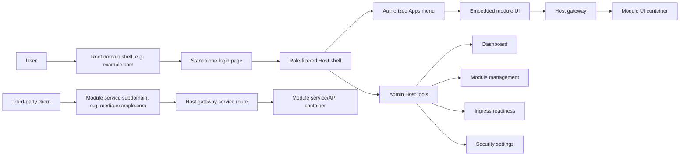

# Host App Shell and Module App Portal

## Description

Docker Host should evolve from a standalone module-management dashboard into an authenticated application shell for Host-owned tools and installed module UIs.

The target experience is a persistent Host layout with a sidebar and topbar:

- Host navigation for dashboard, module management, external ingress readiness, and security settings.
- Apps navigation for installed modules that expose a UI through the Host gateway.
- Optional nested app navigation for module-defined sections.
- Embedded module opening inside the Host shell. Module UIs should not be published as separate public domains or subdomains.

The current architecture already supports the core transport model through the Host gateway. This feature should separate shell-openable module UIs from module service endpoints. UI entrypoints belong in the root Host shell experience. Service or API endpoints that need third-party client access can still use dedicated gateway subdomains, protected by Host-owned authentication and authorization where applicable, and proxied to module containers or developer targets.

Reference UI direction: [TailwindAdmin React](https://react.tailwind-admin.com/)-style admin layout with fixed/collapsible sidebar, sticky header, grouped navigation, and responsive mobile drawer behavior. The related [TailAdmin app layout documentation](https://tailadmin.com/docs/app-layout) describes the same shell shape: sidebar plus sticky header plus scrollable main content.

## Target public navigation model

In externally published deployments, the Host shell is the primary public entry point on the root domain, for example `example.com`.

When an unauthenticated person opens the root domain, Docker Host should send them to the standalone login page. After authentication, the shell experience depends on the Host role:

- `host.admin` opens the admin shell with Host management navigation, module lifecycle tools, gateway and ingress operations, security settings, and Apps navigation.
- `host.user` opens the user shell with only assigned or otherwise authorized Apps navigation plus non-sensitive account actions.

The Apps sidebar should show only module UIs the current principal can open. Selecting an app opens that module UI inside the Host shell, so the shell remains the user's main navigation surface. Direct public UI URLs for modules are not part of the target external publishing model.

Some modules may also expose non-shell service endpoints for third-party clients. For example, a media module can expose a Jellyfin-compatible API for Apple TV clients such as Infuse on `media.example.com`. These service endpoints should continue to use dedicated gateway subdomains. They should not be represented as shell Apps and should not imply that the module's browser UI is available on the same public subdomain.



## Milestones

### Phase 1 - App shell foundation

**Status**: Completed

Create a reusable Host application shell that can wrap current Host pages without changing existing backend behavior.

Tasks:

- Add shared shell components for sidebar, topbar, mobile sidebar drawer, page content, and navigation sections.
- Move the current dashboard page into the shell while preserving existing module lifecycle behavior.
- Move install, update, and security pages into the same shell or align their headers with the shell navigation model.
- Define Host navigation groups:
  - Host
  - Modules
  - Apps
  - Settings
- Keep admin-only routes protected by existing `host.admin` checks.
- Add responsive behavior matching the TailwindAdmin reference pattern:
  - static sidebar on desktop;
  - hidden drawer sidebar on tablet/mobile;
  - sticky topbar for refresh, account, and app context actions.

Acceptance criteria:

- Existing dashboard, install, update, external ingress readiness, and security workflows still work.
- Sidebar navigation does not require module app registry data to render.
- Mobile layout has no horizontal overflow and can open/close the sidebar.

Implementation notes:

- Admin shell pages now live under a Next.js route group while keeping URLs stable.
- `/ingress` owns external ingress readiness and reuses the existing readiness panel.
- The durable Phase 1 behavior is documented in `docs/features/host-app-shell.md`.

Resolved Phase 1 decisions:

- **Question**: Should install, update, and security pages be fully wrapped in the shared shell or only align their headers?
  **Answer**: Wrap dashboard, install, update, and security pages in the shared admin shell.
  **Recommendation**: Use one reusable shell for all current admin pages to remove duplicated headers and prepare for the later Apps route.

- **Question**: Should login, setup, and recovery pages use the shell?
  **Answer**: No. Keep `/login`, `/setup`, and `/recovery` standalone.
  **Recommendation**: Apply the shell only after authentication and only to protected application routes.

- **Question**: How should Phase 1 navigation groups be populated before app registry data exists?
  **Answer**: Use static Host navigation. `Host` contains Dashboard and External ingress. `Modules` contains Installed modules and Install module. `Apps` renders without registry data and can show an empty or disabled state. `Settings` contains Security.
  **Recommendation**: Do not call a future `/api/apps` endpoint in Phase 1.

- **Question**: Should external ingress readiness stay inside the dashboard or become its own navigation page?
  **Answer**: Make it a dedicated admin page while preserving the existing readiness workflow.
  **Recommendation**: Reuse the current readiness panel on a new `/ingress` page and keep dashboard focused on installed modules.

- **Question**: How should topbar actions be modeled?
  **Answer**: The shell owns global account/logout actions and exposes a page-specific action slot for refresh, status badges, and contextual commands.
  **Recommendation**: Move duplicated page headers into shell metadata and page action slots.

- **Question**: What responsive behavior should Phase 1 implement?
  **Answer**: Use a static sidebar on desktop and a drawer sidebar below the desktop breakpoint.
  **Recommendation**: Treat `lg` and wider as desktop. Below `lg`, hide the sidebar behind a drawer and close it after navigation.

- **Question**: Should collapsed sidebar state be persisted?
  **Answer**: No persistence is required for Phase 1.
  **Recommendation**: Keep sidebar and drawer state client-local until there is a user preferences model.

- **Question**: What Next.js structure should host the shell?
  **Answer**: Use an authenticated route group layout for admin shell pages.
  **Recommendation**: Keep URLs stable while moving protected app pages under a route group such as `app/(admin)`.

- **Question**: What verification is sufficient for Phase 1?
  **Answer**: Run lint and production build, then browser-check dashboard, install, update, security, ingress, and mobile drawer behavior.
  **Recommendation**: Verify no horizontal overflow on mobile and that existing workflows still call the same backend APIs.

### Phase 2 - Principal-aware app registry API

**Status**: Completed

Add a Host API that returns only app navigation data that the current authenticated principal is allowed to see.

Tasks:

- Add `GET /api/apps`.
- Authenticate any Host principal, not only `host.admin`; unauthenticated callers receive `401` and no app discovery data.
- Pull the minimal `ui` metadata contract needed by the app registry into this phase before constructing app entries.
- Define a minimal Host-owned shell App access mode:
  - `allAuthenticated` for apps visible to any signed-in Host user;
  - `assignedUsersOnly` for apps visible only to assigned users and `host.admin`;
  - no `public` or anonymous shell App mode.
- Build app entries from explicit shell UI metadata, installed module records, Host-owned app access mode, module access assignments, and runtime status.
- Include only UI entrypoints whose module is installed and whose runtime target is available through the Host shell.
- Apply Host module access rules before returning an app to the caller:
  - `host.admin` can see all shell-routable app entries, including unavailable entries with safe diagnostics;
  - `host.user` can see only apps available to all authenticated users or explicitly assigned to that user.
- Do not infer Apps from gateway exposure records, direct public module hostnames, or `runtime.ports[].public` alone.
- Return enough data for navigation without leaking raw Docker/container internals:
  - app id;
  - module id;
  - display name;
  - description;
  - version;
  - status;
  - entry path;
  - embedded URL;
  - nested navigation items.
- Add tests for:
  - unauthenticated callers are rejected;
  - apps visible to any authenticated Host user;
  - apps visible only to assigned users;
  - shell Apps are not exposed through anonymous or `public` discovery;
  - `host.admin` visibility;
  - `host.user` visibility;
  - disabled or unavailable UI entrypoints;
  - missing metadata;
  - unavailable modules.

Acceptance criteria:

- `host.user` can discover only apps they can open.
- `host.admin` can discover all routable apps, including enough status to diagnose unavailable app entries.
- `/api/modules` remains admin-focused and does not become the user-facing app registry.
- The app registry describes shell-openable module UIs, not every public service endpoint a module may expose for third-party clients.
- Shell Apps do not support anonymous/public discovery. A module UI is discoverable only after Host authentication.
- `/api/apps` does not return direct public module UI domains or subdomains.

Implementation notes:

- `GET /api/apps` is implemented as a dynamic App Router API route.
- `requireHostPrincipal` handles authenticated, non-admin Host API reads.
- `app-registry-service` builds principal-filtered registry entries and keeps Docker/container internals out of the response.
- Minimal `ui` metadata validation is implemented for `ui.entrypoint` and `ui.navigation`.
- The reports development fixture includes `ui` metadata for local app-registry testing.
- Unit coverage exists for metadata validation and app-registry access filtering. Route coverage verifies that unauthenticated `/api/apps` callers receive `401`.

Resolved Phase 2 starter decisions:

- **Question**: Should Phase 2 implement a minimal `ui` metadata contract before `/api/apps`?
  **Answer**: Yes. Phase 2 needs the minimal `ui.entrypoint` and optional `ui.navigation` shape required to build app entries.
  **Recommendation**: Move only the registry-critical subset of Phase 3 into Phase 2, then leave the broader metadata documentation and demo-module polish in Phase 3.

- **Question**: Should `/api/apps` return shell Apps to unauthenticated callers when an app would otherwise be public?
  **Answer**: No. Shell Apps are part of the authenticated Host shell, so `/api/apps` requires an authenticated Host principal.
  **Recommendation**: Treat anonymous/public shell App discovery as closed. Redirect root-domain users to login first, then return role-filtered Apps after authentication.

- **Question**: Are `public`, `private`, or `protected` useful terms for shell Apps?
  **Answer**: No. For shell Apps, the useful distinction is whether an authenticated Host user can see the app by default or only through explicit assignment.
  **Recommendation**: Use shell App access terms such as "all authenticated users" and "assigned users only". Keep older gateway exposure policy terms scoped to separate service/API endpoint publishing until that model is revisited.

- **Question**: Should Phase 2 still support rare public service/API endpoints?
  **Answer**: Not through the Apps registry. Public or externally reachable service/API endpoints are separate gateway exposure behavior and should not create shell Apps.
  **Recommendation**: Keep Phase 2 focused on authenticated shell navigation. Revisit public service/API exposure terminology in the gateway exposure UX phase if the old policy names become confusing.

- **Question**: Which auth sources should `/api/apps` accept?
  **Answer**: Use the existing Host request authentication path so browser sessions and trusted-proxy principals work consistently. CLI bearer tokens may authenticate as admin, but the endpoint remains read-only navigation data.
  **Recommendation**: Add a helper for "require authenticated Host principal" instead of reusing `requireHostAdmin`.

- **Question**: Where should shell App visibility rules come from?
  **Answer**: Visibility should be Host-owned. Phase 2 should not let module metadata grant public visibility or define Host users.
  **Recommendation**: Add a minimal Host-owned shell App access mode with `allAuthenticated` as the default and `assignedUsersOnly` as the restricted mode. Use existing module assignment records for the assigned-user check.

- **Question**: What should `host.admin` and `host.user` receive for unavailable apps?
  **Answer**: `host.admin` should receive unavailable app entries with safe diagnostic status. `host.user` should receive only usable apps they can open.
  **Recommendation**: Hide unavailable apps from regular users until the user portal has a deliberate disabled-app UX.

- **Question**: What app identifier should Phase 2 use?
  **Answer**: Use `moduleId` as the app id while the metadata supports one shell UI entrypoint per module.
  **Recommendation**: Defer separate generated app ids until modules can expose more than one shell app.

- **Question**: Which URLs should `/api/apps` return?
  **Answer**: Return same-origin Host shell paths and reserved embedded URLs only. Do not return raw container URLs, Docker network aliases, or public module UI domains.
  **Recommendation**: Use `/apps/{moduleId}` as shell state and a Host-owned embedded transport URL for iframe content.

- **Question**: How should missing or invalid metadata be handled?
  **Answer**: It should not fail the entire registry response.
  **Recommendation**: Hide invalid entries from `host.user`; include safe unavailable diagnostics for `host.admin`.

### Phase 3 - Module UI metadata contract

**Status**: Completed

Extend module metadata with optional UI navigation data. This keeps app navigation predictable and avoids guessing routes from running modules.

Phase 2 may implement the minimal `ui.entrypoint` and `ui.navigation` support required by `/api/apps`. Phase 3 completes the contract, validation, demo metadata, and durable feature documentation.

The `ui` contract describes a shell-only UI entrypoint. It does not request or imply a direct public hostname for the module UI. If a module also needs a public service/API endpoint for third-party clients, that should be modeled separately from `ui` as a service exposure in a later metadata slice.

Proposed metadata shape:

```json
{
  "ui": {
    "category": "Apps",
    "icon": "boxes",
    "entrypoint": {
      "portKey": "http",
      "path": "/"
    },
    "navigation": [
      {
        "label": "Overview",
        "path": "/"
      },
      {
        "label": "People",
        "path": "/people"
      },
      {
        "label": "Settings",
        "path": "/settings"
      }
    ]
  }
}
```

Tasks:

- Complete `ui` types in module metadata TypeScript models if Phase 2 introduced only the minimal subset.
- Complete metadata validation to accept and normalize optional `ui`.
- Validate that `ui.entrypoint.portKey` references a `runtime.ports[]` item with `public: true`.
- Validate that `ui.entrypoint.path` and `ui.navigation[].path` are absolute same-origin paths beginning with `/`.
- Validate navigation labels and reject empty or excessively long labels.
- Define fallback behavior:
  - if `ui` is absent, do not infer a shell app from service/API gateway exposures;
  - if `ui.navigation` is absent, show no nested submenu.
- Update demo module metadata to include a basic UI contract.
- Update module metadata documentation.

Acceptance criteria:

- Existing modules without `ui` still install but do not appear as shell Apps unless another explicit shell UI contract is added.
- Invalid UI metadata is rejected during install/update planning before runtime exposure.
- Demo module can populate an Apps submenu through metadata.

Implementation notes:

- Phase 3 kept app rendering out of scope and completed the module `ui` metadata contract around the existing Phase 2 `/api/apps` API.
- `ui.category` remains optional but must be `Apps` when provided.
- `ui.icon` remains optional and must be a non-empty lowercase icon key when provided.
- `ui.entrypoint.path` and `ui.navigation[].path` are same-origin absolute paths beginning with `/`; direct URLs, protocol-relative paths, backslashes, control characters, and excessive lengths are rejected.
- Duplicate `ui.navigation[].path` values are rejected.
- The real demo module metadata now declares the basic `ui` contract and exposes stable `/`, `/people`, and `/settings` routes.

Resolved Phase 3 decisions:

- **Question**: What is the real Phase 3 scope now that Phase 2 already introduced minimal `ui` support?
  **Answer**: Treat Phase 3 as contract completion: reconcile docs, close validation gaps, add targeted tests, and keep app rendering for Phase 4.
  **Recommendation**: Use the contract-completion scope. Phase 2 already ships `/api/apps`, validator support, and sample reports metadata; Phase 4 owns sidebar and embedded app behavior.

- **Question**: Should completing `ui` require a metadata schema version bump?
  **Answer**: Keep `schemaVersion: "0.1"` because the metadata format is still a local-first MVP draft.
  **Recommendation**: Keep `schemaVersion: "0.1"` unless externally published modules must support older Host builds. The current code and durable metadata documentation already include `ui` in the `0.1` contract.

- **Question**: What should be the authoritative source for the `ui` contract?
  **Answer**: Keep `docs/features/module-metadata.md` plus executable validation as the source of truth.
  **Recommendation**: Keep the current document-plus-validator model for Phase 3. Add generated schemas only when external module authors need machine-readable validation outside the Host.

- **Question**: How strict should `ui.entrypoint.path` and `ui.navigation[].path` validation be?
  **Answer**: Allow same-origin absolute path strings beginning with `/`, including query strings and fragments.
  **Recommendation**: Keep same-origin static path validation and do not probe module routes. Reject direct URLs, protocol-relative URLs, backslashes, control characters, and excessive length.

- **Question**: Should duplicate nested navigation items be accepted?
  **Answer**: Reject duplicate navigation paths while preserving author-defined order.
  **Recommendation**: Reject duplicate paths and preserve the declared order. Silent deduplication can hide metadata mistakes and make selected navigation state ambiguous.

- **Question**: How should optional `ui.category` and `ui.icon` behave before the Apps sidebar exists?
  **Answer**: Keep `category` optional but limited to `Apps`, and keep `icon` as an optional lowercase key with a Host fallback.
  **Recommendation**: Keep the current narrow fields. Do not let modules define Host navigation taxonomy yet; Phase 4 can map unknown icon keys to a default icon.

- **Question**: What should happen when `ui` exists but is invalid?
  **Answer**: Reject the install or update plan.
  **Recommendation**: Reject invalid `ui` during install/update planning. A missing `ui` is valid, but a malformed shell UI contract should fail before it can create confusing app registry behavior.

- **Question**: How much demo-module work belongs in Phase 3?
  **Answer**: Ensure the demo module exposes stable routes matching `ui.navigation`.
  **Recommendation**: Keep the demo work functional but small: metadata plus stable routes are enough for Phase 3 and give Phase 4 a predictable embedded-app test target.

- **Question**: What test coverage defines Phase 3 as complete?
  **Answer**: Validator tests plus app-registry compatibility tests for valid, absent, and invalid `ui`.
  **Recommendation**: Add targeted validation and registry tests in Phase 3. Save sidebar and iframe browser smoke coverage for Phase 4, where that UI exists.

- **Question**: Should Phase 3 add service/API exposure metadata alongside `ui`?
  **Answer**: Keep service/API exposure metadata separate and defer it to the gateway exposure UX slice.
  **Recommendation**: Keep Phase 3 shell-only. Service/API endpoint publishing is a separate gateway concern and should not be encoded under `ui`.

### Phase 4 - Apps sidebar and app host page

**Status**: Completed

Render the Apps group in the Host sidebar and provide a Host route that opens selected module UIs.

Tasks:

- Add a client hook for `/api/apps`.
- Render Apps as a grouped sidebar section.
- Render module app entries with nested disclosure items when `ui.navigation` exists.
- Add Host route for app opening, for example `/apps/[moduleId]`.
- Preserve selected app and selected nested navigation state.
- Use an iframe for embedded mode:
  - iframe source is a Host shell-owned embedded UI URL plus selected path;
  - Host topbar includes app name, status, and refresh actions;
  - direct public module UI subdomain opening is not part of the external publishing model.
- Add fallback behavior when embedded rendering is blocked:
  - show a concise error panel;
  - explain that the module UI must be opened through the Host shell or fixed to support embedding.
- Do not introduce `/apps/{moduleId}` path proxying to module containers.

Acceptance criteria:

- Clicking an Apps sidebar item opens the module UI through the Host gateway.
- Host shell remains visible around embedded module UI.
- Nested app navigation updates the embedded URL.
- Existing Host pages continue to work when no apps are configured.

Implementation notes:

- `useHostApps` loads `/api/apps` on shell pages and exposes loading, error, refresh, and timestamp state.
- The Host sidebar now renders the Apps section from app registry entries, including empty, loading, error, unavailable, and nested navigation states.
- `/apps/[moduleId]` is a Host shell route. It keeps the shell visible, resolves selected nested navigation through the `path` query parameter, and renders the selected module UI in an iframe.
- The Host app page owns topbar context for app name, selected nested navigation label, availability status, and iframe refresh.
- `/api/apps/[moduleId]/embed` is the reserved embedded transport. It requires Host authentication, resolves only apps visible to the current principal, rejects unavailable apps, proxies to the declared UI runtime port, injects module identity, strips Host-owned request headers, scopes module cookies to the embed route, rewrites root-relative module links/assets through the reserved embed URL, and returns a concise embed-blocked HTML fallback when module frame headers explicitly block embedding.
- `/apps/{moduleId}` remains shell state only and is not a direct module-container proxy.

Resolved Phase 4 starter decisions:

- **Question**: Can module apps override or directly control the Host shell topbar?
  **Answer**: No. In Phase 4, the shell topbar remains Host-owned and is controlled only by the Host app page.
  **Recommendation**: Let the Host app route set topbar context such as app name, availability status, selected nested navigation label, and refresh/reload actions. Module UIs may render their own internal header inside the iframe, but they should not receive runtime control over the shell chrome. If module-provided topbar actions become necessary later, add an explicit declarative metadata contract instead of giving embedded apps direct Shell UI access.

### Phase 5 - Gateway exposure management UX

**Status**: Completed

Expose gateway exposure APIs through Host UI so administrators can publish service/API endpoints without manual API calls. Module browser UIs remain shell-only and should not be published as standalone public subdomains.

Tasks:

- Add an admin view for gateway exposures.
- Let administrators create, edit, disable, and delete service/API exposures.
- Let administrators choose:
  - module;
  - public runtime port;
  - hostname;
  - exposure policy;
  - identity mode.
- Add assignment editing for `assignedUsersOnly`.
- Link exposure records with external ingress readiness.
- Show whether an exposure is a service/API endpoint and therefore excluded from Apps navigation.

Acceptance criteria:

- Admins can create externally published service/API endpoints from the Web UI.
- External ingress readiness still works with the same exposure records.
- Service/API exposure changes do not create shell Apps unless paired with explicit `ui` metadata.

Implementation notes:

- `/ingress` is the combined admin surface for gateway exposures and external ingress readiness.
- The gateway exposure section lists configured service/API endpoints and labels them as excluded from Apps navigation.
- Administrators can create, edit, enable/disable, and delete gateway exposures from the Web UI.
- The create/edit form uses `/api/gateway/options` to get installed modules, public runtime ports, UI-entrypoint hints, active Host users, and Host gateway domain settings.
- When `HOST_GATEWAY_BASE_DOMAIN` is configured, the form asks for a subdomain and previews the full hostname.
- Exposure policy is the primary authorization control. Identity mode is shown as an advanced control with safe defaults and invalid public/required combinations prevented.
- `assignedUsersOnly` editing uses existing module-wide Host assignments and labels them as module access assignments.
- Deleting a gateway exposure removes linked external ingress readiness records so stale readiness state is not left behind.
- Creating an exposure does not create external ingress readiness automatically. The readiness section continues to require an explicit "Plan" action.
- If the selected public runtime port is also the module `ui.entrypoint`, the form warns that gateway exposures are for service/API traffic and browser UIs should remain in the Host Apps shell.

Resolved Phase 5 starter decisions:

- **Question**: Should gateway exposure management live on the existing `/ingress` page or on a new route?
  **Answer**: Extend `/ingress` into the combined admin surface for gateway exposure management and external ingress readiness.
  **Recommendation**: Extend `/ingress` first. Keep the route stable, add a gateway exposure management section before readiness, and avoid splitting one admin workflow across multiple pages until the surface becomes too large.

- **Question**: How should the UI distinguish service/API exposures from shell Apps?
  **Answer**: Gateway exposure records publish module service/API hostnames. Shell Apps continue to come only from explicit `ui` metadata and `/api/apps`; Phase 5 should not add a new port classification metadata contract.
  **Recommendation**: Do not add a new metadata contract in Phase 5. Allow public runtime ports that pass existing validation, but make the UI copy explicit: service/API exposures are not Apps and should not be used to publish standalone module browser UIs. Add a warning when the selected port matches `ui.entrypoint.portKey`.

- **Question**: Where should the create/edit form get module and public-port choices?
  **Answer**: Add a narrow admin-only gateway options endpoint that returns installed modules, public runtime ports, and UI-entrypoint hints for the exposure form.
  **Recommendation**: Add a narrow admin-only options endpoint for Phase 5. It should return only what the gateway exposure form needs and should reuse the same installed-module and metadata reads as gateway validation.

- **Question**: How should hostname entry work with `HOST_GATEWAY_BASE_DOMAIN`?
  **Answer**: When `HOST_GATEWAY_BASE_DOMAIN` is set, ask for the subdomain label and render a read-only full-hostname preview. Use full-hostname entry only when no base domain is configured.
  **Recommendation**: Use a guided subdomain field when `HOST_GATEWAY_BASE_DOMAIN` is set, with a read-only preview of the full hostname. Fall back to full-hostname entry only when no base domain is configured.

- **Question**: How much of exposure policy and identity mode should be visible in the first UI?
  **Answer**: Show exposure policy as the primary control and expose identity mode as an advanced control with defaults preselected.
  **Recommendation**: Show policy as the primary control and identity mode as an advanced control with defaults preselected. Disable or explain invalid combinations such as `public` plus `required` identity.

- **Question**: Should assignment editing be per exposure or per module?
  **Answer**: Keep assignments module-wide in Phase 5 and label the editor as module access assignments.
  **Recommendation**: Keep module-wide assignments in Phase 5 and label the editor as module access assignments. If per-exposure assignments become necessary, treat that as a separate authorization-model change.

- **Question**: What should happen to external ingress readiness records when an exposure is disabled or deleted?
  **Answer**: Preserve readiness when disabling an exposure. When deleting an exposure, remove or unlink its readiness record so no orphaned readiness state remains.
  **Recommendation**: Preserve readiness when disabling, because disable is reversible. On delete, either unlink readiness before deleting or add backend cleanup so deleted exposures do not leave orphaned ingress records.

- **Question**: Should creating an exposure automatically create an external ingress intent?
  **Answer**: No. Keep readiness explicit and leave new exposures unmanaged until the administrator chooses to plan ingress.
  **Recommendation**: Keep readiness explicit in Phase 5. After create, show the exposure in the readiness section with a clear "Plan ingress" action rather than creating readiness state automatically.

### Phase 6 - User portal behavior

**Status**: Completed

Make the shell useful for non-admin users while keeping Host management actions admin-only.

Tasks:

- Let authenticated `host.user` principals load the shell.
- Hide Host admin navigation items from non-admin users.
- Route non-admin users to the Apps view by default.
- Keep module install/update/remove/lifecycle, gateway exposure management, external ingress management, and security settings admin-only.
- Add empty states for:
  - no assigned apps;
  - apps unavailable;
  - login required;
  - access denied.

Acceptance criteria:

- `host.user` can use the Host shell as an app launcher/portal.
- `host.user` cannot access Host admin APIs or admin UI actions.
- `host.admin` keeps the full Host management experience.
- The root domain can serve both admin and user shell experiences after standalone login, with navigation filtered by role and app access.

Implementation notes:

- The shared shell layout now accepts any authenticated `host.admin` or `host.user` principal.
- `host.user` principals are routed from `/` to `/apps`.
- `/apps` is the default user portal and shows assigned app entries, app registry failures, login-required state, and no-assigned-apps state.
- Host management pages render an access-denied shell state for non-admin users instead of exposing management actions.
- Host management APIs remain protected by existing `host.admin` checks.

Resolved Phase 6 decisions:

- **Question**: How should shell access differ from admin access?
  **Answer**: Shell access accepts authenticated `host.admin` and `host.user` principals. Host management remains admin-only through page-level guards and existing admin API authorization.
  **Recommendation**: Use a shared authenticated shell guard, then protect Host management pages and APIs separately.

- **Question**: Where should `host.user` land after login or opening the root domain?
  **Answer**: `host.user` lands on `/apps`.
  **Recommendation**: Keep `/` as the admin dashboard and redirect non-admin users to `/apps`, so an empty assignment state can be shown intentionally.

- **Question**: What should direct admin URL access show for `host.user`?
  **Answer**: Show a role-filtered shell with an access-denied state.
  **Recommendation**: Do not redirect authenticated users back to login. Keep them inside the shell and provide a clear path back to Apps.

- **Question**: How should sidebar navigation be filtered?
  **Answer**: `host.admin` sees Host, Modules, Apps, and Settings navigation. `host.user` sees only Apps and account actions.
  **Recommendation**: Build navigation sections from the current principal role.

- **Question**: What empty states should Phase 6 include?
  **Answer**: Include no assigned apps, apps unavailable, login required, and access denied.
  **Recommendation**: Treat app registry authentication failures as login required, registry/data failures as apps unavailable, and direct admin page access by a user as access denied.

### Phase 7 - Developer mode integration

**Status**: Not Started

Integrate module developer targets into the same Apps portal behavior when `HOST_MODULE_DEV_MODE=enabled`.

Tasks:

- Include enabled developer targets in `/api/apps` when developer mode is active.
- Mark developer app entries clearly in the UI.
- Keep developer targets inert when developer mode is disabled.
- Support local target URLs through existing gateway dev-target proxying.
- Add tests for enabled and disabled developer mode.

Acceptance criteria:

- Module authors can open a local module dev server through the Host shell.
- Developer app entries do not leak into production gateway exposure state.

### Phase 8 - Verification, hardening, and documentation

**Status**: Not Started

Complete end-to-end verification and move stable knowledge from planning into feature documentation.

Tasks:

- Add unit tests for app registry construction and access filtering.
- Add route tests for `/api/apps`.
- Add UI smoke coverage for:
  - empty app list;
  - one app;
  - nested app navigation;
  - blocked iframe fallback;
  - admin vs user sidebar.
- Verify WebSocket/SSE module traffic still works through the gateway when opened from the shell.
- Verify module identity token behavior is unchanged.
- Verify Host session cookies are still stripped before proxied traffic reaches modules.
- Update `docs/features/web-ui-dashboard.md`, `docs/features/auth-gateway.md`, and `docs/features/module-metadata.md`.
- When implementation is complete, move the durable feature explanation to `docs/features/host-app-shell.md` and remove this planning document.

Acceptance criteria:

- Existing tests pass.
- New app portal tests cover the main authorization and navigation paths.
- Documentation describes the implemented app shell behavior and module UI metadata contract.

## Recommended Implementation Order

1. Build the shell around existing admin pages.
2. Add the minimal `ui` metadata support needed by `/api/apps`.
3. Add `/api/apps` with authenticated, access-filtered app entries.
4. Render Apps sidebar and embedded app route.
5. Add service/API gateway exposure management UI.
6. Enable non-admin user portal behavior.
7. Integrate developer targets.
8. Harden tests and documentation.

This order keeps the highest-risk access-control work isolated before iframe embedding and before exposing the shell to regular users.

## Non-Goals

- Do not publish module browser UIs as standalone public domains or subdomains.
- Do not implement user-facing path-based module UI URLs under `/apps/{moduleId}` that bypass the shell.
- Do not replace the existing subdomain gateway model for service/API endpoints.
- Do not require modules to use React, Next.js, or shared frontend dependencies.
- Do not implement Module Federation or remote React component loading in the first version.
- Do not centralize module-owned permissions inside Docker Host.
- Do not expose raw Docker/container details through the user-facing app registry API.
- Do not treat module service endpoints, such as media APIs for third-party clients, as shell Apps.

## Open Questions and Answers

- **Question**: Should `host.user` principals see the Host shell?
  **Answer**: Yes. The shell should become both an admin console and an app portal, with navigation filtered by role.
  **Recommendation**: Let `host.user` load the shell, but expose only Apps and non-sensitive account actions. Keep Host management pages and APIs admin-only.

- **Question**: Should the Apps menu be derived from installed modules or gateway exposures?
  **Answer**: Apps should be derived from explicit shell UI metadata and Host access policy. Service/API gateway exposures are not Apps.
  **Recommendation**: Build Apps from installed modules with `ui` metadata, joined with access policy and runtime availability. Keep service/API exposures in a separate external ingress surface.

- **Question**: Where should nested app navigation live?
  **Answer**: Start with module metadata because it is reviewed during install/update and does not require runtime probing.
  **Recommendation**: Add optional `ui.navigation` metadata. Consider a runtime manifest later only if modules need dynamic navigation.

- **Question**: Should module UIs open inside the Host shell or as full-page subdomain apps?
  **Answer**: Module UIs should open inside the Host shell. They should not be published as full-page public subdomain apps.
  **Recommendation**: Implement shell embedding as the supported UI path. If a module blocks embedding, show an error and require the module UI contract to be fixed instead of exposing a public UI subdomain.

- **Question**: Should Docker Host support path-based routing for module UIs?
  **Answer**: The external user-facing route should remain the Host shell route. A reserved internal shell transport may be needed for iframe content, but it should not become a direct public module UI URL.
  **Recommendation**: Keep `/apps/{moduleId}` as shell state and avoid documenting it as a standalone proxy URL. Use service subdomains only for non-UI endpoints.

- **Question**: Should adding `ui` metadata require a schema version bump?
  **Answer**: It depends on compatibility expectations. The current validator rejects unknown fields, so older Host versions would reject new metadata containing `ui`.
  **Recommendation**: If the metadata format is not yet treated as stable, extend schema `0.1` now. If published backwards compatibility matters, introduce schema `0.2` and document the Host version requirement.

## Risks and Mitigations

- **Iframe blocking**: Module responses may include `X-Frame-Options` or restrictive `Content-Security-Policy`.
  **Mitigation**: Define an embed-compatible module UI contract. Do not use public UI subdomains as the fallback.

- **Cookie and session behavior across service subdomains**: Browser cookies may be sent to service subdomains when scoped to the parent domain.
  **Mitigation**: Preserve current gateway behavior that strips Host session cookies before proxying to modules.

- **Authorization leaks**: A user-facing Apps API could accidentally expose module/container details.
  **Mitigation**: Make `/api/apps` a dedicated minimal API instead of reusing `/api/modules`.

- **Navigation drift**: Module routes may change without metadata updates.
  **Mitigation**: Treat `ui.navigation` as part of the install/update reviewed contract and validate it during metadata refresh.

- **Mobile usability**: Embedded dashboards can be difficult inside narrow iframes.
  **Mitigation**: Ensure the shell can collapse chrome on small screens and require module UIs to provide responsive embedded layouts.

## Implementation Notes

- The app registry should join these existing concepts:
  - installed module records from `modules.json`;
  - local module metadata;
  - shell UI metadata;
  - Host access assignments;
  - Docker runtime status where needed for availability.
- The embedded app route should not bypass gateway authorization.
- UI metadata and service/API exposure metadata should remain separate concepts.
- `host.admin` should see diagnostic status for unavailable apps; `host.user` should see only usable or assigned apps.
- The demo module should be the first module updated with `ui` metadata so the feature has a stable local test target.
- Public root-domain access should terminate at the Host shell/login flow; module-specific external APIs should use their own gateway exposure hostnames such as `media.example.com`.
- Public module UI hostnames such as `reports.example.com` should not be generated or advertised.
