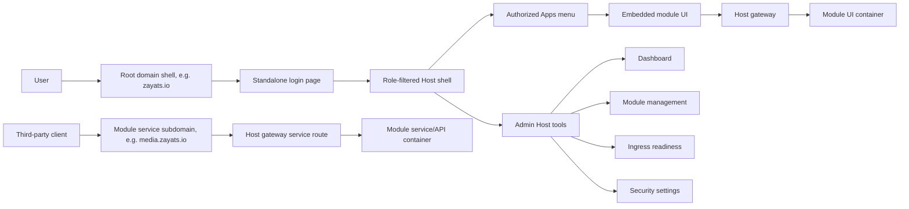

# Host App Shell and Module App Portal

## Description

Docker Host should evolve from a standalone module-management dashboard into an authenticated application shell for Host-owned tools and installed module UIs.

The target experience is a persistent Host layout with a sidebar and topbar:

- Host navigation for dashboard, module management, external ingress readiness, and security settings.
- Apps navigation for installed modules that expose a UI through the Host gateway.
- Optional nested app navigation for module-defined sections.
- Embedded module opening inside the Host shell. Module UIs should not be published as separate public domains or subdomains.

The current architecture already supports the core transport model through the Host gateway. This feature should separate shell-openable module UIs from module service endpoints. UI entrypoints belong in the root Host shell experience. Service or API endpoints that need third-party client access can still use dedicated gateway subdomains, protected by Host-owned authentication and authorization where applicable, and proxied to module containers or developer targets.

Reference UI direction: [TailwindAdmin React](https://react.tailwind-admin.com/)-style admin layout with fixed/collapsible sidebar, sticky header, grouped navigation, and responsive mobile drawer behavior. The related [TailAdmin app layout documentation](https://tailadmin.com/docs/app-layout) describes the same shell shape: sidebar plus sticky header plus scrollable main content.

## Target public navigation model

In externally published deployments, the Host shell is the primary public entry point on the root domain, for example `zayats.io`.

When an unauthenticated person opens the root domain, Docker Host should send them to the standalone login page. After authentication, the shell experience depends on the Host role:

- `host.admin` opens the admin shell with Host management navigation, module lifecycle tools, gateway and ingress operations, security settings, and Apps navigation.
- `host.user` opens the user shell with only assigned or otherwise authorized Apps navigation plus non-sensitive account actions.

The Apps sidebar should show only module UIs the current principal can open. Selecting an app opens that module UI inside the Host shell, so the shell remains the user's main navigation surface. Direct public UI URLs for modules are not part of the target external publishing model.

Some modules may also expose non-shell service endpoints for third-party clients. For example, a media module can expose a Jellyfin-compatible API for Apple TV clients such as Infuse on `media.zayats.io`. These service endpoints should continue to use dedicated gateway subdomains. They should not be represented as shell Apps and should not imply that the module's browser UI is available on the same public subdomain.



## Milestones

### Phase 1 - App shell foundation

**Status**: Completed

Create a reusable Host application shell that can wrap current Host pages without changing existing backend behavior.

Tasks:

- Add shared shell components for sidebar, topbar, mobile sidebar drawer, page content, and navigation sections.
- Move the current dashboard page into the shell while preserving existing module lifecycle behavior.
- Move install, update, and security pages into the same shell or align their headers with the shell navigation model.
- Define Host navigation groups:
  - Host
  - Modules
  - Apps
  - Settings
- Keep admin-only routes protected by existing `host.admin` checks.
- Add responsive behavior matching the TailwindAdmin reference pattern:
  - static sidebar on desktop;
  - hidden drawer sidebar on tablet/mobile;
  - sticky topbar for refresh, account, and app context actions.

Acceptance criteria:

- Existing dashboard, install, update, external ingress readiness, and security workflows still work.
- Sidebar navigation does not require module app registry data to render.
- Mobile layout has no horizontal overflow and can open/close the sidebar.

Implementation notes:

- Admin shell pages now live under a Next.js route group while keeping URLs stable.
- `/ingress` owns external ingress readiness and reuses the existing readiness panel.
- The durable Phase 1 behavior is documented in `docs/features/host-app-shell.md`.

Resolved Phase 1 decisions:

- **Question**: Should install, update, and security pages be fully wrapped in the shared shell or only align their headers?
  **Answer**: Wrap dashboard, install, update, and security pages in the shared admin shell.
  **Recommendation**: Use one reusable shell for all current admin pages to remove duplicated headers and prepare for the later Apps route.

- **Question**: Should login, setup, and recovery pages use the shell?
  **Answer**: No. Keep `/login`, `/setup`, and `/recovery` standalone.
  **Recommendation**: Apply the shell only after authentication and only to protected application routes.

- **Question**: How should Phase 1 navigation groups be populated before app registry data exists?
  **Answer**: Use static Host navigation. `Host` contains Dashboard and External ingress. `Modules` contains Installed modules and Install module. `Apps` renders without registry data and can show an empty or disabled state. `Settings` contains Security.
  **Recommendation**: Do not call a future `/api/apps` endpoint in Phase 1.

- **Question**: Should external ingress readiness stay inside the dashboard or become its own navigation page?
  **Answer**: Make it a dedicated admin page while preserving the existing readiness workflow.
  **Recommendation**: Reuse the current readiness panel on a new `/ingress` page and keep dashboard focused on installed modules.

- **Question**: How should topbar actions be modeled?
  **Answer**: The shell owns global account/logout actions and exposes a page-specific action slot for refresh, status badges, and contextual commands.
  **Recommendation**: Move duplicated page headers into shell metadata and page action slots.

- **Question**: What responsive behavior should Phase 1 implement?
  **Answer**: Use a static sidebar on desktop and a drawer sidebar below the desktop breakpoint.
  **Recommendation**: Treat `lg` and wider as desktop. Below `lg`, hide the sidebar behind a drawer and close it after navigation.

- **Question**: Should collapsed sidebar state be persisted?
  **Answer**: No persistence is required for Phase 1.
  **Recommendation**: Keep sidebar and drawer state client-local until there is a user preferences model.

- **Question**: What Next.js structure should host the shell?
  **Answer**: Use an authenticated route group layout for admin shell pages.
  **Recommendation**: Keep URLs stable while moving protected app pages under a route group such as `app/(admin)`.

- **Question**: What verification is sufficient for Phase 1?
  **Answer**: Run lint and production build, then browser-check dashboard, install, update, security, ingress, and mobile drawer behavior.
  **Recommendation**: Verify no horizontal overflow on mobile and that existing workflows still call the same backend APIs.

### Phase 2 - Principal-aware app registry API

**Status**: Not Started

Add a Host API that returns only app navigation data that the current authenticated principal is allowed to see.

Tasks:

- Add `GET /api/apps`.
- Authenticate any Host principal, not only `host.admin`.
- Build app entries from shell UI metadata, installed module records, access policy, and runtime status.
- Include only UI entrypoints whose module is installed and whose runtime target is available through the Host shell.
- Apply Host module access rules before returning an app to the caller.
- Return enough data for navigation without leaking raw Docker/container internals:
  - app id;
  - module id;
  - display name;
  - description;
  - version;
  - status;
  - entry path;
  - embedded URL;
  - nested navigation items.
- Add tests for:
  - `public`;
  - `loginRequired`;
  - `assignedUsersOnly`;
  - `host.admin` visibility;
  - `host.user` visibility;
  - disabled or unavailable UI entrypoints;
  - missing metadata;
  - unavailable modules.

Acceptance criteria:

- `host.user` can discover only apps they can open.
- `host.admin` can discover all routable apps, including enough status to diagnose unavailable app entries.
- `/api/modules` remains admin-focused and does not become the user-facing app registry.
- The app registry describes shell-openable module UIs, not every public service endpoint a module may expose for third-party clients.
- `/api/apps` does not return direct public module UI domains or subdomains.

### Phase 3 - Module UI metadata contract

**Status**: Not Started

Extend module metadata with optional UI navigation data. This keeps app navigation predictable and avoids guessing routes from running modules.

The `ui` contract describes a shell-only UI entrypoint. It does not request or imply a direct public hostname for the module UI. If a module also needs a public service/API endpoint for third-party clients, that should be modeled separately from `ui` as a service exposure in a later metadata slice.

Proposed metadata shape:

```json
{
  "ui": {
    "category": "Apps",
    "icon": "boxes",
    "entrypoint": {
      "portKey": "http",
      "path": "/"
    },
    "navigation": [
      {
        "label": "Overview",
        "path": "/"
      },
      {
        "label": "People",
        "path": "/people"
      },
      {
        "label": "Settings",
        "path": "/settings"
      }
    ]
  }
}
```

Tasks:

- Add `ui` types to module metadata TypeScript models.
- Update metadata validation to accept and normalize optional `ui`.
- Validate that `ui.entrypoint.portKey` references a `runtime.ports[]` item with `public: true`.
- Validate that `ui.entrypoint.path` and `ui.navigation[].path` are absolute same-origin paths beginning with `/`.
- Validate navigation labels and reject empty or excessively long labels.
- Define fallback behavior:
  - if `ui` is absent, do not infer a shell app from service/API gateway exposures;
  - if `ui.navigation` is absent, show no nested submenu.
- Update demo module metadata to include a basic UI contract.
- Update module metadata documentation.

Acceptance criteria:

- Existing modules without `ui` still install but do not appear as shell Apps unless another explicit shell UI contract is added.
- Invalid UI metadata is rejected during install/update planning before runtime exposure.
- Demo module can populate an Apps submenu through metadata.

### Phase 4 - Apps sidebar and app host page

**Status**: Not Started

Render the Apps group in the Host sidebar and provide a Host route that opens selected module UIs.

Tasks:

- Add a client hook for `/api/apps`.
- Render Apps as a grouped sidebar section.
- Render module app entries with nested disclosure items when `ui.navigation` exists.
- Add Host route for app opening, for example `/apps/[moduleId]`.
- Preserve selected app and selected nested navigation state.
- Use an iframe for embedded mode:
  - iframe source is a Host shell-owned embedded UI URL plus selected path;
  - Host topbar includes app name, status, and refresh actions;
  - direct public module UI subdomain opening is not part of the external publishing model.
- Add fallback behavior when embedded rendering is blocked:
  - show a concise error panel;
  - explain that the module UI must be opened through the Host shell or fixed to support embedding.
- Do not introduce `/apps/{moduleId}` path proxying to module containers.

Acceptance criteria:

- Clicking an Apps sidebar item opens the module UI through the Host gateway.
- Host shell remains visible around embedded module UI.
- Nested app navigation updates the embedded URL.
- Existing Host pages continue to work when no apps are configured.

### Phase 5 - Gateway exposure management UX

**Status**: Not Started

Expose gateway exposure APIs through Host UI so administrators can publish service/API endpoints without manual API calls. Module browser UIs remain shell-only and should not be published as standalone public subdomains.

Tasks:

- Add an admin view for gateway exposures.
- Let administrators create, edit, disable, and delete service/API exposures.
- Let administrators choose:
  - module;
  - public runtime port;
  - hostname;
  - exposure policy;
  - identity mode.
- Add assignment editing for `assignedUsersOnly`.
- Link exposure records with external ingress readiness.
- Show whether an exposure is a service/API endpoint and therefore excluded from Apps navigation.

Acceptance criteria:

- Admins can create externally published service/API endpoints from the Web UI.
- External ingress readiness still works with the same exposure records.
- Service/API exposure changes do not create shell Apps unless paired with explicit `ui` metadata.

### Phase 6 - User portal behavior

**Status**: Not Started

Make the shell useful for non-admin users while keeping Host management actions admin-only.

Tasks:

- Let authenticated `host.user` principals load the shell.
- Hide Host admin navigation items from non-admin users.
- Route non-admin users to the Apps view by default.
- Keep module install/update/remove/lifecycle, gateway exposure management, external ingress management, and security settings admin-only.
- Add empty states for:
  - no assigned apps;
  - apps unavailable;
  - login required;
  - access denied.

Acceptance criteria:

- `host.user` can use the Host shell as an app launcher/portal.
- `host.user` cannot access Host admin APIs or admin UI actions.
- `host.admin` keeps the full Host management experience.
- The root domain can serve both admin and user shell experiences after standalone login, with navigation filtered by role and app access.

### Phase 7 - Developer mode integration

**Status**: Not Started

Integrate module developer targets into the same Apps portal behavior when `HOST_MODULE_DEV_MODE=enabled`.

Tasks:

- Include enabled developer targets in `/api/apps` when developer mode is active.
- Mark developer app entries clearly in the UI.
- Keep developer targets inert when developer mode is disabled.
- Support local target URLs through existing gateway dev-target proxying.
- Add tests for enabled and disabled developer mode.

Acceptance criteria:

- Module authors can open a local module dev server through the Host shell.
- Developer app entries do not leak into production gateway exposure state.

### Phase 8 - Verification, hardening, and documentation

**Status**: Not Started

Complete end-to-end verification and move stable knowledge from planning into feature documentation.

Tasks:

- Add unit tests for app registry construction and access filtering.
- Add route tests for `/api/apps`.
- Add UI smoke coverage for:
  - empty app list;
  - one app;
  - nested app navigation;
  - blocked iframe fallback;
  - admin vs user sidebar.
- Verify WebSocket/SSE module traffic still works through the gateway when opened from the shell.
- Verify module identity token behavior is unchanged.
- Verify Host session cookies are still stripped before proxied traffic reaches modules.
- Update `docs/features/web-ui-dashboard.md`, `docs/features/auth-gateway.md`, and `docs/features/module-metadata.md`.
- When implementation is complete, move the durable feature explanation to `docs/features/host-app-shell.md` and remove this planning document.

Acceptance criteria:

- Existing tests pass.
- New app portal tests cover the main authorization and navigation paths.
- Documentation describes the implemented app shell behavior and module UI metadata contract.

## Recommended Implementation Order

1. Build the shell around existing admin pages.
2. Add `/api/apps` with access-filtered app entries.
3. Add optional `ui` metadata support.
4. Render Apps sidebar and embedded app route.
5. Add service/API gateway exposure management UI.
6. Enable non-admin user portal behavior.
7. Integrate developer targets.
8. Harden tests and documentation.

This order keeps the highest-risk access-control work isolated before iframe embedding and before exposing the shell to regular users.

## Non-Goals

- Do not publish module browser UIs as standalone public domains or subdomains.
- Do not implement user-facing path-based module UI URLs under `/apps/{moduleId}` that bypass the shell.
- Do not replace the existing subdomain gateway model for service/API endpoints.
- Do not require modules to use React, Next.js, or shared frontend dependencies.
- Do not implement Module Federation or remote React component loading in the first version.
- Do not centralize module-owned permissions inside Docker Host.
- Do not expose raw Docker/container details through the user-facing app registry API.
- Do not treat module service endpoints, such as media APIs for third-party clients, as shell Apps.

## Open Questions and Answers

- **Question**: Should `host.user` principals see the Host shell?
  **Answer**: Yes. The shell should become both an admin console and an app portal, with navigation filtered by role.
  **Recommendation**: Let `host.user` load the shell, but expose only Apps and non-sensitive account actions. Keep Host management pages and APIs admin-only.

- **Question**: Should the Apps menu be derived from installed modules or gateway exposures?
  **Answer**: Apps should be derived from explicit shell UI metadata and Host access policy. Service/API gateway exposures are not Apps.
  **Recommendation**: Build Apps from installed modules with `ui` metadata, joined with access policy and runtime availability. Keep service/API exposures in a separate external ingress surface.

- **Question**: Where should nested app navigation live?
  **Answer**: Start with module metadata because it is reviewed during install/update and does not require runtime probing.
  **Recommendation**: Add optional `ui.navigation` metadata. Consider a runtime manifest later only if modules need dynamic navigation.

- **Question**: Should module UIs open inside the Host shell or as full-page subdomain apps?
  **Answer**: Module UIs should open inside the Host shell. They should not be published as full-page public subdomain apps.
  **Recommendation**: Implement shell embedding as the supported UI path. If a module blocks embedding, show an error and require the module UI contract to be fixed instead of exposing a public UI subdomain.

- **Question**: Should Docker Host support path-based routing for module UIs?
  **Answer**: The external user-facing route should remain the Host shell route. A reserved internal shell transport may be needed for iframe content, but it should not become a direct public module UI URL.
  **Recommendation**: Keep `/apps/{moduleId}` as shell state and avoid documenting it as a standalone proxy URL. Use service subdomains only for non-UI endpoints.

- **Question**: Should adding `ui` metadata require a schema version bump?
  **Answer**: It depends on compatibility expectations. The current validator rejects unknown fields, so older Host versions would reject new metadata containing `ui`.
  **Recommendation**: If the metadata format is not yet treated as stable, extend schema `0.1` now. If published backwards compatibility matters, introduce schema `0.2` and document the Host version requirement.

## Risks and Mitigations

- **Iframe blocking**: Module responses may include `X-Frame-Options` or restrictive `Content-Security-Policy`.
  **Mitigation**: Define an embed-compatible module UI contract. Do not use public UI subdomains as the fallback.

- **Cookie and session behavior across service subdomains**: Browser cookies may be sent to service subdomains when scoped to the parent domain.
  **Mitigation**: Preserve current gateway behavior that strips Host session cookies before proxying to modules.

- **Authorization leaks**: A user-facing Apps API could accidentally expose module/container details.
  **Mitigation**: Make `/api/apps` a dedicated minimal API instead of reusing `/api/modules`.

- **Navigation drift**: Module routes may change without metadata updates.
  **Mitigation**: Treat `ui.navigation` as part of the install/update reviewed contract and validate it during metadata refresh.

- **Mobile usability**: Embedded dashboards can be difficult inside narrow iframes.
  **Mitigation**: Ensure the shell can collapse chrome on small screens and require module UIs to provide responsive embedded layouts.

## Implementation Notes

- The app registry should join these existing concepts:
  - installed module records from `modules.json`;
  - local module metadata;
  - shell UI metadata;
  - Host access assignments;
  - Docker runtime status where needed for availability.
- The embedded app route should not bypass gateway authorization.
- UI metadata and service/API exposure metadata should remain separate concepts.
- `host.admin` should see diagnostic status for unavailable apps; `host.user` should see only usable or assigned apps.
- The demo module should be the first module updated with `ui` metadata so the feature has a stable local test target.
- Public root-domain access should terminate at the Host shell/login flow; module-specific external APIs should use their own gateway exposure hostnames such as `media.example.com`.
- Public module UI hostnames such as `reports.example.com` should not be generated or advertised.
