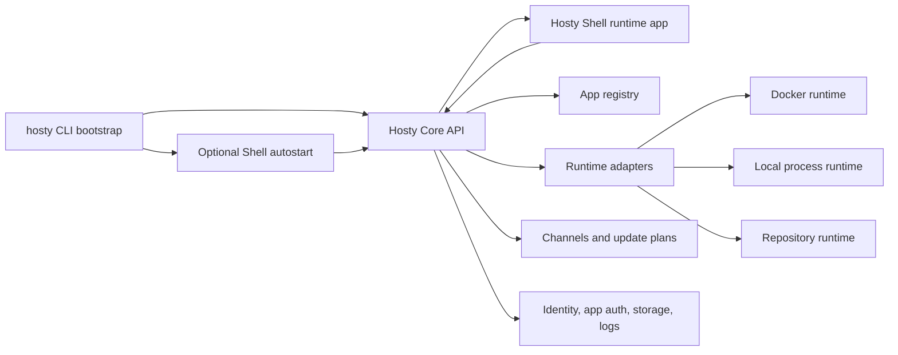
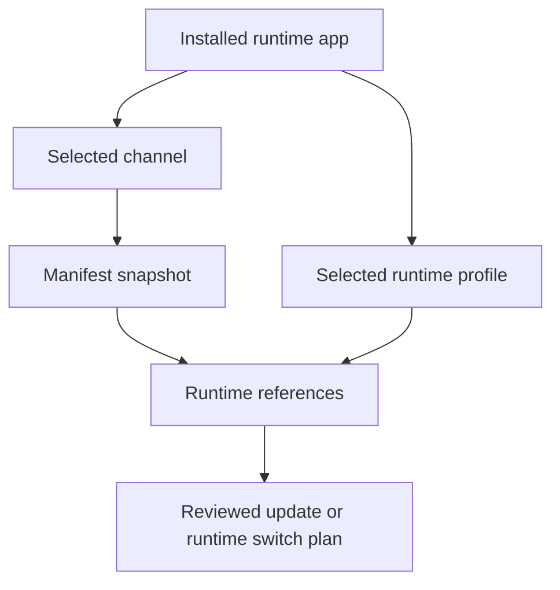
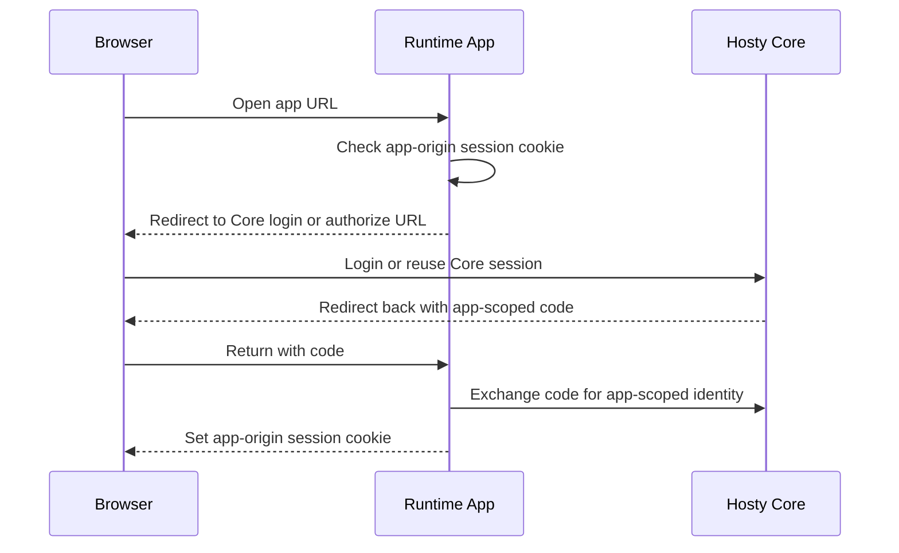

# Hosty Runtime App Platform

## Description

Hosty is the planned product model that evolves the current Docker Host implementation into a general local and remote application orchestrator.

The current system is Docker-first: administrators install Docker-hosted modules from JSON metadata files, and the Host Shell is bundled into the same Host application that exposes the backend API. That model remains supported as the legacy Docker module runtime during migration. The target model is broader and local-first:

- Hosty Core is a long-running local API and orchestration process.
- The `hosty` CLI is the bootstrap wrapper for Hosty Core and the local client for Core APIs.
- Hosty Shell is the default optional Hosty-managed runtime app and provides the web UI client.
- Runtime apps are Hosty-aware user-installed applications with one or more supported runtime profiles.
- Docker is one runtime adapter, not the product boundary.
- App manifests replace metadata JSON as the public contract name.
- Source repositories are optional, but when present they enable agent-driven development, pull request channels, and source-based runtime profiles.

The goal is a home or personal server orchestrator for many small applications, often built or modified by AI agents. Hosty should make these applications easy to install, update, inspect, switch between release channels, and eventually modify from in-context feedback in the Shell.



## Naming Direction

The current repository and command use Docker Host naming. That name is too narrow for the planned model.

Target names:

- Product and orchestrator: Hosty.
- CLI command: `hosty`.
- Current `docker-host` CLI: deprecated compatibility alias during migration.
- Backend service: Hosty Core, a local-first long-running process.
- Browser management UI: Hosty Shell, a default optional Hosty-managed runtime app.
- Installed user workloads: runtime apps.
- Built-in management workloads: default Hosty-managed apps or core services.

The exact repository name is not finalized. The planning docs should use Hosty for the target model while keeping references to Docker Host where they describe the implemented legacy behavior.

## Core Concepts

### Hosty Core

Hosty Core is the headless orchestration API and runtime control plane. In the target architecture it is a local-first long-running ASP.NET Core process, packaged as a single-file application in the same broad style as the current CLI. Core should use ASP.NET Core Minimal APIs for endpoint registration and configuration so the application stays compact, explicit, and easy to bootstrap. It is launched and managed by the `hosty` bootstrap CLI. It owns:

- app registry and persistent state;
- install, update, switch-channel, switch-runtime, configure, remove, and recovery plans;
- identity, user assignments, and module/app access policies;
- service discovery and dependency resolution;
- app launch, app-scoped identity exchange, and endpoint exposure;
- runtime adapter coordination, including the default Shell runtime app;
- logs, events, health, and diagnostics;
- channel resolution and source snapshot validation.

Hosty Core should not be a runtime app. It is the platform process that manages runtime apps, default Hosty-managed apps, and core services. The existing Docker-hosted Next implementation is a migration state, not the target Core launch model.

Core exposes APIs that the CLI, Shell, desktop clients, mobile clients, agents, and Hosty-aware runtime apps can call. The CLI should keep bootstrap responsibilities, while ordinary app lifecycle, user, assignment, identity, source, settings, and runtime operations flow through Core APIs.

A native tray/menu-bar companion can be added later as a platform-specific installer component for Windows, macOS, or Linux. It is not required for the first local-first Core split. For now, operators and agents should inspect whether Core is running through the `hosty` CLI and Core health/status APIs.

### Bootstrap CLI Responsibilities

The `hosty` CLI is not the owner of Hosty domain behavior. It is a bootstrap wrapper around Core and a local API client.

Bootstrap responsibilities:

- install or repair the local Core bootstrap package;
- locate Core configuration needed to start and contact Core;
- start, stop, restart, and report health/status for Core where the current platform supports it;
- after Core starts, call Core APIs to start the configured Shell runtime app when Shell autostart is enabled;
- run self-update checks for the bootstrap CLI;
- update the bootstrap CLI when a newer compatible bootstrap package is available;
- check whether Core has an available update and apply it when requested;
- check whether the default Hosty Shell runtime app has an available update and ask Core to apply it when requested.

When `hosty update` runs, the intended order is:

1. Check and update the bootstrap CLI.
2. Check and update Hosty Core.
3. Check and update Hosty Shell.

Other operations should call Core APIs. If Core is not installed or not running, the CLI should report that bootstrap state and offer the relevant bootstrap action instead of reimplementing Core behavior locally.

### Hosty Shell

Hosty Shell is the default browser UI client for Hosty Core. In the first split it remains a Next.js application, is built as a Docker image, and is launched by Core through the same runtime lifecycle used for other managed apps.

Shell is optional. A Hosty installation can run without Shell when managed by CLI, Core API, or another client. By default, `hosty start` starts Core and then asks Core to start the configured Shell runtime app when Shell autostart is enabled.

Shell responsibilities:

- show Hosty-managed apps and runtime apps;
- manage install/update/configuration flows;
- embed runtime app UIs;
- expose update and channel controls for Hosty itself;
- later collect UI annotations and send agent change requests.

Shell should be installed or available by default, but runtime apps should not depend on Shell to run. Apps can still be managed by CLI/API and opened by direct URLs when Shell is unavailable. Shell limits app discovery and launch affordances for the active Host user, but a launched Hosty-aware runtime app owns its own origin session after receiving an app-scoped launch code or completing the Core authorization flow.

Shell has the same Core-managed lifecycle shape as other managed apps: start, stop, restart, update, runtime status, logs, and health where supported. The Shell UI should not expose a self-stop action for the active Shell instance because stopping the UI from itself is confusing, but CLI and Core API may still stop Shell.

Shell is replaceable. A future web UI, macOS app, mobile app, or third-party management client can act as a Shell if it speaks Hosty Core APIs and follows the same authentication and authorization rules.

### Default Hosty Apps And Core Services

Default Hosty-managed apps and core services are Hosty-owned units that support the platform. Initial default app:

- Hosty Shell.

Potential future core services:

- gateway/proxy service for a future separate plan;
- identity service;
- scheduler;
- agent bridge;
- workflow runner;
- update coordinator.

Default Hosty-managed apps can be shown separately from user-installed runtime apps, but they should use the same Core lifecycle model unless a specific platform rule overrides an action. Shell should hide self-stop in its own UI, but the CLI and Core API can still stop it.

### Runtime Apps

Runtime apps are user-installed Hosty-aware applications. The current Docker modules become legacy runtime apps with `docker` runtime profiles during migration.

Runtime apps can be:

- Docker images with no known source repository;
- Docker images with an associated source repository;
- repository-backed applications launched by configured local commands such as `npm run`, `dotnet run`, or a Python command;
- local command apps whose runtime prerequisites are already installed on the host;
- CLI or command workloads used as dependencies by other apps.

A runtime app can be a user-facing UI app, a service dependency, or both. For example, Redis can be represented as a runtime app with no source repository and only a Docker runtime profile. Other apps can depend on it through service endpoints.

Wrapping arbitrary third-party web applications behind a Hosty gateway/proxy is out of scope for the current runtime app model. A browser runtime app should be written or adapted for Hosty: it can receive Core origin and app id configuration, exchange app-scoped launch codes or auth codes with Core, create its own app-origin session cookie, refresh or revalidate that session, and call scoped Core APIs such as user directory APIs when authorized.

## Manifest Contract

The public contract name should move from metadata JSON to manifest JSON.

Compatibility rules:

- Existing `schemaVersion: "0.2"` and `"0.3"` files remain valid legacy Docker module manifests.
- Existing API fields such as `metadataUrl` remain accepted during migration.
- New APIs should prefer `manifestUrl` while accepting `metadataUrl` as an alias.
- The Host should read legacy `metadata.json` and target `manifest.json` where needed.
- Docs and UI should use "manifest" for the target model.

Recommended new schema namespace:

```text
app.0.1
```

The new app manifest should separate app identity, optional source, runtime profiles, UI, storage, dependencies, and capabilities.

### App Data Directory

Each runtime app should have its own Hosty-managed app data directory. This is not one shared global data directory. The target convention is a stable `data/` child directory inside the app-owned state root:

```text
<hosty-data-root>/apps/<app-id>/data/
```

Legacy Docker modules currently live under `modules/<module-id>/`; migration can preserve the physical legacy path while exposing the same conceptual per-app data directory to new app model code. New app records should use `apps/<app-id>/data/` once the store layout migrates.

Examples:

```text
<hosty-data-root>/apps/com.example.project-manager/data/
<hosty-data-root>/apps/io.redis.cache/data/
```

Hosty should make the app data directory available to runtime profiles consistently:

- Docker runtime: bind-mount the host data directory into the container path declared by the manifest and pass the resolved container path through an environment variable.
- Local command runtime: pass the host data directory path through an environment variable.
- Stateless service definitions: normally do not receive a local data directory unless the manifest explicitly declares local state.

Recommended standard environment variable:

```text
HOSTY_APP_DATA_DIR
```

The manifest can declare whether the app expects local persistent data and how each runtime should receive it. Hosty may still create a data directory by default for first-party runtime apps, but stateless service definitions and apps with no local state should be able to opt out of backup and data directory behavior.

Example:

```json
{
  "data": {
    "enabled": true,
    "backup": {
      "enabled": true,
      "beforeUpdate": true
    },
    "targets": [
      {
        "runtime": "docker",
        "containerPath": "/app/data",
        "environment": "HOSTY_APP_DATA_DIR"
      },
      {
        "runtime": "localCommand",
        "environment": "HOSTY_APP_DATA_DIR"
      }
    ]
  }
}
```

For simple apps, Hosty can provide a default data target for each runtime adapter. More advanced apps can still declare additional storage mappings separately from the primary app data directory.

### Optional Source

`source` is optional.

Apps with no known source are still first-class runtime apps. A Docker-only dependency such as Redis may only provide an image runtime. Hosty should still be able to install, update, start, stop, expose, and provide it as a dependency.

When `source` is present, it enables additional workflows:

- agent-driven changes;
- pull request channel discovery;
- source checkout and local runtime profiles;
- commit-level update validation;
- repository-aware annotations and issue/PR creation.

### Multiple Runtime Profiles

A manifest can declare multiple runtime profiles. Hosty can install one app once, keep its persistent storage and configuration, and switch the active runtime profile through a reviewed plan.

Example:

```json
{
  "schemaVersion": "app.0.1",
  "id": "com.example.notes",
  "name": "Notes",
  "version": "1.4.0",
  "source": {
    "type": "git",
    "repository": "https://github.com/example/notes"
  },
  "runtimeProfiles": [
    {
      "key": "docker",
      "type": "docker",
      "default": true
    },
    {
      "key": "dev",
      "type": "localCommand"
    }
  ],
  "defaultRuntime": "docker",
  "services": [
    {
      "key": "app",
      "runtimes": {
        "docker": {
          "type": "docker",
          "image": "ghcr.io/example/notes:1.4.0",
          "ports": [
            {
              "key": "http",
              "containerPort": 3000,
              "protocol": "http",
              "public": true
            }
          ]
        },
        "dev": {
          "type": "localCommand",
          "workingDirectory": ".",
          "command": "npm run dev",
          "ports": [
            {
              "key": "http",
              "containerPort": 3000,
              "localPort": 3000,
              "protocol": "http",
              "public": true
            }
          ]
        }
      }
    }
  ],
  "endpoints": [
    {
      "key": "web",
      "service": "app",
      "port": "http",
      "public": true
    }
  ],
  "ui": {
    "entrypoint": {
      "endpoint": "web",
      "path": "/"
    }
  },
  "data": {
    "enabled": true,
    "targets": [
      {
        "runtime": "docker",
        "service": "app",
        "containerPath": "/app/data"
      }
    ]
  }
}
```

Runtime switching must preserve compatible:

- app id;
- storage mappings;
- settings;
- dependency contracts;
- user assignments;
- endpoint and browser launch exposure policy where possible.

If a target runtime profile changes storage, settings, endpoints, or dependencies, Hosty must show a plan before applying.

### Docker-Only App Example

An app can have no source repository:

```json
{
  "schemaVersion": "app.0.1",
  "id": "io.redis.cache",
  "name": "Redis",
  "version": "7.2",
  "runtimeProfiles": [
    {
      "key": "docker",
      "type": "docker",
      "default": true
    }
  ],
  "defaultRuntime": "docker",
  "services": [
    {
      "key": "redis",
      "runtimes": {
        "docker": {
          "type": "docker",
          "image": "redis:7.2"
        }
      }
    }
  ]
}
```

This supports dependency use without requiring Hosty or an agent to know where the image was built.

## Channels And Runtime Profiles

Channels and runtime profiles are separate axes.

- A runtime profile describes how an app runs.
- A channel selects a concrete version or source snapshot.
- A source repository describes where code may live.
- A manifest describes the app contract and available runtime profiles.

A channel must not imply Docker or source checkout by itself. It resolves to a manifest snapshot and optional channel-specific runtime references.

Example channel entry:

```json
{
  "id": "pr-42-button-style",
  "label": "PR #42 button-style",
  "kind": "pull-request",
  "source": {
    "repository": "https://github.com/example/notes",
    "ref": "refs/pull/42/head",
    "commit": "abc123"
  },
  "manifestUrl": "https://apps.example/notes/pr-42-button-style/manifest.json",
  "expiresAt": "2026-06-14T00:00:00Z"
}
```

The manifest resolved by that channel can point the Docker runtime to a PR image tag and the repository runtime to the same commit. The active runtime remains an app-level decision.



## App Access And Auth Model

Hosty Core owns platform authentication, authorization, and app access decisions. Shell is not the owner of authentication; it is only one client of Core APIs.

Initial auth roles:

- Hosty Core provides the local login, logout, session, setup, recovery, and identity APIs.
- Hosty Shell uses Core auth status and redirects to Core login when needed.
- The `hosty` CLI uses a trusted local control channel, not browser cookies or user bearer tokens.
- Runtime apps receive app-scoped identity from Core, not the primary Hosty session cookie.
- Future auth providers such as OIDC, Auth0, trusted proxy identity, or another system service should plug into Core auth without forcing Shell or runtime apps to change their basic protocol.

Hosty should support multiple browser access modes for runtime apps.

### Shell Embedded

This is the current direct-origin iframe model.

1. The user logs into Hosty Core through Shell.
2. Shell opens the runtime app in an iframe.
3. The app requests identity from its parent with `postMessage`.
4. Shell calls Core for an app-scoped signed identity token.
5. Shell posts the token to the app origin.
6. The app can use the token directly or exchange it for an app-origin cookie.

The Hosty session cookie stays on the Core/Shell origin. The runtime app receives only app-scoped identity.

### Standalone Auth Redirect

This is the preferred standalone mode for Hosty-aware apps.



Rules:

- The runtime app owns its app-origin session cookie.
- Core owns the main Hosty session.
- Core returns an app-scoped code or signed identity token with a target audience for that app.
- The app validates the identity and can periodically refresh or revalidate access through Core.
- The app should redirect to Core login when its app-origin session expires or Core says access is no longer valid.

This mode does not require proxying app UI traffic through Hosty. Browser runtime apps are expected to implement the Hosty-aware auth exchange themselves.

### Deferred Browser Proxy Mode

Wrapping arbitrary third-party browser apps through a Hosty gateway/proxy is not part of the current runtime app model. If Hosty later needs to wrap no-auth apps, legacy tools, or third-party browser UIs, that work should be captured in a separate plan with explicit security, routing, cookie, and support boundaries.

Service/API endpoint exposure remains distinct from browser UI app launch. A runtime app can expose dependency endpoints or integration APIs without making Hosty responsible for proxying its browser UI.

### App-Owned Integrations

Runtime apps can have their own third-party integrations, for example Azure DevOps PATs, OAuth grants, API keys, or service tokens. These are app-owned integration credentials, not Hosty user authentication.

Hosty can help by:

- storing app settings and secrets;
- passing selected secrets to runtime profiles;
- exposing configuration UI and audit records;
- restricting which Hosty users can configure or open the app.

Hosty should not become the authorization layer for every third-party API a runtime app calls. A Project Manager app can use Hosty identity for local user access while independently managing Azure DevOps or other integration credentials.

## App Data Backups

Hosty should provide a first-class backup and restore flow for each runtime app's primary data directory.

Primary goals:

- create a backup of that app's own `data/` directory before applying an app update;
- allow manual backups of one selected app at any time;
- allow restoring a previous backup for that app when an update or app bug corrupts local data;
- keep backup behavior independent of the runtime profile, so Docker and local command runtimes protect the same app data directory.

Initial backup format:

- compressed archive, preferably ZIP for portability;
- stored under the Hosty data root, outside the live app data directory;
- includes metadata such as app id, app version, selected channel, selected runtime, manifest digest, created time, reason, and archive digest.

Target layout:

```text
<hosty-data-root>/
  apps/
    <app-id>/
      data/
      manifest.json
  backups/
    <app-id>/
      2026-06-01T12-00-00Z_pre-update.zip
      2026-06-01T12-00-00Z_pre-update.json
    io.redis.cache/
      2026-06-01T12-30-00Z_manual.zip
      2026-06-01T12-30-00Z_manual.json
```

Backup reasons should include:

- `pre-update`;
- `manual`;
- `pre-runtime-switch`;
- `pre-restore`;
- `scheduled` if scheduled backups are added later.

Update behavior:

1. Hosty computes the update plan.
2. If the app data backup policy requires `beforeUpdate`, the apply step creates a backup before mutating runtime containers, local command state, or manifest files.
3. The update plan and apply result should include the backup id/path when a backup is created.
4. If backup creation fails for a backup-required app, the update should stop before applying changes.

Restore behavior:

1. Hosty shows available backups for an app.
2. The administrator selects a backup.
3. Hosty stops the active runtime app or requires it to be stopped.
4. Hosty creates a `pre-restore` backup of current data unless disabled by explicit confirmation.
5. Hosty replaces the live data directory from the selected backup.
6. Hosty restarts the app only when the administrator chooses to do so.

Open implementation details:

- retention policy, for example keep last N backups per app and optionally keep pre-update backups for N days;
- whether very large app data directories should support streaming archives and progress reporting;
- documenting that external mounts and additional storage mappings are excluded from Hosty-managed app backups;
- whether backup encryption is needed for secrets or sensitive local data;
- how to verify archive integrity before restore.

Apps that do not use local persistent data and stateless dependency records can disable backups in the manifest.

## Agent-Oriented Workflow

The long-term agent workflow should support fast changes to personal apps:

1. A user opens a runtime app through Hosty Shell.
2. The user selects a page element or region and adds an annotation.
3. Shell captures route, app id, channel, runtime profile, screenshot or DOM target, and the user note.
4. Hosty Core sends the change request to an agent bridge.
5. The agent edits the source repository and opens or updates a pull request.
6. CI publishes a pull request channel with a manifest snapshot and runtime artifacts where applicable.
7. Hosty shows the pull request channel for that app.
8. The user switches the app to the pull request channel and validates against the same local data.
9. The user promotes or merges the change.

This workflow should work for Docker-backed apps when the app has a source repository. It should also work for repository runtime profiles where Hosty runs the source directly.

## UI Model

The management UI should distinguish default Hosty-managed apps from user-installed runtime apps, while keeping the lifecycle model consistent.

Default Hosty-managed apps section:

- Hosty Shell.
- Future gateway, scheduler, agent bridge, or update services.
- Actions: `Open`, `Update`, `Restart`, and status/logs when supported.
- No `Remove`.
- Hide `Stop` for the active Shell instance inside Shell UI, but allow Shell stop through CLI and Core API.

Runtime apps section:

- User-installed applications and service dependencies.
- Actions: `Open`, `Update`, `Switch channel`, `Switch runtime`, `Restart`, `Stop`, `Configure`, `Remove`.
- Dependency-only apps may have no `Open` action.
- Apps without source repositories can still update through manifest/image channels.

The current installed modules view can migrate incrementally:

1. Keep existing Docker module rows.
2. Add a separate default Hosty-managed apps table above user-installed runtime apps.
3. Add summary fields such as `kind`, `system`, `capabilities`, `selectedChannel`, and `selectedRuntime`.
4. Rename UI copy from modules to apps where it does not break the implemented Docker module behavior.

## Persistent State Direction

The current `modules.json` remains the implemented store. The target store should evolve toward app-oriented records in `apps.json`.

Target concepts:

- synthesized default Hosty-managed app records for Hosty-owned apps when needed.
- `apps` records in `apps.json` for new runtime apps.
- legacy `modules` records in `modules.json` for compatibility.
- `manifestUrl` as preferred source pointer.
- `metadataUrl` retained for legacy records.
- `manifestPath` as preferred local copy path.
- `metadataPath` retained for legacy records.
- `selectedChannel` for the chosen app or default Hosty-managed app channel.
- `selectedRuntime` for the active runtime profile.
- `source` snapshot for repository-aware apps.
- `accessMode` for `shellEmbedded`, `standaloneAuthRedirect`, `gatewayProtected`, or future access modes.
- `data` policy for the primary app data directory and backup behavior.
- `backups` index or discoverable backup records for app data snapshots.
- `capabilities` for action availability.

Hosty Shell should be persisted as a managed runtime app once Shell delivery separates from Hosty Core. During migration, a synthesized default app registry is acceptable only as temporary compatibility behavior.

During migration, Hosty should be able to build one management view from both `apps.json` and legacy `modules.json`, but new installs should create or update only `apps.json`.

## Compatibility And Data Root Migration

Hosty should use a read-old/write-new migration strategy. The migration should avoid automatic data moves and keep legacy compatibility isolated in adapter layers that can be removed later.

### Data Root Selection

The new default data root is:

```text
~/.hosty
```

The legacy data root is:

```text
~/.docker-host
```

Selection rules:

1. If an explicit data root is configured, use it.
2. If `~/.hosty` exists, use it.
3. If `~/.hosty` does not exist and `~/.docker-host` exists, use `~/.docker-host` as the active legacy root.
4. If neither exists, create and use `~/.hosty`.
5. If both exist, prefer `~/.hosty`.

This lets existing installations keep working after CLI/Core updates while new installations use Hosty naming. When both roots exist, Hosty should not silently merge state from `~/.docker-host` into `~/.hosty`; administrators can migrate data explicitly when needed.

### Registry And Directory Layout

Target layout for new installs:

```text
<hosty-data-root>/
  apps.json
  apps/
    <app-id>/
      manifest.json
      data/
  backups/
    <app-id>/
```

Legacy layout remains readable:

```text
<legacy-data-root>/
  modules.json
  modules/
    <module-id>/
      metadata.json
      ...
```

New app installs should write only the new app layout:

- registry: `apps.json`;
- app root: `apps/<app-id>/`;
- manifest copy: `apps/<app-id>/manifest.json`;
- primary data directory: `apps/<app-id>/data/`.

Legacy installed modules should remain readable through a legacy module adapter:

- registry: `modules.json`;
- module root: `modules/<module-id>/`;
- metadata copy: `modules/<module-id>/metadata.json`.

The target layout is relative to the active data root. If only `~/.docker-host` exists and Hosty uses it as the active legacy root, new app installs should still use `<active-root>/apps.json` and `<active-root>/apps/<app-id>/`.

Hosty should not automatically move legacy module directories into the new app directory. If an administrator wants to migrate data manually, the supported path is:

1. remove or uninstall the legacy module when appropriate;
2. copy the desired legacy module data into the new app's `apps/<app-id>/data/` directory;
3. install the app through the new manifest/app flow;
4. let the new runtime profile use the existing data directory.

### Update Behavior For Legacy Modules

Legacy modules that are still installed from `modules.json` can continue to update in place through the legacy module update path. This avoids surprising data movement during a normal update.

New app installs and updates should use the new app layout. A future explicit migration command can convert a legacy module record to an app record, but routine update should not silently migrate registry files or data directories.

### Compatibility Adapter Boundaries

Compatibility code should be kept narrow and removable:

- data root resolver: `~/.hosty` preferred, `~/.docker-host` fallback;
- registry reader: read `apps.json` and legacy `modules.json`;
- summary mapper: legacy module record to runtime app summary;
- manifest mapper: legacy metadata `0.2`/`0.3` to Docker runtime app model;
- path resolver: `apps/<id>/manifest.json` for new apps, `modules/<id>/metadata.json` for legacy modules;
- CLI aliases: `docker-host` and `modules` commands map to `hosty` and `apps` commands during deprecation.

These adapters should be marked as compatibility code in source comments and tests so they can be removed intentionally after the deprecation window.

## Compatibility With Current Docker Modules

The current Docker module implementation remains the first runtime adapter:

- Legacy metadata `0.2` and `0.3` maps to runtime app kind `runtime`.
- Legacy `containers` map to Docker runtime profiles.
- Legacy `ui` maps to app UI entrypoint.
- Legacy dependencies and settings continue to use existing install/update plans.
- Existing `docker-host modules install <metadata-url>` remains supported during migration.
- New CLI command shapes should prefer `hosty apps install <manifest-url>`.

The migration should avoid a large rewrite of install/update behavior. The legacy Docker module engine can be wrapped by the new app model first, then generalized runtime-by-runtime.

## Milestones

### Phase 1 - Document target vocabulary

**Status**: Completed

- Introduce Hosty, Hosty Core, Hosty Shell, default Hosty-managed apps, runtime apps, manifests, channels, and runtime profiles.
- Document that `source` is optional.
- Document that Docker is the first runtime adapter, not the product boundary.
- Update channel planning to prefer manifest snapshots over metadata URLs.

### Phase 2 - Add compatibility fields

**Status**: Completed

- Add Hosty data root resolution with `~/.hosty` preferred and `~/.docker-host` as a legacy fallback.
- Add app store reading from `apps.json` plus legacy module reading from `modules.json`.
- Add new install writes to `apps.json` and `apps/<app-id>/`, even when the active root is legacy `~/.docker-host`.
- Add `manifestUrl` as an accepted alias for existing install/update API requests.
- Add `manifestPath` alongside `metadataPath` in internal models where useful.
- Keep `metadataUrl` and `metadataPath` for legacy records.
- Keep existing metadata validators for `0.2` and `0.3`.
- Start using "manifest" in docs and new UI labels.
- Isolate root, registry, path, and metadata compatibility behavior in removable adapter classes.

### Phase 3 - Add app summary model

**Status**: Completed

- Add app summary fields for `kind`, `system`, `capabilities`, `selectedChannel`, and `selectedRuntime`.
- Add current app access summary fields for Shell-embedded apps: `accessMode`, `entryPath`, `embeddedUrl`, `origin`, `originScope`, and `identityTokenUrl`.
- Keep legacy module summary fields for current screens.
- Add a default Hosty Shell app entry.
- Show default Hosty-managed apps separately from user-installed runtime apps in the management UI.
- Disable unsupported actions based on capabilities rather than hardcoded module ids.
- Defer standalone auth redirect and split-origin availability summaries to Phase 8 because those access modes are not implemented yet.

### Phase 4 - Rename CLI surface

**Status**: Completed

- Introduce the `hosty` CLI command.
- Keep `docker-host` as a deprecated alias during migration.
- Install or update a `hosty` executable or shim in the managed CLI bin directory.
- Keep a `docker-host` compatibility executable or shim pointing to the same CLI while deprecated commands remain supported.
- Reconcile the shell profile PATH block during install and update so the managed CLI bin directory is discoverable from new terminals.
- Print a one-line manual `export PATH=...` instruction when the current terminal session does not yet include the managed CLI bin directory.
- Prefer `hosty apps` over `docker-host modules` in new docs.
- Keep current commands working until the new app model is stable.

### Phase 5 - Define `app.0.1` manifest schema

**Status**: Completed

- Specify and document the first compatibility manifest shape: identity, optional source, channels URL, runtime profiles, UI, primary app data directory, storage, settings, dependencies, endpoints, and reserved `access`/`capabilities` fields.
- Add parser and validator for `schemaVersion: "app.0.1"`.
- Map legacy Docker module metadata into an app manifest compatibility model.
- Store new app manifest copies as `apps/<app-id>/manifest.json`, with legacy `modules/<module-id>/metadata.json` retained for legacy module records.
- Defer active access-mode behavior and capability overrides to later phases. Production local-command runtime execution is tracked in the runtime profiles/source runtimes plan.

### Phase 6 - Add app data backup and restore

**Status**: Completed

- Create a standard primary app data directory convention.
- Inject `HOSTY_APP_DATA_DIR` into Docker runtime profiles that have a primary data mapping.
- Document local command `HOSTY_APP_DATA_DIR` injection in the runtime profiles/source runtimes plan.
- Add backup records and ZIP archive creation for app data directories.
- Add pre-update backups for apps with a primary data directory.
- Add manual backup and restore APIs.
- Add restore safety behavior: Core requires the runtime app to be stopped before restore and can create an optional `pre-restore` backup.
- Document the Stage 4 retention follow-up boundary.

## Follow-up Planning

The compatibility foundation is intentionally smaller than the long-term Hosty product model. Remaining work moved to focused planning documents so each subsystem can be implemented in a safer order:

- [Runtime Profiles And Source Runtimes](runtime-profiles-and-source-runtimes.md) - app-native lifecycle state, source/local command runtime execution, existing-user CLI identity helpers, legacy developer mode removal, and runtime switching.
- [App Auth And Origin Separation](app-auth-and-origin-separation.md) - Hosty-aware app auth, standalone launch links, and split Core/Shell public origins.
- [Agent Bridge Workflow](agent-bridge-workflow.md) - Shell annotations, agent requests, repository edits, pull request channels, and validation.
- [App Data Backup Retention](../features/app-data-backup-retention.md) - completed automatic retention, deletion APIs, scheduled cleanup, and UI/CLI controls for backups.

## Resolved Decisions

No open questions remain for this planning pass. The current accepted decisions are:

- `source` is optional. Apps can be Docker-only, source-less, or otherwise runtime-only without a source repository known to Hosty.
- Hosty Core is the local-first long-running API and runtime control process. It is launched and managed by the `hosty` bootstrap CLI and is not itself a runtime app.
- The `hosty` CLI remains responsible for bootstrap operations and then performs ordinary operations through Hosty Core APIs.
- `hosty update` should check and update the bootstrap CLI first, then Core, then the default Hosty Shell runtime app.
- Core owns ordinary app lifecycle and domain operations. The CLI should not duplicate Core behavior except for bootstrap actions needed when Core is unavailable.
- Native tray/menu-bar companions are deferred. The current Core running/stopped UX should be exposed through the `hosty` CLI and Core health/status APIs.
- Shell is an optional Hosty-managed runtime app and default web client for Hosty Core. It currently remains a Next.js app built and run as a Docker container.
- Shell uses the same Core-managed lifecycle shape as other managed apps, but Shell UI should hide self-stop for the active Shell instance. CLI and Core API may still stop Shell.
- `hosty start` starts Core and then asks Core to start the configured Shell runtime app when Shell autostart is enabled. Shell autostart is enabled by default.
- Core and Shell public origins are split through `HOST_CORE_PUBLIC_ORIGIN` and `HOST_SHELL_PUBLIC_ORIGIN`; `HOST_PUBLIC_ORIGIN` remains a compatibility alias for combined deployments.
- Default Hosty-managed apps and user-installed runtime apps should be shown in separate UI sections, even if they share a backend summary shape.
- Source/local command runtime workflows apply to default Hosty-managed apps too. The current combined Host app is the temporary local-source target until Core and Shell split.
- Core or the combined Host cannot rely on its own in-process Core API to complete self runtime replacement after it exits; self-runtime switch/restart operations require the trusted CLI or another outer supervisor.
- The existing Docker-hosted Next implementation is a migration state. In that state, Core must not execute localCommand apps by spawning child processes inside the Core container.
- Channels are runtime-neutral. They select a manifest/source snapshot, not specifically a Docker image.
- Channels may add, remove, or modify runtime profiles, but only through a reviewed update plan.
- Channel switching must not implicitly switch the active runtime unless the current runtime no longer exists and the plan explicitly confirms the replacement.
- Package-only app distribution, such as installing apps directly from npm packages, is out of scope. Runtime apps are installed from Docker images or repositories.
- Repository-backed apps run through a generic local command runtime. Commands such as `npm run ...`, `dotnet run`, or Python commands are valid when the required toolchain is installed.
- `metadata.json` files should not be renamed on disk until the app-native lifecycle refactor is complete and first-party demo workflows use the app manifest contract. New docs and APIs should prefer manifest terminology first, while preserving scoped compatibility during that transition.
- Hosty Core should move to a local-first ASP.NET Core single-file process before source/local command runtime execution becomes the primary development workflow.
- Hosty Core should use ASP.NET Core Minimal APIs for the first Core implementation.
- Redis-like dependencies are runtime apps with service endpoints, possibly without UI and without source.
- Hosty CLI install and update should reconcile PATH, create or refresh the `hosty` command, and keep a deprecated `docker-host` compatibility shim while needed.
- Hosty supports both `~/.hosty` and legacy `~/.docker-host` data roots. Explicit configuration wins; otherwise `~/.hosty` is preferred, `~/.docker-host` is used only when the new root does not exist, and if both exist Hosty uses `~/.hosty`.
- Hosty should not silently merge `~/.docker-host` into `~/.hosty` when both roots exist.
- New runtime app installs write to `apps.json` and `apps/<app-id>/`. Legacy `modules.json` and `modules/<module-id>/` remain readable through compatibility adapters.
- Legacy modules discovered from `modules.json` update in place through the legacy path. Routine update must not migrate registry files or physical app data.
- After app-native lifecycle state is implemented, first-party demo workflows use `app.0.1`, and legacy developer mode is removed, `modules.json` can be removed as a required lifecycle store and legacy module metadata support can be reduced to an explicit migration/import path if still needed.
- Physical data migration is manual or handled by a future explicit migration command; it is not part of install or update.
- Compatibility code should be isolated in removable adapters and marked as temporary compatibility behavior.
- Gateway/proxy wrapping for arbitrary third-party browser apps is out of scope for the current runtime app model.
- Hosty-aware apps should use standalone auth redirect, Shell-provided launch codes, or app-scoped identity exchange with Core.
- Apps that do not implement Hosty auth are apps that cannot redirect to Core, exchange app-scoped auth or launch codes, validate Hosty-signed identity, or create app-local sessions from Hosty identity.
- Runtime apps must not receive the main Hosty session cookie. They receive only app-scoped codes or signed identity tokens.
- Third-party integration credentials such as Azure DevOps PATs, OAuth grants, API keys, and service tokens are app-owned settings or secrets, not Hosty user auth.
- Most first-party runtime apps receive a primary per-app `data/` directory exposed as `HOSTY_APP_DATA_DIR`; stateless apps and dependency records may opt out.
- Apps with local persistent data should create a backup before update by default. If backup is required and cannot be created, update must stop before mutation.
- Hosty-managed backups include only the app's primary per-app `data/` directory. External mounts and additional storage mappings are excluded.
- Restore should not automatically restart the app. Stop or require stopping the runtime app, create a `pre-restore` backup, restore data, then offer restart as a separate action.
