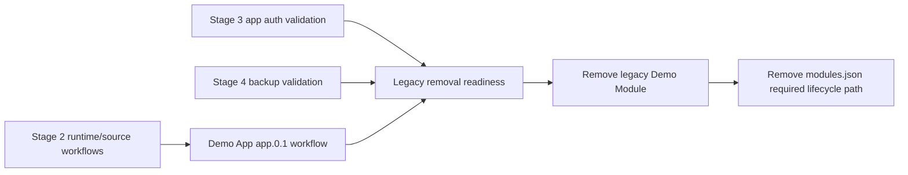

# Legacy Demo Module Removal

## Description

This plan tracks the cleanup that was previously listed as the final cleanup phase of Stage 2 runtime profiles and source runtimes. It is intentionally separate from Stage 2 so the completed runtime/source business logic can stay closed while the legacy compatibility fixture remains available for later validation.

The cleanup removes the repository-local legacy Demo Module, reduces `modules.json` from a required lifecycle store to a migration/import compatibility input where still needed, and updates release, CI, Shell, CLI, and documentation references so the `app.0.1` Demo App is the only first-party runtime app workflow.

The work should run after Stage 3 app auth/origin separation and Stage 4 backup retention management have enough validation coverage that they no longer need the legacy schema `0.3` Demo Module fixture. Live Docker daemon smoke tests for published Demo App image workflows should pass before removing the fixture.

## Milestones

### Phase 1 - Confirm removal readiness

**Status**: Not Started

- Verify the Demo App covers install, update, start, stop, restart, configure, remove, recovery, gateway routing, identity, assignments, backup, restore, delete-data, source override, local command runtime, Docker runtime, and runtime switching workflows.
- Run live Docker daemon smoke tests for the published Demo App Docker image workflow.
- Confirm Stage 3 app auth and split-origin validation no longer depends on `modules/demo-module` or legacy schema `0.3` UI identity behavior.
- Confirm Stage 4 backup retention validation no longer depends on legacy module data layout or Demo Module fixtures.
- Identify any tests, fixture routes, docs, package workspaces, and CI workflows that still reference `modules/demo-module`.

### Phase 2 - Remove repository Demo Module fixture

**Status**: Not Started

- Remove `modules/demo-module` from the repository and root workspace list.
- Remove the legacy Demo Module fixture route and replace any default install URL examples with `apps/demo-app/manifest.json` or a published Demo App manifest URL.
- Remove `demo-module-image.yml` and CI path filters/jobs that build or lint the Demo Module.
- Update release docs so Demo App image publication is the only first-party demo image workflow.
- Update feature docs that still describe Demo Module as an active fixture.

### Phase 3 - Retire legacy lifecycle-store dependency

**Status**: Not Started

- Remove `modules.json` as a required lifecycle store for app-oriented installs after app-owned lifecycle state covers the full app management surface.
- Keep an explicit migration/import path for already-installed legacy modules if backward compatibility is still required.
- Remove code paths that write new app-oriented lifecycle state back to `modules.json`.
- Update API, CLI, Shell, and domain docs to describe `modules.json` only as a legacy migration/import input or remove it entirely if support is intentionally dropped.

### Phase 4 - Validate and document final cleanup

**Status**: Not Started

- Run the full repository CI path after fixture removal.
- Re-run app lifecycle, auth/open, source/local command, runtime switching, and backup/restore smoke checks against Demo App.
- Update `docs/root.md`, `docs/roadmap.md`, and affected feature docs with the final compatibility boundary.
- Remove this planning document after the cleanup is implemented and its lasting details have been moved into feature docs.

## Open Questions And Recommendations

- Question: Should existing installations with legacy module records keep working after this cleanup?
  Answer: Not decided.
  Recommendation: Prefer an explicit migration/import path for preserved legacy data instead of keeping `modules.json` as a permanent app lifecycle store.

- Question: Should legacy schema `0.3` metadata remain installable after Demo Module is removed?
  Answer: Not decided.
  Recommendation: Decide based on real compatibility requirements. If it remains supported, keep one minimal test fixture that is not presented as a first-party demo app.
