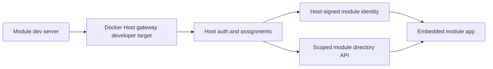

# Module Development Harness

## Description

Module development should use a fast integrated loop before falling back to image rebuilds. The accepted model is to run the module application locally, route it through the Docker Host gateway as a developer target, and seed Host-owned development users and assignments so the module receives the normal Host-signed identity contract.

The harness must not inject fake module identity tokens directly into module requests. Docker Host should remain responsible for authentication, gateway authorization, `X-Docker-Host-Identity` signing, scoped directory responses, and app shell embedding. Modules should keep using production-facing validation logic while their code runs from a local development server.



## Milestones

### Phase 1 - Standardize the current integrated loop

**Status**: Completed

Docker Host already supports local developer targets through `HOST_MODULE_DEV_MODE=enabled` and `docker-host modules dev link`. The repository demo script `npm run host:dev:demo` starts the Host, starts the demo module, seeds development browser accounts, and writes a deterministic developer target under the development data root.

Tasks and goals:

- Treat the integrated dev target flow as the default module development recommendation.
- Keep standalone module mocks limited to module-owned UI or business logic tests.
- Use production-like local images only for Dockerfile, storage, lifecycle, install, update, and container runtime checks.
- Document that Host-owned identity tokens should be tested through the gateway, not by hand-written token fixtures.

### Phase 2 - Add reusable dev manifest

**Status**: Not Started

Add a module-local manifest that describes how to run a module through Docker Host without rebuilding its image for every app change.

The manifest should include:

- metadata URL or metadata file source;
- local module command and working directory;
- target hostname, port key, target URL, exposure policy, and identity mode;
- development users and module assignments;
- module directory policy such as whether email is included;
- optional environment overrides for the module process.

Example shape:

```json
{
  "metadataUrl": "http://localhost:3000/fixtures/modules/demo-module",
  "moduleCommand": "npm run dev",
  "target": {
    "hostname": "demo.localhost",
    "portKey": "http",
    "targetBaseUrl": "http://127.0.0.1:3100",
    "policy": "assignedUsersOnly",
    "identity": "required"
  },
  "users": [
    { "email": "admin@docker-host.local", "role": "host.admin" },
    { "email": "user@docker-host.local", "role": "host.user", "assigned": true }
  ],
  "directoryPolicy": {
    "includeEmail": true
  }
}
```

### Phase 3 - Add CLI orchestration

**Status**: Not Started

Add an installed-CLI workflow that can start or prepare the integrated development loop from a manifest.

Target command shape:

```bash
docker-host dev up --manifest modules/demo-module/.docker-host/dev.json
docker-host dev reset --manifest modules/demo-module/.docker-host/dev.json
```

Tasks and goals:

- Ensure `HOST_MODULE_DEV_MODE=enabled` is configured before linking targets.
- Start or restart the Host when launch settings change.
- Seed development users, assignments, and module directory policy through Host-owned APIs.
- Link or update the developer target using the existing module developer target API.
- Start the local module command in the foreground and shut it down cleanly.
- Print the Host shell app URL and the seeded development accounts.

### Phase 4 - Add validation affordances

**Status**: Not Started

Make the harness useful for repeatable validation, not only manual browsing.

Tasks and goals:

- Add a status command that reports Host readiness, target reachability, app registry visibility, and identity mode.
- Add a reset command that clears only harness-owned developer state for the selected manifest.
- Add optional smoke checks for app shell embedding, route rewriting, identity token presence, and scoped directory responses.
- Keep production-like Docker image validation as a separate explicit step.

## Open Questions And Answers

- **Question:** Should the harness mint module identity tokens itself?
  **Answer:** No. That would bypass the gateway contract and hide token audience, issuer, key, and header-stripping bugs.
  **Recommendation:** Always let Docker Host mint `X-Docker-Host-Identity` through the normal gateway or app embed path.

- **Question:** Should user and assignment seeding write directly to Host JSON files?
  **Answer:** Direct writes are acceptable only for repository-local helper scripts such as the demo shell. A reusable installed CLI workflow should use Host-owned APIs.
  **Recommendation:** Add API support where needed before implementing `docker-host dev up` for external modules.

- **Question:** Should the harness replace production-like image testing?
  **Answer:** No. It shortens the app and gateway feedback loop, but it does not prove Dockerfile, storage mount, install, update, or lifecycle behavior.
  **Recommendation:** Use the harness first, then run local image install testing before shipping module runtime changes.
