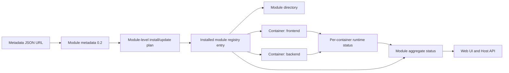

# Multi-container Modules

## Description

Docker Host modules должны поддерживать несколько Docker containers внутри одного логического модуля. Это позволит одному модулю запускать связанные сервисы, например `frontend` и `backend`, сохраняя установку, обновление, версионирование, recovery и удаление на уровне модуля.

Это намеренно breaking change для текущей модели `schemaVersion: "0.1"`. Обратная совместимость не нужна: код должен заменить старый single-container contract, а не поддерживать две формы manifest одновременно.

Пользовательская модель остается module-first. Containers являются runtime services внутри модуля. В Web UI эти элементы лучше называть services, а в manifest/backend contracts использовать точный термин `containers`.



## Accepted Decisions

- Использовать `schemaVersion: "0.2"` для нового manifest contract.
- Удалить поддержку `schemaVersion: "0.1"` из validation, planning, install/update, recovery, tests, fixtures и documentation.
- Заменить top-level `image` и `runtime` на top-level `containers[]`.
- Оставить identity и version на уровне модуля. Containers внутри модуля не имеют отдельных версий.
- Считать install и update операциями над модулем целиком. Изменение любого container image или runtime declaration означает изменение module update plan.
- Не добавлять специальную per-container update semantics. Docker Host должен пересчитать полный plan и применить обновление модуля как одну операцию.
- Поведение unchanged images оставить Docker и pull policy. Docker Host все равно проходит по всем containers в плане.
- Оставить dependencies отношениями между логическими модулями, а не между отдельными containers.
- Разрешать dependency URLs через стабильные module endpoints. Endpoint может внутри указывать на любой container dependency module.
- Добавить top-level `endpoints[]` для dependency resolution и gateway exposure.
- Генерировать deterministic Docker container names и network aliases из `moduleId + containerKey`.
- Показывать в Web UI и aggregate module status, и per-container status.

## Target Manifest Shape

Новый manifest описывает containers как runtime services, принадлежащие модулю:

```json
{
  "schemaVersion": "0.2",
  "id": "com.acme.app",
  "name": "Acme App",
  "description": "Frontend and backend packaged as one Docker Host module.",
  "version": "1.0.0",
  "containers": [
    {
      "key": "backend",
      "image": {
        "repository": "ghcr.io/acme/app-backend",
        "tag": "1.0.0",
        "pullPolicy": "ifNotPresent"
      },
      "runtime": {
        "ports": [
          {
            "key": "http",
            "containerPort": 8080,
            "protocol": "http"
          }
        ],
        "resources": {
          "cpus": 0.5,
          "memory": "512m"
        }
      }
    },
    {
      "key": "frontend",
      "dependsOn": ["backend"],
      "image": {
        "repository": "ghcr.io/acme/app-frontend",
        "tag": "1.0.0",
        "pullPolicy": "ifNotPresent"
      },
      "runtime": {
        "ports": [
          {
            "key": "http",
            "containerPort": 3000,
            "protocol": "http"
          }
        ]
      }
    }
  ],
  "endpoints": [
    {
      "key": "web",
      "container": "frontend",
      "port": "http",
      "public": true
    },
    {
      "key": "api",
      "container": "backend",
      "port": "http",
      "public": false
    }
  ],
  "connections": [
    {
      "source": {
        "type": "endpoint",
        "key": "api"
      },
      "targets": [
        {
          "container": "frontend",
          "type": "env",
          "name": "BACKEND_BASE_URL"
        }
      ]
    }
  ]
}
```

## Manifest Rules

- `containers[].key` должен быть уникальным внутри модуля и использовать безопасный lowercase identifier.
- Каждый container должен иметь ровно один `image`.
- `containers[].runtime.ports[].key` должен быть уникальным внутри конкретного container.
- `endpoints[].key` должен быть уникальным на уровне модуля.
- `endpoints[].container` должен ссылаться на существующий container key.
- `endpoints[].port` должен ссылаться на существующий port key внутри выбранного container.
- `endpoints[].public` заменяет старый hint `runtime.ports[].public`.
- `containers[].dependsOn` используется только для startup order внутри модуля, а не как version boundary.
- Cycles в `containers[].dependsOn` должны отклоняться.
- Модуль должен иметь минимум один container.
- Старые top-level `image` и `runtime` не должны приниматься validator.

## Settings And Environment

Settings остаются module-level, потому что администратор конфигурирует модуль, а не отдельные containers. Setting targets должны стать массивом, чтобы один setting можно было прокинуть в один или несколько containers.

```json
{
  "key": "PUBLIC_API_BASE_URL",
  "type": "url",
  "required": false,
  "default": "http://localhost:8080",
  "targets": [
    {
      "container": "frontend",
      "type": "env",
      "name": "PUBLIC_API_BASE_URL"
    }
  ]
}
```

Environment variable conflict checks должны быть scoped per container. Один и тот же env name допустим в разных containers.

Internal module connections должны использовать top-level `connections[]`. Это позволит Host прокинуть Docker-network URL одного endpoint в другой container того же модуля без hard-coded Docker aliases в приложении.

Dependency connections тоже должны указывать target containers:

```json
{
  "id": "com.acme.identity",
  "version": "1",
  "required": true,
  "metadataUrl": "https://modules.example/identity.json",
  "connection": {
    "endpoint": "api",
    "targets": [
      {
        "container": "backend",
        "type": "env",
        "name": "IDENTITY_BASE_URL"
      }
    ]
  }
}
```

## Storage

Storage остается module-owned, но mount targets должны быть container-aware.

Recommended shape:

```json
{
  "key": "data",
  "label": "Data",
  "purpose": "data",
  "required": true,
  "mount": {
    "recommended": true,
    "type": "bind",
    "modulePath": "data"
  },
  "targets": [
    {
      "container": "backend",
      "containerPath": "/app/data",
      "writable": true
    },
    {
      "container": "frontend",
      "containerPath": "/app/data",
      "writable": false
    }
  ]
}
```

External mount collections должны использовать ту же target model, чтобы один выбранный host path мог монтироваться в один или несколько containers с container-specific paths и read-only behavior.

## Installed State

`modules.json` должен перестать хранить single-container поля:

- удалить `containerName`;
- удалить `image`;
- удалить single `runtimeStatus` assumptions из API models;
- заменить single-container storage mappings на container-aware targets.

Recommended installed module record shape:

```json
{
  "id": "com.acme.app",
  "metadataUrl": "https://modules.example/app.json",
  "metadataPath": "modules/com.acme.app/metadata.json",
  "metadataDigest": "sha256:...",
  "planDigest": "sha256:...",
  "operationStatus": "installed",
  "containers": [
    {
      "key": "backend",
      "containerName": "mod-com-acme-app-backend",
      "networkAlias": "mod-com-acme-app-backend",
      "image": {
        "repository": "ghcr.io/acme/app-backend",
        "tag": "1.0.0",
        "reference": "ghcr.io/acme/app-backend:1.0.0",
        "pullPolicy": "ifNotPresent"
      }
    },
    {
      "key": "frontend",
      "containerName": "mod-com-acme-app-frontend",
      "networkAlias": "mod-com-acme-app-frontend",
      "image": {
        "repository": "ghcr.io/acme/app-frontend",
        "tag": "1.0.0",
        "reference": "ghcr.io/acme/app-frontend:1.0.0",
        "pullPolicy": "ifNotPresent"
      }
    }
  ],
  "settings": {},
  "storageMappings": {},
  "externalMounts": [],
  "resolvedDependencies": [],
  "installedAt": "2026-05-21T09:00:00Z",
  "updatedAt": "2026-05-21T09:00:00Z",
  "lastError": null
}
```

## Runtime API Shape

`ModuleSummary` должен включать:

- module identity и operation status;
- aggregate runtime status;
- `containers[]` с per-container runtime status;
- endpoint summary;
- last module-level error.

Recommended aggregate states:

- `not_created`, если все required containers отсутствуют;
- `running`, если все required containers running;
- `degraded`, если хотя бы один required container не running или имеет unknown state;
- `exited`, если все required containers stopped/exited;
- `unknown`, если Docker status невозможно определить.

Текущий `ModuleRuntimeState` можно расширить значением `degraded` или выделить отдельный `ModuleAggregateRuntimeState`.

## Lifecycle Behavior

Module-level lifecycle API surface остается прежним:

- `POST /api/modules/{moduleId}/start`
- `POST /api/modules/{moduleId}/stop`
- `POST /api/modules/{moduleId}/restart`
- install, update, retry, cleanup, remove

Execution changes:

- `start` запускает containers в dependency order по `containers[].dependsOn`;
- `stop` останавливает containers в reverse dependency order;
- `restart` останавливает в reverse order, затем запускает в dependency order;
- install создает и запускает все containers модуля;
- update применяется к модулю целиком и может пересоздавать все containers модуля;
- retry пересоздает missing или failed module containers из stored module record и local metadata;
- cleanup/remove plans перечисляют каждый container и каждый image reference.

Per-container lifecycle actions не входят в первую implementation. Их можно добавить позже, если diagnostics или recovery workflows потребуют точечных действий.

## Dependencies And Endpoints

Dependencies остаются module-to-module relationships. Consumer dependency request ссылается на endpoint key dependency module, а не на concrete container key.

Example resolution:

- Consumer module declares dependency `com.acme.identity`.
- Consumer requests dependency endpoint `api`.
- Dependency metadata defines endpoint `api -> container: backend, port: http`.
- Host resolves URL from dependency container network alias and container port.
- Host injects URL into requested target containers on the consumer.

Так dependency contracts остаются стабильными даже если dependency module позже перенесет endpoint из одного internal container в другой.

Gateway exposure тоже должен ссылаться на module endpoint keys вместо raw runtime port keys. Для этого нужно обновить gateway exposure validation и resolution с `moduleId + portKey` на `moduleId + endpointKey`.

## Web UI Changes

Dashboard должен остаться плотным и module-first.

- Заменить колонку `Image` на `Services`.
- Оставить `Runtime` как aggregate module status.
- Показывать service chips в строке модуля, например `frontend Running`, `backend Running`.
- Показывать aggregate copy: `2/2 running`, `1/2 degraded`, `0/2 stopped`.
- Expanded row должен показывать services table:
  - service key;
  - image reference;
  - Docker state;
  - container name;
  - container id;
  - network alias;
  - endpoints and ports;
  - started/finished timestamps;
  - per-container error.
- Stats cards должны считать installed modules и running services.
- Install/update review pages должны показывать containers, images, endpoints, dependency URL targets и container-aware storage mappings.
- Recovery dialogs должны перечислять все containers, затронутые cleanup/remove.

## Milestones

### Phase 1 - Contract and schema replacement

**Status**: Completed

Заменить single-container domain contract на multi-container contract.

- Обновить `ModuleMetadata`, `NormalizedModuleMetadata`, install/update plan types, installed module records и API response types.
- Удалить `image`, `runtime`, `containerName` и single `runtimeStatus` из module-level contracts, где они подразумевают один container.
- Добавить `containers[]`, `endpoints[]`, container-aware `settings[].targets`, dependency connection targets и container-aware storage targets.
- Обновить metadata validation так, чтобы принималась только `schemaVersion: "0.2"`.
- Удалить старые compatibility paths и tests, которые normalize `0.1` metadata.

### Phase 2 - Planning and conflict detection

**Status**: Completed

Сделать install/update plans описывающими все containers модуля.

- Создавать planned Docker target для каждого container.
- Генерировать deterministic container names и network aliases из `moduleId + containerKey`.
- Pull/check каждого image из plan.
- Проверять duplicate container keys, endpoint keys, Docker names, aliases, storage mappings, env targets per container и dependency cycles.
- Recompute update plans для всего модуля и показывать changes per container.
- Оставить update apply простым: replace/recreate module containers как unit при принятом runtime-affecting update.

### Phase 3 - Docker lifecycle

**Status**: Completed

Научить Docker runtime layer работать с набором module containers.

- Inspect всех module containers и возврат per-container statuses.
- Start containers в dependency order.
- Stop containers в reverse dependency order.
- Restart containers как whole-module action.
- Create containers с container-specific env, mounts, ports, image, resources и alias.
- Aggregate per-container Docker states в module runtime state.

#### Phase 3 decisions

- Question: Phase 3 должна менять только Docker runtime layer или также install/update apply flows?
  - Answer: Только Docker runtime layer и module lifecycle API. Install/update/retry/remove остаются в Phase 4.
  - Recommendation: Подготовить runtime helpers для нескольких containers и использовать их в lifecycle actions, не смешивая это с полным переносом mutation flows.

- Question: Какой runtime status helper нужен?
  - Answer: Добавить plural helper для всех containers и оставить single-container helper только как compatibility wrapper.
  - Recommendation: Использовать plural status path в module summaries и lifecycle preflight.

- Question: Как считать aggregate state при частично отсутствующих containers?
  - Answer: `not_created`, если отсутствуют все containers; `degraded`, если отсутствует только часть containers.
  - Recommendation: Partial missing containers должны блокировать lifecycle action без попытки auto-create.

- Question: Что делать, если inspect одного container падает не 404?
  - Answer: Вернуть `unknown` для этого container и продолжить inspect остальных.
  - Recommendation: Aggregate `unknown` использовать, когда все inspected statuses unknown; смешанные unknown/running/exited состояния считать `degraded`.

- Question: Start должен создавать отсутствующие containers?
  - Answer: Нет. Start запускает только уже созданные containers.
  - Recommendation: Missing containers должны идти через retry, cleanup/remove или reinstall flows.

- Question: Как запускать, останавливать и перезапускать containers?
  - Answer: Start идет в dependency order, stop в reverse dependency order, restart делает whole-module stop затем whole-module start.
  - Recommendation: Использовать metadata `containers[].dependsOn`; при невозможности построить порядок fallback должен сохранять stored order.

- Question: Если один container не стартовал, продолжать запуск остальных?
  - Answer: Нет. Lifecycle action должен быть fail-fast.
  - Recommendation: Вернуть ошибку с container name/key и оставить уже выполненные Docker операции для явной диагностики.

- Question: Какие данные нужны для create container config?
  - Answer: Installed record плюс уже вычисленные container-specific env, mounts, ports, image, resources и aliases.
  - Recommendation: Docker runtime layer не должен пересчитывать install/update planning decisions.

- Question: Какие tests нужны для Phase 3?
  - Answer: Unit tests для dependency ordering и aggregate status; Docker daemon integration остается ручной или mocked на более позднем этапе.
  - Recommendation: Проверить all missing, partial missing, stopped, unknown и start/stop order как минимальный automated coverage.

### Phase 4 - Install, update, retry, cleanup, and remove

**Status**: Completed

Перевести module mutation flows с одного container на несколько containers.

- Persist multi-container installing state.
- Write metadata и create module-owned directories один раз на модуль.
- Create module directory service tokens и environment для каждого container.
- Apply settings, dependencies, internal connections и storage в правильные container targets.
- Update retry должен пересоздавать containers модуля из local metadata и stored state.
- Cleanup/remove plans должны показывать все containers и все image references.
- Docker images при cleanup/remove сохраняются как сегодня.

### Phase 5 - Gateway, ingress, and dependency resolution

**Status**: Completed

Перевести public и internal routing с raw port keys на stable module endpoints.

- Update gateway exposure records так, чтобы они хранили `endpointKey` вместо `portKey`.
- Resolve gateway target URLs через `endpoints[]`.
- Validate public gateway exposures через `endpoints[].public = true`.
- Resolve dependency URLs через dependency module endpoints.
- Inject dependency URLs в declared target containers.
- Update external ingress readiness snapshots и labels на endpoints.

Implementation note: gateway exposure state is written as schema `0.2` with `endpointKey`. Existing local exposure records and external ingress snapshots that still contain `portKey` are normalized to `endpointKey` when read, so local development state survives the rename. Module developer-mode targets still use their separate `portKey` field because that store is not gateway exposure state.

### Phase 6 - Web UI

**Status**: Completed

Обновить dashboard и review flows для multi-container modules.

- Показывать module aggregate status и service chips в module list.
- Заменить single-container details на services table.
- Update stats cards для running services и modules needing attention.
- Update install review для containers, images, endpoints, storage targets и environment targets.
- Update update review для changes per container.
- Update recovery dialogs для списка всех container artifacts.

### Phase 7 - Demo module, docs, and verification

**Status**: Completed

Обновить sample artifacts и tests так, чтобы repository валидировал только новую модель.

- Перевести `modules/demo-module/metadata.json` на schema `0.2`.
- Добавить sample frontend/backend fixture.
- Обновить feature documentation после реализации.
- Обновить Host API docs с новыми response shapes.
- Обновить unit tests для metadata validation, install planning, update planning, lifecycle, recovery, gateway resolution и UI rendering.
- Стабильное поведение описано в `docs/features/`; этот planning-документ оставлен как implementation audit trail и phase checklist.

## Verification

Reconciled on 2026-05-21:

- `npm run host:lint` passes.
- `npm run host:test` passes: 66 tests.
- `dotnet test apps/cli/tests/Haas.DockerHost.Cli.Tests/Haas.DockerHost.Cli.Tests.csproj` passes: 42 tests.
- `npm run host:build` passes. Next.js reports an existing Turbopack NFT tracing warning for `module-dev-store.ts`; the build still completes successfully.

## Open Questions And Answers

- Question: Should old single-image manifests still work?
  - Answer: No. Code should support only the new schema after this feature lands.
  - Recommendation: Delete old schema paths instead of adding adapters.

- Question: Should each container have its own module version?
  - Answer: No. Versioning stays at module level.
  - Recommendation: Treat any container image/runtime change as a module update.

- Question: Should update have special per-container semantics?
  - Answer: No for the first implementation. Update remains a module-level plan and apply flow.
  - Recommendation: Recompute and review all containers, then apply module update as one unit.

- Question: Should dependencies point to a container inside dependency module?
  - Answer: No. Dependencies should point to stable module endpoints.
  - Recommendation: Let dependency module decide which internal container serves each endpoint.

- Question: Should UI expose containers as first-class top-level objects?
  - Answer: No. The primary object stays module.
  - Recommendation: Show containers as services nested inside module rows and detail panels.

- Question: Should the first implementation include per-container start/stop buttons?
  - Answer: No. Module lifecycle actions should remain module-wide.
  - Recommendation: Add per-container actions later only if diagnostics and recovery workflows need them.

- Question: Should `modules.json.schemaVersion` change with the installed record shape?
  - Answer: Yes. The installed module registry schema changes from single-container records to multi-container records.
  - Recommendation: Use `modules.json` schemaVersion `0.2` and do not add a `0.1` migration path for this intentionally breaking feature.

- Question: Should aggregate runtime status reuse `ModuleRuntimeState`?
  - Answer: No. Aggregate module state is not the same as a Docker container state because it can include values such as `degraded`.
  - Recommendation: Add a dedicated `ModuleAggregateRuntimeState` and keep `ModuleRuntimeState` scoped to per-container Docker state.

- Question: What identifier format should container keys, endpoint keys, and port keys use?
  - Answer: Use a strict lowercase Docker/DNS-safe identifier.
  - Recommendation: Validate keys with `^[a-z][a-z0-9-]{0,62}$` to keep generated names and aliases deterministic.

- Question: Can a container omit ports?
  - Answer: Yes. Worker and sidecar containers do not need runtime ports.
  - Recommendation: Allow empty `containers[].runtime.ports`; validate endpoint references only when endpoints are declared.

- Question: Are settings, dependency connections, and storage targets required?
  - Answer: Settings may omit targets and normalize to an empty target list; storage declarations need at least one target; dependency connection declarations need an endpoint and at least one target.
  - Recommendation: Normalize `settings[].targets` to `[]`, require non-empty `storage.directories[].targets` and `storage.mountCollections[].targets`, and require non-empty `dependencies[].connection.targets` when `connection` is present.

- Question: Are optional dependencies part of this phase?
  - Answer: No. Optional dependencies remain unsupported.
  - Recommendation: Continue rejecting `dependencies[].required: false` in metadata validation.

- Question: Should feature documentation be updated during Phase 1?
  - Answer: Yes for source-of-truth contract pages affected by the schema replacement.
  - Recommendation: Update contract documentation with the new `0.2` schema during Phase 1, then move completed planning content into stable feature docs after the feature is fully implemented.
