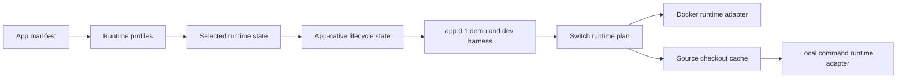

# Runtime Profiles And Source Runtimes

## Description

This plan covers the next runtime layer after the Hosty compatibility foundation. The current implementation can parse `app.0.1` Docker and local command runtime profiles, stores `selectedRuntime` in `apps.json`, and installs Docker runtime profiles through the legacy module engine. It does not yet switch runtime profiles after install, execute repository/local command runtime profiles in production, or maintain source checkouts.

Recommended implementation order:

1. Make runtime profile state explicit and stable.
2. Refactor lifecycle state into the app-oriented store.
3. Migrate the repository demo app and developer harness to the app manifest contract.
4. Add Docker-to-Docker runtime switching first.
5. Add source repository records and checkout/cache management.
6. Add the local command runtime adapter.
7. Add Docker-to-source/localCommand switching.

This keeps the first switching implementation inside the existing Docker safety model before introducing source execution.

## Milestones

### Phase 1 - Stabilize runtime profile state

**Status**: Completed

- Keep `selectedRuntime` in `apps.json` for app-oriented installs.
- Preserve the original app manifest enough to re-plan other runtime profiles later.
- Return selected runtime in app summaries and CLI app list output.
- Add validation that installed records point to a runtime profile still present in the refreshed manifest.
- Add tests for legacy modules, single-runtime app manifests, and multi-runtime app manifests.

Implemented so far:

- `apps.json` stores `selectedRuntime`.
- `app.0.1` manifests can declare multiple app-level runtime profiles and multiple services per selected profile.
- Docker service runtimes from the selected profile are normalized into the existing module install/update engine.
- Local command service runtimes are parsed and normalized for future planning.
- App manifest copies under `apps/<app-id>/manifest.json` preserve the original runtime profile declarations for future runtime-switch planning.
- Update plan and update apply normalize refreshed app manifests against the stored `selectedRuntime`, so a missing selected profile is reported as a validation error instead of silently switching to the manifest default.
- App summaries and CLI-facing app records expose `selectedRuntime`; richer runtime-profile availability lists are deferred to the runtime switching UI/API phases.

### Phase 2 - Refactor lifecycle state into app records

**Status**: Completed

- Move installed runtime lifecycle state for app-oriented installs from `modules.json` into `apps.json` or an app-owned runtime state section.
- Preserve existing API and CLI compatibility during the refactor; routes and commands may remain module-named while their backing store becomes app-native.
- Store Docker runtime details needed by lifecycle operations, including containers, published ports, operation status, last operation, last error, update attempts, settings, storage mappings, external mounts, resolved dependencies, metadata digest, and plan digest.
- Keep legacy `modules.json` reads as a removable compatibility fallback only for already-installed legacy module records.
- Update install, update, retry, start, stop, restart, configure, remove, recovery, gateway resolution, identity-token issuance, app registry, and backup restore flows to resolve installed app state through the app-native lifecycle service.
- Ensure app-owned data remains under `apps/<app-id>/data/` and external mounts remain excluded from Hosty-managed backup and delete-data behavior.
- Add migration-safe tests for app-only lifecycle records, legacy module fallback records, failed operation retry, remove/delete-data behavior, gateway/app registry lookups, and backup restore stop-before-restore.
- Document the temporary compatibility boundary and the removal criteria for legacy `modules.json` lifecycle reads. After this phase and the demo/developer harness migration phase are complete, Hosty can remove `modules.json` as a required app lifecycle store.

Implemented so far:

- `apps.json` records can store lifecycle fields previously kept on installed module records, including containers, published ports, operation status, settings, storage mappings, external mounts, resolved dependencies, update attempts, and errors.
- The module store compatibility layer reads legacy `modules.json` records and app lifecycle records together, while writes route app-oriented lifecycle records back to `apps.json`.
- App registry resolution can expose runtime bindings from app-only lifecycle records without requiring legacy module records.
- User-facing lifecycle summary errors now refer to installed app state instead of `modules.json`.
- Gateway resolution, assignment options, backup data resolution, configure, failed install retry, and remove/delete-data behavior all support app-only lifecycle records without legacy module records.
- Legacy `modules.json` remains readable as a temporary compatibility fallback until the first-party demo/developer harness migration is complete.

### Phase 3 - Migrate demo app and developer harness to app manifests

**Status**: Not Started

- Convert the repository-local demo app production fixture from legacy `schemaVersion: "0.3"` metadata to the `app.0.1` manifest contract.
- Convert the developer harness fixture from `metadata.dev.json` with process services to an app manifest development contract that can describe local command runtime profiles.
- Update `hosty dev up`, `status`, `identity`, `reset`, and `clean` to accept the new development manifest shape while keeping only explicitly scoped compatibility for old dev metadata until this phase is complete.
- Update repository scripts, Dockerfile fixture copies, tests, and docs that currently point at `modules/demo-module/metadata.json` or `modules/demo-module/metadata.dev.json`.
- Preserve the integrated Hosty development harness behavior for Shell embedding, Hosty identity, app assignments, scoped directory access, gateway routing, WebSockets, and direct endpoint probes.
- Keep the demo app multi-service structure in one app-level source repository. Do not introduce a multi-repository demo app contract.
- After this phase and the app-native lifecycle phase are complete, remove legacy module metadata support from first-party demo and development workflows.

### Phase 4 - Add Docker-to-Docker runtime switching

**Status**: Not Started

- Add `switch-runtime/plan` and `switch-runtime/apply` control routes.
- Restrict the first implementation to Docker runtime profiles.
- Compare current and target Docker images, ports, settings, storage mappings, dependency contracts, and generated container names.
- Create a `pre-runtime-switch` app data backup before mutation when a primary data directory exists.
- Reuse update-plan digest semantics so the reviewed plan must match at apply time.
- Preserve compatible settings and app data mappings by stable keys.
- Stop and replace containers only after the reviewed plan is confirmed.

### Phase 5 - Add source repository records and checkout cache

**Status**: Not Started

- Store optional source repository metadata in app records.
- Add a Host-managed source checkout/cache root under `<hosty-data-root>/sources/<app-id>/`, alongside `<hosty-data-root>/apps/<app-id>/` and `<hosty-data-root>/backups/<app-id>/`.
- Treat `source` as one app-level repository. Multi-service apps are expected to keep their Hosty app manifest, service source, and local command runtime implementations inside that repository.
- Resolve branch, tag, and commit refs to immutable commit SHAs.
- Keep direct Docker-only apps valid when no source exists.
- Keep multi-repository apps out of scope for the first source runtime implementation. If a service is owned by a separate repository, model it as a separate runtime app dependency or defer support for an explicit future `source.repositories[]` contract.
- Add cleanup rules for abandoned source checkouts.
- Add private repository credential handling through app-owned secrets or a future credential provider.

### Phase 6 - Add local command runtime adapter

**Status**: Not Started

- Define a runtime adapter interface for non-Docker process supervision.
- Launch local command runtime profiles from a source checkout or configured working directory.
- Inject `HOSTY_APP_DATA_DIR`, settings, dependency URLs, and assigned ports into the process environment.
- Track process status, logs, health, and restart behavior.
- Define platform-specific command constraints without introducing npm-package app distribution.
- Add stop/restart/remove behavior for local command runtimes.

### Phase 7 - Add Docker-to-source runtime switching

**Status**: Not Started

- Extend switch-runtime plans from Docker-to-Docker to Docker-to-localCommand and localCommand-to-Docker.
- Verify that the target runtime can use the current primary app data directory.
- Show explicit conflicts when storage, settings, endpoints, or dependencies cannot be preserved.
- Keep runtime switching separate from channel switching unless the reviewed plan explicitly combines them.
- Validate rollback/recovery behavior after a failed runtime switch.

### Phase 8 - Validation and documentation

**Status**: Not Started

- Add end-to-end tests for Docker-to-Docker switching.
- Add local command runtime integration tests.
- Document runtime profile authoring guidance in the feature docs.
- Document source checkout storage and cleanup behavior.
- Add CLI and Web UI guidance for runtime switch reviews.

## Resolved Decisions

- Runtime app storage is app-oriented: app files live under `<hosty-data-root>/apps/<app-id>/`, app data lives under `<hosty-data-root>/apps/<app-id>/data/`, source checkouts live under `<hosty-data-root>/sources/<app-id>/`, and backups live under `<hosty-data-root>/backups/<app-id>/`.
- Use immutable source checkout directories plus a small mutable worktree cache when needed.
- One runtime app has one app-level source repository in the first source runtime implementation.
- Multi-service apps should keep their app manifest, service source, and local command runtime implementations in that repository.
- Services owned by independent repositories should be modeled as separate runtime app dependencies until a future multi-source contract is intentionally designed.
- Legacy `modules.json` can be removed as a required lifecycle store after the app-native lifecycle refactor is complete and first-party demo/developer harness workflows use the app manifest contract.
- The repository demo app and developer harness should migrate to `app.0.1`; legacy `schemaVersion: "0.3"` metadata remains only as temporary compatibility input during that migration.
- Local command runtimes are allowed by the manifest model, but production execution should allow them only when the working directory is Hosty-managed or explicitly configured by an administrator.
- Runtime switching and channel switching remain separate commands first; channel switching must not implicitly switch runtime unless a reviewed plan explicitly confirms it.

No open questions remain for this planning pass.
