# Runtime Profiles And Source Runtimes

## Description

This completed Stage 2 plan covers the runtime layer after the Hosty compatibility foundation. The implementation parses `app.0.1` Docker and local command runtime profiles, stores `selectedRuntime` and app-native lifecycle state in app-owned records, maintains app source state and managed checkouts, executes local command runtime profiles through Core, and supports reviewed runtime switching between Docker and local command profiles.

This document is now historical planning context. The implemented behavior is documented in [Hosty runtime app platform](../features/hosty-runtime-app-platform.md), [Final Hosty architecture boundaries](../features/final-hosty-architecture.md), [Runtime source workflows](../features/runtime-source-workflows.md), [Local development and testing](../features/local-development.md), [CLI app and module commands](../features/cli-module-commands.md), [Docker Host domain model](../features/domain-model.md), and [Demo App](../features/demo-app.md).

Accepted planning change: the legacy developer harness is not migrating to a new app-manifest dev mode. Hosty should remove the separate developer harness workflow, dev-only metadata, deterministic dev-user seeding, and separate local target state. Local app development should instead use a normal installed runtime app with a source/local command runtime, optional local source override state, existing Host users, and trusted CLI helpers that can list users and issue short-lived app identity for those users.

The same source/local command runtime model applies to default Hosty-managed apps. Stage 2 split the combined Host direction into a local platform process, Hosty Core, and a default optional Hosty-managed runtime app, Hosty Shell. Shell can use managed source checkouts or local source overrides like other managed apps. The self-hosting boundary is explicit: Core cannot fully supervise its own runtime replacement after it stops, so switching or restarting Core requires the trusted CLI or another outer supervisor. Shell-only runtime changes can be managed by Core.

The Stage 2 Core launch model is local-first. Hosty Core is a long-running ASP.NET Core process using Minimal APIs, and Hosty Shell is an optional Next.js runtime app. Core owns runtime state, planning, access checks, user state, settings, identity, and control APIs. The CLI is the Core bootstrap wrapper and local API client.

A native tray/menu-bar companion is deferred. The first local-first Core implementation should expose running/stopped state and control through the `hosty` CLI and Core health/status APIs instead of requiring a platform-specific desktop companion.

Completed implementation order:

1. Make runtime profile state explicit and stable.
2. Refactor lifecycle state into the app-oriented store.
3. Split the current combined Host into local-first Core and optional Shell runtime app boundaries.
4. Add source repository state and local source overrides.
5. Add the local command runtime adapter for installed apps.
6. Add trusted existing-user app identity and open CLI helpers.
7. Migrate the repository demo app to installed source/local runtime and retire legacy developer mode.
8. Extend source/local runtime workflows to default Hosty-managed apps.
9. Add Docker-to-Docker runtime switching.
10. Add Docker-to-source/localCommand switching.
11. Validate and document runtime/source workflows.

The legacy demo/module compatibility removal that was previously tracked as the final cleanup phase moved to Stage 5 and is now documented in [Legacy compatibility](../features/legacy-compatibility.md). That cleanup was intentionally not a Stage 2 blocker because it depended on later auth/origin, backup, release, and live Docker validation.

This intentionally pulls source and local command execution ahead of Docker-to-Docker switching because the old developer harness is being removed instead of extended. The tradeoff is a larger source-runtime implementation earlier in the plan, but it avoids investing more work in soon-to-be-removed dev-only metadata and user seeding.

```mermaid
flowchart LR
  A["App manifest"] --> B["Runtime profiles"]
  B --> C["Selected runtime state"]
  C --> L["App-native lifecycle state"]
  L --> X["Local-first Core and Shell runtime app"]
  X --> F["Source state and local override"]
  F --> G["Local command runtime adapter"]
  G --> I["Existing-user CLI identity/open"]
  I --> M["app.0.1 demo without dev harness"]
  M --> S["Default app source/local runtime"]
  S --> D["Switch runtime plan"]
  D --> E["Docker runtime switching"]
  D --> H["Docker/source switching"]
  H --> V["Validation and docs"]
```

## Milestones

### Phase 1 - Stabilize runtime profile state

**Status**: Completed

- Keep `selectedRuntime` in app-owned records for app-oriented installs.
- Preserve the original app manifest enough to re-plan other runtime profiles later.
- Return selected runtime in app summaries and CLI app list output.
- Add validation that installed records point to a runtime profile still present in the refreshed manifest.
- Add tests for legacy modules, single-runtime app manifests, and multi-runtime app manifests.

Implemented so far:

- App-owned records store `selectedRuntime`.
- `app.0.1` manifests can declare multiple app-level runtime profiles and multiple services per selected profile.
- Docker service runtimes from the selected profile are normalized into the existing module install/update engine.
- Local command service runtimes are parsed and normalized for future planning.
- App manifest copies under `apps/<app-id>/manifest.json` preserve the original runtime profile declarations for future runtime-switch planning.
- Update plan and update apply normalize refreshed app manifests against the stored `selectedRuntime`, so a missing selected profile is reported as a validation error instead of silently switching to the manifest default.
- App summaries and CLI-facing app records expose `selectedRuntime`; richer runtime-profile availability lists are deferred to the runtime switching UI/API phases.

### Phase 2 - Refactor lifecycle state into app records

**Status**: Completed

- Move installed runtime lifecycle state for app-oriented installs from `modules.json` into `apps.json` or an app-owned runtime state section.
- Preserve existing API and CLI compatibility during the refactor; routes and commands may remain module-named while their backing store becomes app-native.
- Store Docker runtime details needed by lifecycle operations, including containers, published ports, operation status, last operation, last error, update attempts, settings, storage mappings, external mounts, resolved dependencies, metadata digest, and plan digest.
- Keep legacy `modules.json` reads as a removable compatibility fallback only for already-installed legacy module records.
- Update install, update, retry, start, stop, restart, configure, remove, recovery, gateway resolution, identity-token issuance, app registry, and backup restore flows to resolve installed app state through the app-native lifecycle service.
- Ensure app-owned data remains under `apps/<app-id>/data/` and external mounts remain excluded from Hosty-managed backup and delete-data behavior.
- Add migration-safe tests for app-only lifecycle records, legacy module fallback records, failed operation retry, remove/delete-data behavior, gateway/app registry lookups, and backup restore stop-before-restore.
- Document the temporary compatibility boundary and the removal criteria for legacy `modules.json` lifecycle reads. After this phase and the first-party demo/legacy dev-mode removal phase are complete, Hosty can remove `modules.json` as a required app lifecycle store.

Implemented so far:

- `apps.json` records can store lifecycle fields previously kept on installed module records, including containers, published ports, operation status, settings, storage mappings, external mounts, resolved dependencies, update attempts, and errors.
- The module store compatibility layer reads legacy `modules.json` records and app lifecycle records together, while writes route app-oriented lifecycle records back to `apps.json`.
- App registry resolution can expose runtime bindings from app-only lifecycle records without requiring legacy module records.
- User-facing lifecycle summary errors now refer to installed app state instead of `modules.json`.
- Gateway resolution, assignment options, backup data resolution, configure, failed install retry, and remove/delete-data behavior all support app-only lifecycle records without legacy module records.
- Legacy `modules.json` remains readable as a temporary compatibility fallback until the first-party demo migration and legacy developer-mode removal are complete.

### Phase 3 - Split local-first Core and Shell boundaries

**Status**: Completed for the Stage 2 local-first baseline

- Introduce Hosty Core as a local-first long-running API and runtime control process implemented as an ASP.NET Core single-file application launched by the `hosty` CLI.
- Use ASP.NET Core Minimal APIs for Core endpoint registration and configuration.
- Keep the `hosty` CLI as bootstrap tooling and local API client; ordinary user, app, lifecycle, source, settings, identity, and runtime operations should call Core APIs.
- Keep CLI-owned bootstrap operations narrow: install or repair Core bootstrap package, locate Core launch configuration, start/stop/restart/status Core where supported, and recover enough state to contact Core.
- Make `hosty update` check and update components in order: bootstrap CLI, Hosty Core, then Hosty Shell.
- Treat Shell as the third default Hosty component for update purposes, modeled as an optional Hosty-managed runtime app after the split.
- Make `hosty start` start Core and then call Core APIs to start the configured Shell runtime app when Shell autostart is enabled. Shell autostart is enabled by default.
- Add CLI-visible Core running/stopped and health/status checks for the first local-first Core implementation.
- Do not require a native tray/menu-bar companion for this phase; treat it as a future platform-specific installer component.
- Move the current web UI into Hosty Shell as a Next.js Docker runtime app. Shell should be a pure web UI client that can be unavailable without preventing CLI/API app management.
- Give Shell the same Core-managed lifecycle shape as other managed apps, including start, stop, restart, update, runtime status, logs, and health where supported.
- Hide self-stop for the active Shell instance in Shell UI, while allowing CLI and Core API to stop Shell.
- Treat runtime apps as Hosty-aware apps. They receive Core origin and app identity configuration, then exchange app-scoped launch or auth codes with Core to create app-origin sessions.
- Defer arbitrary third-party web app wrapping, gateway-protected browser UI mode, and reverse-proxy page wrapping to a separate future plan.
- Keep service/API endpoint exposure distinct from browser UI launch.
- Define migration boundaries for current Next routes: Core-owned API/state/auth/lifecycle routes move to Core, while Shell-owned pages/components move to the Shell runtime app.
- Keep the legacy Docker-hosted Next implementation only as a migration compatibility state until local-first Core can own runtime execution.

Implemented so far:

- Hosty Core exists as an ASP.NET Core Minimal API process with local control discovery, health/status, lifecycle, source, user, auth, identity, backup, and runtime switching endpoints.
- `hosty core start|stop|restart|status|logs` controls the local Core process, and top-level `hosty start|stop|restart|status|logs` route to Core.
- Hosty Shell exists as `apps/shell`, a Core-managed `hosty.shell` runtime app with a Docker runtime profile.
- Core bootstraps the Shell manifest as a system runtime app and autostarts Shell when configured.
- Shell UI hides self-stop, self-restart, and self-remove controls for the active `hosty.shell` instance while CLI and Core control APIs keep those operations available.
- The legacy `apps/host` Next implementation has been removed; compatibility now means explicit legacy metadata/module-store boundaries, not a repository-local Host package.

### Phase 4 - Add source state and local source overrides

**Status**: Completed

- Store optional source repository metadata and source runtime state in app records.
- Add a Host-managed source checkout/cache root under `<hosty-data-root>/sources/<app-id>/`, alongside `<hosty-data-root>/apps/<app-id>/` and `<hosty-data-root>/backups/<app-id>/`.
- Add a local source override mode for administrator-selected worktrees that live outside `<hosty-data-root>/sources/<app-id>/`.
- Treat local source override state as Host installation state, not public manifest metadata.
- Treat `source` as one app-level repository. Multi-service apps are expected to keep their Hosty app manifest, service source, and local command runtime implementations inside that repository.
- Resolve branch, tag, and commit refs to immutable commit SHAs for managed checkouts.
- Keep direct Docker-only apps valid when no source exists.
- Keep multi-repository apps out of scope for the first source runtime implementation. If a service is owned by a separate repository, model it as a separate runtime app dependency or defer support for an explicit future `source.repositories[]` contract.
- Add cleanup rules for abandoned source checkouts.
- Keep managed source checkouts limited to public-readable repositories and local filesystem repositories for Stage 2. Defer private repository credential handling to a future Core-owned credential provider.

Implemented so far:

- Core stores app source state, including repository metadata, resolved refs, immutable commit SHAs, managed checkout paths, local override paths, and update timestamps.
- Core exposes local control source routes for inspection, managed checkout resolution, local override configuration, and local override clearing.
- The CLI exposes `hosty apps source`, `source-resolve`, `source-override`, and `source-clear-override` commands with table and JSON output.
- Local command runtime profiles prefer local overrides, then managed checkouts, then the app root when resolving their working directory.
- Core and CLI expose source cleanup plan/apply commands for abandoned managed checkout directories under the Hosty `sources/` root.

### Phase 5 - Add local command runtime adapter

**Status**: Completed

- Define a runtime adapter interface for non-Docker process supervision.
- Keep Core authoritative for local command lifecycle state, planning, access checks, and control routes.
- Launch local command runtime profiles from a managed source checkout or explicitly configured local override path through local-first Core.
- Inject `HOSTY_APP_DATA_DIR`, settings, dependency URLs, assigned ports, and Hosty internal service credentials into the process environment.
- Track process status, logs, health, and restart behavior in app lifecycle state.
- Define platform-specific command constraints without introducing npm-package app distribution.
- Add start, stop, restart, remove, and failed-start recovery behavior for local command runtimes.

Implemented so far:

- Core has a `localCommand` runtime adapter with start, stop, restart-through-Core, remove, log capture, app data environment injection, settings injection, dependency URL injection, and assigned port injection.
- Local command runtimes resolve working directories from local source overrides first, then managed checkouts, then the installed app root.
- Failed local command startup cleans up previously started services so partial multi-service starts do not leave orphaned processes.
- Core and CLI expose runtime health reporting. For `localCommand` runtimes, health includes per-service process state, PID, exit code, log path, and working directory.
- Platform-specific `localCommand` constraints are documented in `docs/features/local-development.md`.

### Phase 6 - Add existing-user CLI identity and open helpers

**Status**: Completed

- Add `hosty users list` with a sanitized user projection, including id, email when available, display name, Host role, disabled state, and optional app assignment summary.
- Add `hosty users list --app <app-id> --format json` so agents and local operators can choose from users that can realistically access a target app.
- Add `hosty apps identity <app-id> --user <email-or-id> --format token|header|json|env` for short-lived Hosty-signed app identity tokens.
- Add `hosty apps open <app-id> --user <email-or-id> --mode shell|standalone` for browser-oriented local checks. Standalone mode should use the app-scoped auth-code flow from the app auth plan when a browser cannot inject identity headers directly.
- Enforce normal access checks by default: disabled users, missing assignments, incompatible exposure policy, and unavailable app runtime state must fail instead of silently issuing identity.
- Do not add seeded development users as part of this workflow. The CLI uses existing Host users and app assignments.
- Do not add a default bypass flag. Any future diagnostic bypass must be explicit and visibly marked as non-production-equivalent.

Implemented so far:

- `hosty users list` and `hosty users list --app <app-id> --format json` call Core sanitized user summary APIs.
- `hosty apps identity <app-id> --user <email-or-id> --format token|header|env|json` issues short-lived Core-signed app identity.
- `hosty apps open <app-id> --user <email-or-id> --mode shell|standalone` returns browser launch links from Core.
- Core identity issuance uses existing enabled Host users and normal app access checks.

### Phase 7 - Migrate demo app and retire legacy developer mode

**Status**: Completed for the Stage 2 primary Demo App workflow

Completed in the legacy developer-mode removal pass:

- Removed first-party `metadata.dev.json` usage and documentation.
- Removed the top-level developer harness command group, deprecated aliases, CLI launch settings, and Host control/API routes for separate local target state.
- Removed Host app registry, gateway, user-assignment, Shell UI, and identity-token handling for `developer` app sources.
- Updated docs and skill references to use installed runtime apps with source/local command runtime profiles.

Completed in the Demo App migration pass:

- `apps/demo-app` is the primary first-party runtime app package with `app.0.1` manifest metadata, Docker and `dev` local command runtime profiles, and app id `com.haas.demo-app`.
- First-party local runtime documentation uses `npm run core:dev` or `hosty core start` plus `hosty apps install apps/demo-app/manifest.json --runtime dev`.
- Demo App user-facing defaults and UI copy use Demo App terminology instead of presenting the app as the legacy Demo Module.
- Root documentation links to `docs/features/demo-app.md` as the primary first-party runtime app workflow.
- CI uses current Stage 2 package scripts for Shell, Demo App, Core, and CLI.
- `modules/demo-module` was retired in Stage 5. Legacy schema `0.3` metadata compatibility remains covered by minimal parser fixtures.

### Phase 8 - Add default app source/local runtime workflows

**Status**: Completed for the Stage 2 Shell/Core split boundary

- Apply source state, local source overrides, and local command runtime profiles to default Hosty-managed apps as well as user-installed runtime apps.
- Treat Shell as the default managed app target after the Core/Shell split.
- Support local source override workflows for Shell so developers and agents can run changed Shell code from a selected worktree.
- Keep the self-hosting boundary explicit: Core must not rely on an in-process Core API call to complete its own stop/restart/switch after it exits.
- Use the trusted CLI or another outer supervisor for Core runtime switching and restart.
- Allow Shell-only local runtime switching to be Core-managed as a separate runtime app.
- Document the difference between ordinary user-installed runtime apps, default Shell runtime changes, and Core self-runtime changes.

Implemented so far:

- `apps/shell/manifest.json` now declares app-level source metadata and both Docker and `dev` local command runtime profiles.
- Shell local runtime changes can use the same Core source override and runtime switch commands as user-installed runtime apps.
- The difference between user-installed runtime apps, Shell-only runtime changes, and Core self-runtime changes is documented in `docs/features/runtime-source-workflows.md` and `docs/features/local-development.md`.

### Phase 9 - Add Docker-to-Docker runtime switching

**Status**: Completed for Stage 2 runtime profile contracts

- Add `switch-runtime/plan` and `switch-runtime/apply` control routes.
- Restrict the first implementation to Docker runtime profiles.
- Compare current and target Docker images, ports, settings, storage mappings, dependency contracts, and generated container names.
- Create a `pre-runtime-switch` app data backup before mutation when a primary data directory exists.
- Reuse update-plan digest semantics so the reviewed plan must match at apply time.
- Preserve compatible settings and app data mappings by stable keys.
- Stop and replace containers only after the reviewed plan is confirmed.

Implemented so far:

- Core exposes runtime switch plan/apply routes and the CLI exposes `hosty apps switch-runtime-plan` and `hosty apps switch-runtime`.
- Runtime switch apply stops a running app, updates selected runtime state, and restarts the app when it was running before the switch.
- Runtime switch plans include digest confirmation semantics.
- Runtime switch apply creates a `pre-runtime-switch` backup when the primary app data directory exists.
- Runtime switch plans compare runtime type, service images or commands, ports, service environment keys, settings, dependencies, endpoint contracts, storage target compatibility, and generated Docker container names.
- Runtime switch plan digests include the reviewed `changes` list so apply rejects stale reviews after contract changes.

### Phase 10 - Add Docker-to-source runtime switching

**Status**: Completed for Stage 2 source runtime switching

- Extend switch-runtime plans from Docker-to-Docker to Docker-to-localCommand and localCommand-to-Docker.
- Verify that the target runtime can use the current primary app data directory.
- Show explicit conflicts when storage, settings, endpoints, or dependencies cannot be preserved.
- Keep runtime switching separate from channel switching unless the reviewed plan explicitly combines them.
- Validate rollback/recovery behavior after a failed runtime switch.

Implemented so far:

- Runtime switch plan/apply can select Docker or `localCommand` runtime profiles from the installed manifest.
- Core rejects switching an app with existing primary data to a target runtime that does not declare a compatible primary data target.
- Docker-to-localCommand switching can use managed source state or administrator-selected local source overrides.
- Runtime switch plans show added, removed, or changed settings, endpoints, dependencies, service ports, service environments, and data target compatibility.
- Failed restart recovery is validated: if target runtime start fails after a running app switch, Core restores selected runtime state to the previous runtime, leaves the app stopped, records the error, and keeps any pre-switch backup.

### Phase 11 - Validation and documentation

**Status**: Completed for Stage 2 automated validation

- Core lifecycle tests cover Docker-to-Docker runtime switch planning/apply, pre-switch backups, plan digest checks, selected-runtime rollback after failed restart, source runtime switching data compatibility, public-readable source policy, managed checkout cleanup, and local command process health.
- CLI tests cover source state commands, cleanup commands, runtime switch plan changes, and runtime health routing/output.
- Demo App build and lint validate the primary first-party runtime app workflow.
- Root `npm run ci` validates Shell build, Demo App build, Core build/tests, and CLI build/tests.
- Runtime profile authoring guidance, source checkout storage/cleanup behavior, runtime switch reviews, self-runtime boundaries, and local command platform constraints are documented in feature docs.

Live Docker daemon smoke tests for published image workflows were deferred out of Stage 2 and now target the Demo App workflow documented in [Demo App](../features/demo-app.md).

## Resolved Decisions

- Runtime app storage is app-oriented: app files live under `<hosty-data-root>/apps/<app-id>/`, app data lives under `<hosty-data-root>/apps/<app-id>/data/`, source checkouts live under `<hosty-data-root>/sources/<app-id>/`, and backups live under `<hosty-data-root>/backups/<app-id>/`.
- Hosty Core should become a local-first ASP.NET Core single-file process using Minimal APIs before local command runtime execution becomes the primary workflow.
- The `hosty` CLI is a bootstrap wrapper and local API client for Core; it uses Core APIs for ordinary operations.
- CLI-owned update checks apply to the bootstrap CLI, Hosty Core, and Hosty Shell in that order.
- Core owns ordinary lifecycle/domain behavior. The CLI should only duplicate behavior that is required before Core is installed, running, or reachable.
- Tray/menu-bar companion apps are deferred. Core status and control are handled through CLI/API in the current plan.
- Hosty Shell is an optional Hosty-managed runtime app and pure web UI client. It remains a Next.js app built and run as a Docker container in the first split.
- `hosty start` starts Core and then asks Core to start the configured Shell runtime app when Shell autostart is enabled. Shell autostart is enabled by default.
- Shell uses the same Core-managed lifecycle shape as other managed apps, but Shell UI should hide self-stop for the active Shell instance. CLI and Core API may still stop Shell.
- Browser runtime apps in the current model are Hosty-aware apps, not arbitrary third-party pages wrapped through a proxy.
- Runtime apps create app-origin sessions by exchanging Shell launch codes, standalone auth codes, or app-scoped identity with Core.
- Gateway/proxy wrapping of arbitrary third-party browser apps is deferred to a separate future plan.
- Use immutable source checkout directories plus a small mutable worktree cache when needed.
- Local source override state belongs to the Host installation record, not to public app manifest metadata.
- Source/local command runtime support applies to default Hosty-managed apps as well as user-installed runtime apps.
- Core owns source/local command runtime state and policy, but local command execution location depends on Core launch mode.
- When Core runs in Docker, local command execution must be delegated to a trusted host-side runtime supervisor so apps run on the host machine, not inside the Core container.
- When Core runs as a trusted local process, Core may directly supervise local command apps.
- Shell is the default app target for local source override workflows after the Core/Shell split.
- Core cannot fully supervise its own runtime replacement after it stops; those runtime switch/restart operations require the trusted CLI or another outer supervisor.
- Shell local runtime changes can be managed by Core like other runtime apps.
- One runtime app has one app-level source repository in the first source runtime implementation.
- Multi-service apps should keep their app manifest, service source, and local command runtime implementations in that repository.
- Services owned by independent repositories should be modeled as separate runtime app dependencies until a future multi-source contract is intentionally designed.
- Legacy `modules.json` can be removed as a required lifecycle store after the app-native lifecycle refactor is complete and first-party demo workflows use the app manifest contract.
- The repository demo app should migrate to `app.0.1`.
- The legacy top-level developer harness should be removed instead of migrated.
- Dev-only metadata, deterministic dev-user seeding, dev-harness assignment seeding, and separate local target state should be removed from first-party workflows.
- Trusted local CLI app identity should use existing enabled Host users and enforce normal app access checks by default.
- Local command runtimes are allowed by the manifest model, but production execution should allow them only when the working directory is Hosty-managed or explicitly configured by an administrator.
- Runtime switching and channel switching remain separate commands first; channel switching must not implicitly switch runtime unless a reviewed plan explicitly confirms it.
- Managed source checkouts in Stage 2 support public-readable `http`/`https` repositories and local filesystem repositories only. Core rejects embedded credentials and SSH-style repository URLs, and git subprocesses run with interactive credential prompts disabled. Private repositories are handled through administrator-managed local source overrides until a future Core-owned credential provider is designed.
- Legacy demo/module compatibility removal is a later cleanup stage, not a Stage 2 completion criterion.

## Open Questions And Recommendations

- Question: Are private Git repository credentials part of Stage 2?
  Answer: No. Stage 2 supports public-readable managed source repositories and local source overrides only.
  Recommendation: Implement private repositories later through a Core-owned credential provider using OS-protected storage where available, app-scoped credential references in app state, redacted CLI/Shell configuration surfaces, and no credential echoing in logs or source state JSON.
