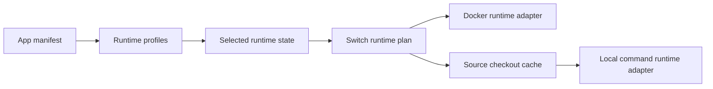

# Runtime Profiles And Source Runtimes

## Description

This plan covers the next runtime layer after the Hosty compatibility foundation. The current implementation can parse `app.0.1` Docker and local command runtime profiles, stores `selectedRuntime` in `apps.json`, and installs Docker runtime profiles through the legacy module engine. It does not yet switch runtime profiles after install, execute repository/local command runtime profiles in production, or maintain source checkouts.

Recommended implementation order:

1. Make runtime profile state explicit and stable.
2. Add Docker-to-Docker runtime switching first.
3. Add source repository records and checkout/cache management.
4. Add the local command runtime adapter.
5. Add Docker-to-source/localCommand switching.

This keeps the first switching implementation inside the existing Docker safety model before introducing source execution.

## Milestones

### Phase 1 - Stabilize runtime profile state

**Status**: In Progress

- Keep `selectedRuntime` in `apps.json` for app-oriented installs.
- Preserve the original app manifest enough to re-plan other runtime profiles later.
- Return selected runtime in app summaries and CLI app list output.
- Add validation that installed records point to a runtime profile still present in the refreshed manifest.
- Add tests for legacy modules, single-runtime app manifests, and multi-runtime app manifests.

Implemented so far:

- `apps.json` stores `selectedRuntime`.
- `app.0.1` manifests can declare multiple app-level runtime profiles and multiple services per selected profile.
- Docker service runtimes from the selected profile are normalized into the existing module install/update engine.
- Local command service runtimes are parsed and normalized for future planning.

Remaining:

- preserve enough source manifest state to plan non-selected runtime profiles after install;
- detect selected runtime drift on update;
- expose runtime-profile availability in admin-facing summaries.

### Phase 2 - Add Docker-to-Docker runtime switching

**Status**: Not Started

- Add `switch-runtime/plan` and `switch-runtime/apply` control routes.
- Restrict the first implementation to Docker runtime profiles.
- Compare current and target Docker images, ports, settings, storage mappings, dependency contracts, and generated container names.
- Create a `pre-runtime-switch` app data backup before mutation when a primary data directory exists.
- Reuse update-plan digest semantics so the reviewed plan must match at apply time.
- Preserve compatible settings and app data mappings by stable keys.
- Stop and replace containers only after the reviewed plan is confirmed.

### Phase 3 - Add source repository records and checkout cache

**Status**: Not Started

- Store optional source repository metadata in app records.
- Add a Host-managed source checkout/cache root under the Hosty data root.
- Resolve branch, tag, and commit refs to immutable commit SHAs.
- Keep direct Docker-only apps valid when no source exists.
- Add cleanup rules for abandoned source checkouts.
- Add private repository credential handling through app-owned secrets or a future credential provider.

### Phase 4 - Add local command runtime adapter

**Status**: Not Started

- Define a runtime adapter interface for non-Docker process supervision.
- Launch local command runtime profiles from a source checkout or configured working directory.
- Inject `HOSTY_APP_DATA_DIR`, settings, dependency URLs, and assigned ports into the process environment.
- Track process status, logs, health, and restart behavior.
- Define platform-specific command constraints without introducing npm-package app distribution.
- Add stop/restart/remove behavior for local command runtimes.

### Phase 5 - Add Docker-to-source runtime switching

**Status**: Not Started

- Extend switch-runtime plans from Docker-to-Docker to Docker-to-localCommand and localCommand-to-Docker.
- Verify that the target runtime can use the current primary app data directory.
- Show explicit conflicts when storage, settings, endpoints, or dependencies cannot be preserved.
- Keep runtime switching separate from channel switching unless the reviewed plan explicitly combines them.
- Validate rollback/recovery behavior after a failed runtime switch.

### Phase 6 - Validation and documentation

**Status**: Not Started

- Add end-to-end tests for Docker-to-Docker switching.
- Add local command runtime integration tests.
- Document runtime profile authoring guidance in the feature docs.
- Document source checkout storage and cleanup behavior.
- Add CLI and Web UI guidance for runtime switch reviews.

## Open Questions And Recommendations

- Question: Where should Hosty store repository checkouts?
  Answer: No implementation exists yet.
  Recommendation: Use `<hosty-data-root>/sources/<app-id>/...` with immutable commit directories plus a small mutable worktree cache when needed.

- Question: Should local command runtimes be allowed without a source repository?
  Answer: The manifest model allows local command runtime profiles, but production execution is not implemented.
  Recommendation: Allow it only when the working directory is Hosty-managed or explicitly configured by an administrator. Avoid arbitrary host paths by default.

- Question: Should runtime switching also switch update channels?
  Answer: Current accepted decision says channel switching must not implicitly switch runtime unless the plan explicitly confirms it.
  Recommendation: Keep runtime switching and channel switching as separate commands first.
