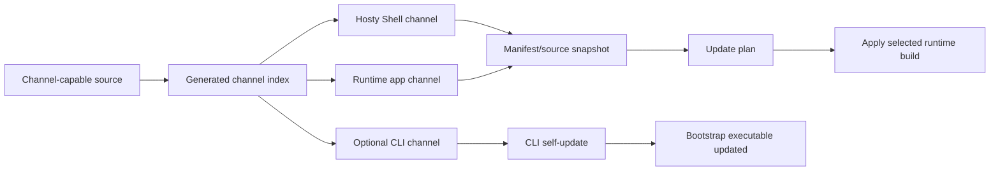

# Update Channels

## Description

Update Channels define how Hosty discovers, displays, and applies alternate builds for Hosty Shell, system apps, runtime apps, and the bootstrap CLI.

The original channel idea started as a CLI self-update source. The broader target model is runtime-oriented:

- Hosty Shell should be visible in management surfaces as a system app, even though it is currently bundled into the Host application;
- runtime apps should be able to expose selectable channels for feature validation against real local data;
- channels should resolve to concrete manifest/source snapshots, not directly imply a runtime type;
- the CLI should remain a thin bootstrap and lifecycle tool, with its own channels only where separate CLI delivery is useful.

The current system installs modules from a direct module metadata URL and updates them by refreshing that stored metadata URL. That flow remains the legacy Docker module baseline. In the target model, metadata JSON becomes manifest JSON. Channels add a discovery layer above manifest URLs, source refs, image tags, and release artifacts. Selecting a channel should resolve to concrete manifest, source, image, or release references, then reuse the existing install/update planning model.

The runtime channel indexes are generated artifacts. They are not committed as JSON files in the repository. The repository should contain schema documentation, planning, and workflow code that generates and publishes those indexes.

The initial product-level channels are:

- `main` - the primary channel, built from the `main` branch and used as the default update source.
- `pr-<number>-<branch-slug>` - temporary pull request channels for validating PR-specific Shell, Host, module, and optional CLI builds.

The `stable` channel is intentionally deferred. It can be added later as a manually promoted release channel if the project starts producing release-candidate or production release approvals separate from `main`.



## Concepts

### Runtime App

A runtime app is something Hosty can show as an installed or managed application with a current version, optional source, selected channel, selected runtime profile, and update state.

Initial runtime app types:

- `system` - a Hosty-owned system app such as Hosty Shell.
- `runtime` - a user-installed app, including legacy Docker modules.

The CLI is not a runtime app. It is a local bootstrap executable. It can still use a channel index for self-update, but it should not drive the whole product model.

### Hosty Shell

Hosty Shell is currently part of the Host Web UI and Host container image. The planning target is to show it in app management as a first-class system app.

The first implementation can model Shell updates as Host image updates:

- current Shell channel maps to a Host image reference;
- switching the Shell channel updates the Host image setting or Host-owned Shell source state;
- the existing Host lifecycle recreates or restarts the Host container when needed.

A later implementation can separate Shell delivery from Hosty Core if the architecture needs it. The channel model should allow that, but not require it now.

### Runtime App Manifest

Legacy Docker modules already have a concrete manifest-like source:

- `metadataUrl` in `modules.json`;
- a local copied `metadata.json`;
- container image references resolved from metadata.

Target runtime apps should use `manifestUrl` and a local `manifest.json`. Legacy `metadataUrl` and `metadata.json` remain supported as compatibility aliases.

For runtime apps, a channel switch should resolve to a replacement manifest source or manifest snapshot and then use the existing app/module update plan:

1. The administrator chooses a channel for an installed runtime app.
2. Hosty resolves that channel to a manifest URL or manifest snapshot.
3. Hosty builds an update plan using the selected manifest.
4. The administrator reviews settings, storage, dependencies, runtime profiles, and image/source changes.
5. Hosty applies the update and stores the selected channel/source state.

This keeps channel switching compatible with existing update safety behavior. It is not only a Docker image tag replacement.

### Repository-backed Source

Direct manifest and legacy metadata URLs remain supported. Repository-backed runtime apps should still produce a concrete manifest before install or update planning.

Source repositories are optional. A runtime app can be installed from a Docker image or another runtime reference with no source known to Hosty. When source is present, channels can point to branches, pull requests, commits, and generated artifacts for agent-driven validation.

Repository-backed channels can be represented as source selectors:

- branch selector, for example `main` or `feature/auth-flow`;
- pull request selector, for example PR `42`;
- commit selector for immutable validation;
- release tag selector for manually promoted builds.

Hosty should not need to understand every repository layout at the update-plan layer. A repository integration can discover or generate the app manifest for a selected branch or pull request, but the install/update engine should still consume a concrete manifest document.

For source-code apps, manifests can later describe how the app is built or run, for example a Node.js app with package scripts. Channels should select the version of that source; update planning should still work from a concrete resolved manifest document.

### Runtime Profiles

Runtime profiles and channels are separate axes.

- A channel selects a version, source ref, manifest snapshot, and runtime artifact references.
- A runtime profile selects how the installed app runs, such as Docker image, local process, npm script, Python process, command, or external URL.
- A channel can change available runtime profiles, but switching channel should not silently switch the active runtime profile unless the update plan explicitly requires it.

This lets one app run from a Docker image for normal use, then temporarily switch to a repository-backed development runtime while preserving the same storage mappings and settings.

## Channel Indexes

There are two related but separate index types.

### Product Channel Index

The product channel index is owned by this repository and covers Hosty itself: Hosty Core, Hosty Shell, and optionally the CLI.

It should be published to a stable GitHub Release asset, for example:

- release tag: `update-channels`
- asset name: `channels.json`
- URL shape: `https://github.com/alex-de-haas/hosty/releases/download/update-channels/channels.json`

Example shape:

```json
{
  "schemaVersion": 1,
  "defaultChannel": "main",
  "generatedAt": "2026-05-31T10:00:00Z",
  "channels": [
    {
      "id": "main",
      "label": "Main",
      "kind": "main",
      "description": "Latest successful main branch build.",
      "source": {
        "branch": "main",
        "commit": "abc123"
      },
      "core": {
        "image": "ghcr.io/alex-de-haas/hosty-core:latest"
      },
      "shell": {
        "image": "ghcr.io/alex-de-haas/hosty-shell:latest"
      },
      "cli": {
        "releaseTag": "cli-main"
      }
    },
    {
      "id": "pr-42-auth-flow",
      "label": "PR #42 auth-flow",
      "kind": "pull-request",
      "description": "Temporary update channel for PR #42.",
      "source": {
        "pullRequest": 42,
        "branch": "feature/auth-flow",
        "commit": "def456"
      },
      "core": {
        "image": "ghcr.io/alex-de-haas/hosty-core:pr-42-auth-flow"
      },
      "shell": {
        "image": "ghcr.io/alex-de-haas/hosty-shell:pr-42-auth-flow"
      },
      "cli": {
        "releaseTag": "cli-pr-42-auth-flow"
      },
      "expiresAt": "2026-06-14T00:00:00Z"
    }
  ]
}
```

The `cli` block is optional over time. If the CLI remains simple enough, Shell, Core, and runtime app channels may carry most product changes while the CLI updates less often.

The current implementation can map `shell.image` or `core.image` to the existing Host image until Shell and Core delivery are split.

### Runtime App Channel Index

A runtime app channel index is owned by the app publisher. It advertises selectable manifest sources for one app.

The app manifest can later add an optional pointer to this index. Legacy metadata can add the same pointer during compatibility migration:

```json
{
  "id": "com.acme.reports",
  "version": "1.0.0",
  "channelsUrl": "https://apps.acme.example/reports/channels.json"
}
```

Example runtime app channel index:

```json
{
  "schemaVersion": 1,
  "appId": "com.acme.reports",
  "defaultChannel": "main",
  "channels": [
    {
      "id": "main",
      "label": "Main",
      "kind": "main",
      "source": {
        "branch": "main",
        "commit": "abc123"
      },
      "manifestUrl": "https://apps.acme.example/reports/main/manifest.json"
    },
    {
      "id": "pr-42-new-dashboard",
      "label": "PR #42 new-dashboard",
      "kind": "pull-request",
      "source": {
        "pullRequest": 42,
        "branch": "feature/new-dashboard",
        "commit": "def456"
      },
      "manifestUrl": "https://apps.acme.example/reports/pr-42-new-dashboard/manifest.json",
      "expiresAt": "2026-06-14T00:00:00Z"
    }
  ]
}
```

Channel ids and generated tags should use the pull request number as the stable identifier. A branch slug can be appended for readability, but the pull request number must remain the conflict-resistant key. Branch names can contain unsupported characters, become too long, or change over time.

The `source` block is optional at the channel level. Source-less apps can still publish channels that only resolve to manifest or image references.

Legacy indexes may continue to provide `moduleId` and `metadataUrl`. New indexes should use `appId` and `manifestUrl`. Hosty should treat `metadataUrl` as a legacy alias for `manifestUrl` when resolving Docker module channels.

## UI Behavior

The installed modules view should evolve into an app management view with separate sections for system apps and runtime apps.

It should show:

- Hosty Shell as a system app;
- future core services as system apps when they are independently manageable;
- installed modules as legacy runtime apps;
- new runtime apps from app manifests;
- current channel where known;
- current version or commit where known;
- selected runtime profile where applicable;
- current runtime status;
- available actions such as update, switch channel, switch runtime, restart, stop, remove, configure, or open.

Shell-specific behavior:

- Shell should be visible even when no runtime apps are installed.
- Shell should be labeled as a system app so administrators do not confuse it with a removable module.
- Channel switching should make it clear whether a Host restart or container recreation is required.
- Shell should expose update from the UI so remote administrators do not need to SSH into a server only to run the CLI.
- Shell should not expose remove or ordinary stop actions.

Runtime-app-specific behavior:

- A runtime app with no `channelsUrl` or repository source can keep the current update behavior.
- A runtime app with channels can expose `Switch channel` next to `Update`.
- A runtime app can have no source repository and still be channel-capable if the channel resolves to a manifest or image reference.
- Channel switching should always show an update plan before applying changes.
- Runtime profile switching should always show a plan before applying changes.
- The UI should preserve real-data validation safety by showing storage, settings, dependency, runtime profile, image/source, and endpoint changes.

## CLI Behavior

The CLI should remain focused on bootstrap, Host lifecycle, and local update transport.

Supported product channel command shapes:

- `hosty update` - fetch product channels, show an interactive selection prompt, default to the configured channel or `main`.
- `hosty update --channel main` - update non-interactively from the named product channel.
- `hosty update --channel pr-42-auth-flow` - update from a PR-specific product channel.
- `hosty update --list-channels` - print the current generated product channel list without updating.

When applying a product channel, the CLI should:

- download the product channel index;
- validate the schema version;
- resolve the selected channel;
- update the local Hosty Core or Shell image setting from `channel.core.image` or `channel.shell.image`, depending on current packaging;
- download and apply a CLI artifact from `channel.cli.releaseTag` only if the selected channel includes a CLI block;
- verify CLI artifacts with `SHA256SUMS` when available;
- refresh the managed CLI command shims, including `hosty` and the deprecated `docker-host` alias during migration;
- reconcile the shell profile PATH block so the managed CLI bin directory is available in new terminal sessions;
- print a manual `export PATH=...` command when the current terminal session does not yet include the managed CLI bin directory;
- store the selected product channel locally so the next interactive update can default to it;
- leave Host container recreation to the existing `hosty start` flow unless an explicit restart/apply command is introduced.

The selected product channel is user preference, not a permanent property of the binary. Build metadata should still be embedded separately in the CLI over time, such as version, commit SHA, build time, release tag, and build channel.

The existing `docker-host` command should remain a compatibility alias during migration. New docs and new commands should prefer `hosty`.

## GitHub Actions Model

The implementation should extend the existing artifact publishing workflows instead of adding a separate distribution system.

Main product channel workflow:

- build the current Host image from `main`;
- publish the current Host image as the compatibility Hosty Core/Shell image until packaging is split;
- build the CLI only when CLI inputs changed or when a coordinated product channel requires it;
- publish or update a rolling GitHub prerelease with tag `cli-main` when CLI assets are built;
- update the generated product channel index entry for `main`;
- publish the regenerated `channels.json` asset to the `update-channels` release.

Pull request product channel workflow:

- run only when a PR is intended to expose an update channel, for example by label `update-channel`;
- build the current Host image for the PR;
- publish the current Host image with a tag like `pr-42-auth-flow`;
- build and publish PR-specific CLI assets only when needed;
- publish or update a rolling GitHub prerelease with a tag like `cli-pr-42-auth-flow` when CLI assets are built;
- add or update the PR channel in the generated product channel index;
- publish the regenerated `channels.json` asset to the `update-channels` release.

Pull request cleanup workflow:

- run when a pull request is closed;
- remove the matching PR channel from the generated product channel index;
- publish the regenerated `channels.json` asset;
- delete generated PR release assets, release tags, and package/image tags when GitHub permissions allow it;
- never delete the source branch from the cleanup workflow.

Runtime app channel workflows are publisher-owned. An app repository can generate its own channel index from branches, pull requests, commits, or release tags. Hosty should consume those indexes through documented URLs rather than requiring all app publishers to use this repository's workflow implementation.

## Milestones

### Phase 1 - Broaden the channel contract

**Status**: Completed

- Document channels as runtime-neutral app channels, not only CLI channels.
- Define Hosty Shell, system app, runtime app, and optional CLI channel responsibilities.
- Document that generated runtime indexes are release assets, not committed repository JSON.
- Add future repository-backed source considerations without replacing the existing manifest/update model.

### Phase 2 - Show Shell as a managed system app

**Status**: In Progress

- Add a Hosty Shell entry to a system apps management section.
- Label Shell as a system app with non-removable behavior.
- Show current Shell image, channel, version, or commit where available.
- Expose Shell update from the UI.
- Show restart or recreate requirements when the Shell channel changes.

### Phase 3 - Generate and publish the main product channel

**Status**: Not Started

- Publish the `main` channel entry for the current Host image, mapped to Hosty Core/Shell until packaging is split.
- Rename or replace the current rolling `cli-dev` behavior with `cli-main` if CLI channel publishing remains useful.
- Keep backward compatibility for `cli-dev` only if needed for existing installers.
- Publish `channels.json` to the `update-channels` release.

### Phase 4 - Add product channel selection

**Status**: Not Started

- Add product channel index download and schema validation.
- Add interactive product channel selection to `hosty update`.
- Add non-interactive `--channel` and `--list-channels` options.
- Store the selected product channel in local CLI configuration.
- Update the local Host image setting when a product channel is applied.
- Preserve existing checksum verification and executable replacement behavior for channels that include CLI artifacts.
- Reconcile CLI shims and PATH profile entries during update, especially for the `docker-host` to `hosty` command migration.

### Phase 5 - Add runtime app channel discovery

**Status**: Not Started

- Add optional app manifest support for a channel index pointer such as `channelsUrl`.
- Keep legacy module metadata support for the same pointer.
- Add Host-side loading and validation for runtime app channel indexes.
- Store the selected app channel and resolved manifest source in persistent app state.
- Keep direct manifest URL and legacy metadata URL apps fully supported.

### Phase 6 - Add runtime app channel switching

**Status**: Not Started

- Add a `Switch channel` action for runtime apps with available channels.
- Resolve the selected channel to a manifest before planning.
- Reuse the existing module update plan and apply flow.
- Show settings, storage, dependency, runtime profile, image/source, endpoint, and manifest changes before applying.
- Validate channel switching against real installed data and failure recovery behavior.

### Phase 7 - Add runtime profile switching

**Status**: Not Started

- Add selected runtime profile state for runtime apps.
- Add `Switch runtime` planning and apply APIs.
- Keep channel switching and runtime switching as separate actions.
- Preserve compatible storage and settings when switching from Docker image runtime to repository/local process runtime.
- Show explicit conflicts when the target runtime cannot use the current data mappings.

### Phase 8 - Add pull request channels and cleanup

**Status**: Not Started

- Add an opt-in trigger for PR product channels, preferably a label such as `update-channel`.
- Generate PR-safe slugs using `pr-<number>-<branch-slug>`.
- Publish PR-specific Hosty Core/Shell image tags while packaging is combined.
- Publish PR-specific CLI releases only when needed.
- Add PR channel entries to the generated product channel index.
- Remove closed PR channels from the generated product channel index.
- Delete generated PR CLI releases, release tags, and Host image tags when safe.
- Keep cleanup best-effort and visible in workflow logs.

### Phase 9 - Validate end-to-end delivery

**Status**: Not Started

- Validate switching Shell to `main`.
- Validate switching Shell to `pr-<number>-<branch-slug>`.
- Confirm the Shell image setting changes to the selected channel image.
- Confirm `hosty start` pulls and starts the matching Host image.
- Validate switching an installed runtime app to an app PR channel.
- Confirm runtime app channel switching uses the update plan before applying changes.
- Validate that source-less Docker apps remain installable and updateable.
- Validate that source-backed Docker apps can advertise PR channels from their repository.
- Confirm closed PR channels disappear from channel lists.

## Resolved Decisions

No open questions remain for this planning pass. The current accepted decisions are:

- The default product channel is `main`. The `stable` channel is reserved for a future manually promoted release process.
- Runtime channel JSON is generated and published as release assets. It is not committed to the repository.
- The repository should contain schema documentation, planning, and workflow code for channel generation, not live generated channel indexes.
- CLI channel support is optional inside product channels. Publish CLI artifacts only when CLI changes need validation or coordinated rollout.
- Shell is a Hosty system app/client. It is managed and updateable, but not removable like a user runtime app.
- Runtime app channels do not replace `manifest.json`. Channels resolve to concrete manifests or manifest snapshots.
- Channel discovery sits above manifests. Legacy metadata remains a manifest compatibility layer.
- Source repositories are optional for channel support. Source-less Docker apps can still use channels that resolve to a manifest or image reference.
- Channels and runtime profiles are separate axes. `Switch channel` and `Switch runtime` remain separate actions with separate plans.
- A channel can change available runtime profiles. The update plan must show those changes and avoid implicit active-runtime switches unless required and explicitly confirmed.
- Branch names are not treated as channels automatically. Curated channel indexes are generated from selected branches or pull requests.
- Pull request channels are opt-in, preferably through a label such as `update-channel`.
- Pull request channel ids use the PR number as the stable key, with an optional branch slug only for readability.
- Pull request cleanup must not delete the source branch.
- Pull request cleanup removes the channel entry immediately. Generated releases, tags, images, and package assets are deleted best-effort when permissions allow.
- Cleanup logs must stay explicit, and channel index cleanup must not be blocked by package/image deletion failures.
