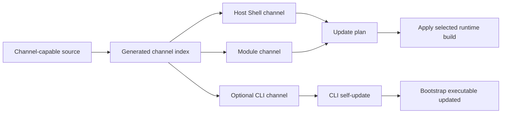

# Update Channels

## Description

Update Channels define how Docker Host discovers, displays, and applies alternate builds for the Host Shell, installed modules, and the bootstrap CLI.

The original channel idea started as a CLI self-update source. The broader target model is runtime-oriented:

- the Host Shell should be visible in management surfaces next to installed modules, even though it is currently bundled into the Host application;
- installed modules should be able to expose selectable channels for feature validation against real local data;
- the CLI should remain a thin bootstrap and lifecycle tool, with its own channels only where separate CLI delivery is useful.

The current system installs modules from a direct module metadata URL and updates them by refreshing that stored metadata URL. That flow remains the baseline. Channels add a discovery layer above metadata URLs and image tags. Selecting a channel should resolve to concrete metadata, image, or release references, then reuse the existing install/update planning model.

The runtime channel indexes are generated artifacts. They are not committed as JSON files in the repository. The repository should contain schema documentation, planning, and workflow code that generates and publishes those indexes.

The initial product-level channels are:

- `main` - the primary channel, built from the `main` branch and used as the default update source.
- `pr-<number>-<branch-slug>` - temporary pull request channels for validating PR-specific Shell, Host, module, and optional CLI builds.

The `stable` channel is intentionally deferred. It can be added later as a manually promoted release channel if the project starts producing release-candidate or production release approvals separate from `main`.



## Concepts

### Runtime App

A runtime app is something the Host can show as an installed or managed application with a current version, source, channel, and update state.

Initial runtime app types:

- `shell` - the Host Shell used to manage Docker Host and embed module UIs.
- `module` - an installed module from module metadata.

The CLI is not a runtime app. It is a local bootstrap executable. It can still use a channel index for self-update, but it should not drive the whole product model.

### Host Shell

The Host Shell is currently part of the Host Web UI and Host container image. The planning target is to show it in installed-app management as a first-class system app.

The first implementation can model Shell updates as Host image updates:

- current Shell channel maps to a Host image reference;
- switching the Shell channel updates the Host image setting or Host-owned Shell source state;
- the existing Host lifecycle recreates or restarts the Host container when needed.

A later implementation can separate Shell delivery from the Host backend if the architecture needs it. The channel model should allow that, but not require it now.

### Module

Installed modules already have a concrete source:

- `metadataUrl` in `modules.json`;
- a local copied `metadata.json`;
- container image references resolved from metadata.

For modules, a channel switch should resolve to a replacement metadata source and then use the existing module update plan:

1. The administrator chooses a channel for an installed module.
2. The Host resolves that channel to a metadata URL or metadata snapshot.
3. The Host builds an update plan using the selected metadata.
4. The administrator reviews settings, storage, dependencies, and image changes.
5. The Host applies the update and stores the selected channel/source state.

This keeps channel switching compatible with existing update safety behavior. It is not only a Docker image tag replacement.

### Repository-backed Source

Direct metadata URLs remain supported. Future repository-backed modules should still produce concrete metadata before install or update planning.

Repository-backed channels can be represented as source selectors:

- branch selector, for example `main` or `feature/auth-flow`;
- pull request selector, for example PR `42`;
- commit selector for immutable validation;
- release tag selector for manually promoted builds.

The Host should not need to understand every repository layout at the update-plan layer. A repository integration can discover or generate the module metadata for a selected branch or pull request, but the install/update engine should still consume a concrete metadata document.

For source-code modules, metadata can later describe how the app is built or run, for example a Node.js app with package scripts. That is a separate runtime-source extension. Channels should select the version of that source; update planning should still work from a concrete resolved metadata document.

## Channel Indexes

There are two related but separate index types.

### Product Channel Index

The product channel index is owned by this repository and covers Docker Host itself.

It should be published to a stable GitHub Release asset, for example:

- release tag: `update-channels`
- asset name: `channels.json`
- URL shape: `https://github.com/alex-de-haas/docker-host/releases/download/update-channels/channels.json`

Example shape:

```json
{
  "schemaVersion": 1,
  "defaultChannel": "main",
  "generatedAt": "2026-05-31T10:00:00Z",
  "channels": [
    {
      "id": "main",
      "label": "Main",
      "kind": "main",
      "description": "Latest successful main branch build.",
      "source": {
        "branch": "main",
        "commit": "abc123"
      },
      "shell": {
        "image": "ghcr.io/alex-de-haas/docker-host:latest"
      },
      "cli": {
        "releaseTag": "cli-main"
      }
    },
    {
      "id": "pr-42-auth-flow",
      "label": "PR #42 auth-flow",
      "kind": "pull-request",
      "description": "Temporary update channel for PR #42.",
      "source": {
        "pullRequest": 42,
        "branch": "feature/auth-flow",
        "commit": "def456"
      },
      "shell": {
        "image": "ghcr.io/alex-de-haas/docker-host:pr-42-auth-flow"
      },
      "cli": {
        "releaseTag": "cli-pr-42-auth-flow"
      },
      "expiresAt": "2026-06-14T00:00:00Z"
    }
  ]
}
```

The `cli` block is optional over time. If the CLI remains simple enough, Shell and module channels may carry most product changes while the CLI updates less often.

### Module Channel Index

A module channel index is owned by the module publisher. It advertises selectable metadata sources for one module.

The module metadata can later add an optional pointer to this index:

```json
{
  "id": "com.acme.reports",
  "version": "1.0.0",
  "channelsUrl": "https://modules.acme.example/reports/channels.json"
}
```

Example module channel index:

```json
{
  "schemaVersion": 1,
  "moduleId": "com.acme.reports",
  "defaultChannel": "main",
  "channels": [
    {
      "id": "main",
      "label": "Main",
      "kind": "main",
      "source": {
        "branch": "main",
        "commit": "abc123"
      },
      "metadataUrl": "https://modules.acme.example/reports/main/metadata.json"
    },
    {
      "id": "pr-42-new-dashboard",
      "label": "PR #42 new-dashboard",
      "kind": "pull-request",
      "source": {
        "pullRequest": 42,
        "branch": "feature/new-dashboard",
        "commit": "def456"
      },
      "metadataUrl": "https://modules.acme.example/reports/pr-42-new-dashboard/metadata.json",
      "expiresAt": "2026-06-14T00:00:00Z"
    }
  ]
}
```

Channel ids and generated tags should use the pull request number as the stable identifier. A branch slug can be appended for readability, but the pull request number must remain the conflict-resistant key. Branch names can contain unsupported characters, become too long, or change over time.

## UI Behavior

The installed modules view should evolve into a runtime apps management view.

It should show:

- Host Shell as a system app;
- installed modules as module apps;
- current channel where known;
- current version or commit where known;
- current runtime status;
- available actions such as update, switch channel, restart, stop, remove, or open.

Shell-specific behavior:

- Shell should be visible even when no modules are installed.
- Shell should be labeled as a system app so administrators do not confuse it with a removable module.
- Channel switching should make it clear whether a Host restart or container recreation is required.

Module-specific behavior:

- A module with no `channelsUrl` or repository source can keep the current update behavior.
- A module with channels can expose `Switch channel` next to `Update`.
- Channel switching should always show an update plan before applying changes.
- The UI should preserve real-data validation safety by showing storage, settings, dependency, image, and endpoint changes.

## CLI Behavior

The CLI should remain focused on bootstrap, Host lifecycle, and local update transport.

Supported product channel command shapes:

- `docker-host update` - fetch product channels, show an interactive selection prompt, default to the configured channel or `main`.
- `docker-host update --channel main` - update non-interactively from the named product channel.
- `docker-host update --channel pr-42-auth-flow` - update from a PR-specific product channel.
- `docker-host update --list-channels` - print the current generated product channel list without updating.

When applying a product channel, the CLI should:

- download the product channel index;
- validate the schema version;
- resolve the selected channel;
- update the local Host Shell image setting from `channel.shell.image`;
- download and apply a CLI artifact from `channel.cli.releaseTag` only if the selected channel includes a CLI block;
- verify CLI artifacts with `SHA256SUMS` when available;
- store the selected product channel locally so the next interactive update can default to it;
- leave Host container recreation to the existing `docker-host start` flow unless an explicit restart/apply command is introduced.

The selected product channel is user preference, not a permanent property of the binary. Build metadata should still be embedded separately in the CLI over time, such as version, commit SHA, build time, release tag, and build channel.

## GitHub Actions Model

The implementation should extend the existing artifact publishing workflows instead of adding a separate distribution system.

Main product channel workflow:

- build the Host image from `main`;
- publish the Host image as `ghcr.io/alex-de-haas/docker-host:latest`;
- build the CLI only when CLI inputs changed or when a coordinated product channel requires it;
- publish or update a rolling GitHub prerelease with tag `cli-main` when CLI assets are built;
- update the generated product channel index entry for `main`;
- publish the regenerated `channels.json` asset to the `update-channels` release.

Pull request product channel workflow:

- run only when a PR is intended to expose an update channel, for example by label `update-channel`;
- build the Host image for the PR;
- publish the Host image with a tag like `pr-42-auth-flow`;
- build and publish PR-specific CLI assets only when needed;
- publish or update a rolling GitHub prerelease with a tag like `cli-pr-42-auth-flow` when CLI assets are built;
- add or update the PR channel in the generated product channel index;
- publish the regenerated `channels.json` asset to the `update-channels` release.

Pull request cleanup workflow:

- run when a pull request is closed;
- remove the matching PR channel from the generated product channel index;
- publish the regenerated `channels.json` asset;
- delete generated PR release assets, release tags, and package/image tags when GitHub permissions allow it;
- never delete the source branch from the cleanup workflow.

Module channel workflows are publisher-owned. A module repository can generate its own channel index from branches, pull requests, commits, or release tags. Docker Host should consume those indexes through documented URLs rather than requiring all module publishers to use this repository's workflow implementation.

## Milestones

### Phase 1 - Broaden the channel contract

**Status**: Completed

- Document channels as runtime app channels, not only CLI channels.
- Define Host Shell, module, and optional CLI channel responsibilities.
- Document that generated runtime indexes are release assets, not committed repository JSON.
- Add future repository-backed source considerations without replacing the existing metadata update model.

### Phase 2 - Show Shell as a managed system app

**Status**: Not Started

- Add a Host Shell entry to the management UI next to installed modules.
- Label Shell as a system app with non-removable behavior.
- Show current Shell image, channel, version, or commit where available.
- Show restart or recreate requirements when the Shell channel changes.

### Phase 3 - Generate and publish the main product channel

**Status**: Not Started

- Publish the `main` channel entry with `ghcr.io/alex-de-haas/docker-host:latest`.
- Rename or replace the current rolling `cli-dev` behavior with `cli-main` if CLI channel publishing remains useful.
- Keep backward compatibility for `cli-dev` only if needed for existing installers.
- Publish `channels.json` to the `update-channels` release.

### Phase 4 - Add product channel selection

**Status**: Not Started

- Add product channel index download and schema validation.
- Add interactive product channel selection to `docker-host update`.
- Add non-interactive `--channel` and `--list-channels` options.
- Store the selected product channel in local CLI configuration.
- Update the local Host image setting when a product channel is applied.
- Preserve existing checksum verification and executable replacement behavior for channels that include CLI artifacts.

### Phase 5 - Add module channel discovery

**Status**: Not Started

- Add optional module metadata support for a channel index pointer such as `channelsUrl`.
- Add Host-side loading and validation for module channel indexes.
- Store the selected module channel and resolved metadata source in `modules.json`.
- Keep direct metadata URL modules fully supported.

### Phase 6 - Add module channel switching

**Status**: Not Started

- Add a `Switch channel` action for modules with available channels.
- Resolve the selected channel to metadata before planning.
- Reuse the existing module update plan and apply flow.
- Show settings, storage, dependency, image, endpoint, and runtime changes before applying.
- Validate channel switching against real installed data and failure recovery behavior.

### Phase 7 - Add pull request channels and cleanup

**Status**: Not Started

- Add an opt-in trigger for PR product channels, preferably a label such as `update-channel`.
- Generate PR-safe slugs using `pr-<number>-<branch-slug>`.
- Publish PR-specific Host image tags.
- Publish PR-specific CLI releases only when needed.
- Add PR channel entries to the generated product channel index.
- Remove closed PR channels from the generated product channel index.
- Delete generated PR CLI releases, release tags, and Host image tags when safe.
- Keep cleanup best-effort and visible in workflow logs.

### Phase 8 - Validate end-to-end delivery

**Status**: Not Started

- Validate switching Shell to `main`.
- Validate switching Shell to `pr-<number>-<branch-slug>`.
- Confirm the Shell image setting changes to the selected channel image.
- Confirm `docker-host start` pulls and starts the matching Host image.
- Validate switching an installed module to a module PR channel.
- Confirm module channel switching uses the update plan before applying changes.
- Confirm closed PR channels disappear from channel lists.

## Open Questions And Answers

- Question: Should the default product channel be called `stable`?
  - Answer: No, not initially. The current delivery model has development PR validation and the real mainline environment, but no separate release approval environment.
  - Recommendation: Use `main` as the default channel and reserve `stable` for future manually promoted releases.

- Question: Should the runtime channel JSON be committed to the repository?
  - Answer: No. Runtime channel indexes should be generated and published as release assets so PR channels can appear and disappear without CI committing to `main`.
  - Recommendation: Commit only schema documentation, planning, and workflow implementation.

- Question: Should the CLI have its own channels?
  - Answer: Maybe, but it should not be the center of the model. The CLI has relatively small scope compared with Shell and module behavior.
  - Recommendation: Keep CLI channel support optional inside product channels and only publish CLI artifacts when CLI changes need validation.

- Question: Should Shell be treated exactly like an installed module?
  - Answer: Not yet. Shell is currently part of the Host application and container image, while installed modules use metadata and module lifecycle state.
  - Recommendation: Show Shell as a managed system app first. Revisit a module-like Shell packaging model only if Shell delivery separates from the Host backend.

- Question: Should module channels replace `metadata.json`?
  - Answer: No. Channels should resolve to concrete metadata. The existing metadata-based install and update plan remains the safety boundary.
  - Recommendation: Add channel discovery above metadata, not instead of metadata.

- Question: Should branch names be treated as channels automatically?
  - Answer: Not directly. Branch names are useful source selectors, but raw branch lists can be noisy and unstable.
  - Recommendation: Generate curated channel indexes from branches or pull requests. Use PR number as the stable channel id for PR channels.

- Question: Should PR channels be created for every pull request?
  - Answer: Not by default. That can make channel lists noisy and spend build capacity on PRs that do not need local channel validation.
  - Recommendation: Make PR channel publishing opt-in with a label such as `update-channel`.

- Question: Should PR cleanup delete the source branch?
  - Answer: No. The source branch may belong to a developer workflow or a fork.
  - Recommendation: Delete only generated releases, tags, images, and channel index entries.

- Question: Should PR assets be deleted immediately after closing a PR?
  - Answer: The channel entry should be removed immediately. Asset deletion should be attempted immediately when safe, but treated as best-effort because registry package deletion can depend on permissions and retention behavior.
  - Recommendation: Keep cleanup logs explicit and avoid blocking channel index cleanup on package deletion failures.
