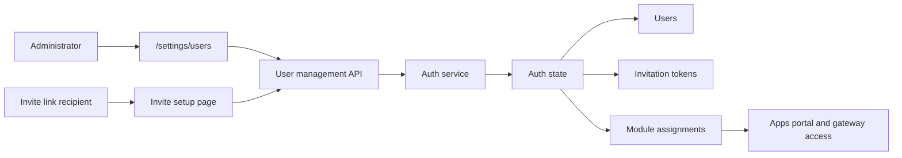

# User Management Settings

## Description

Add an administrator-only User Management page under Settings where Host administrators can manage Host users without using the CLI. The page should let administrators list users, invite local users or administrators through role-scoped one-time setup links, revoke invitation links, disable users, change local user roles, revoke access, and manage Host app assignments.

The feature should reuse the existing Host-owned auth model instead of introducing a separate permissions store:

- users live in `/data/auth/state.json` as `AuthUserRecord`;
- Host roles remain `host.admin` and `host.user`;
- module and app access assignment uses `AuthState.moduleAssignments`;
- setup-token style links should remain one-time, hash-only-at-rest tokens;
- sensitive mutations should reuse recent administrator reauthentication;
- all mutations should append auth audit events.

## Milestones

### Phase 1 - Auth domain and API contract

**Status**: Completed

Build the backend contract first so the UI can remain thin and the behavior is testable.

- Add invitation-token support to auth state. Recommended shape: extend setup-token records or add a dedicated `AuthInvitationTokenRecord` with `purpose: "invite"`, `role`, optional `email`, optional `displayName`, `moduleAssignments`, `createdByUserId`, `createdAt`, `expiresAt`, optional `usedAt`, and optional `revokedAt`.
- Add auth service operations:
  - list users with provider, role, disabled state, created/updated timestamps, active session count, active CLI token count, and assigned module ids;
  - create invite link for `host.user` or `host.admin`;
  - list and revoke pending invite links;
  - accept invite link and create a local password user;
  - update local user role/display name;
  - disable a user and revoke their active sessions and tokens;
  - replace a user's module assignments.
- Add API routes, likely:
  - `GET /api/auth/users`;
  - `POST /api/auth/invitations`;
  - `GET /api/auth/invitations`;
  - `DELETE /api/auth/invitations/{inviteId}`;
  - `POST /api/auth/invitations/accept`;
  - `PATCH /api/auth/users/{userId}`;
  - `DELETE /api/auth/users/{userId}`;
  - `PUT /api/auth/users/{userId}/assignments`.
- Require `host.users.manage` for user lifecycle and assignment APIs.
- Require recent reauthentication for invite creation, role changes, disable/delete, invitation revoke, and assignment replacement.
- Add service and route tests for token expiry, token reuse, duplicate email, last-admin protection, role changes, session/token revocation, assignment validation, and audit events.

### Phase 2 - User Management settings UI

**Status**: Completed

Add the administrator-facing surface under Settings.

- Add a Settings navigation item for `User Management` at `/settings/users`.
- Build an admin-only page using the existing shell, shadcn components, and `SecuritySettingsClient` reauthentication pattern.
- Show a user list with search/filter controls, role/provider badges, disabled state, assigned app count, active session count, and last activity when available.
- Add an invite dialog with role selection, email, display name, optional module assignments, expiration choice, and a copyable invite URL returned once.
- Add a pending invites section with role, email, expiry, created-by, used/revoked state, copy URL when still available only if raw token is still in client memory, and revoke action.
- Add a user detail drawer or page for profile, role, app assignments, sessions, CLI tokens summary, and danger-zone actions.
- Keep assignment controls module-oriented: assign installed Host apps/modules to a user and clear assignments to return that module to all-authenticated visibility under the current model.

### Phase 3 - Invite acceptance flow

**Status**: Completed

Provide a browser flow for invited users.

- Add a dedicated invite setup route, recommended as `/setup/invite?setupToken=...`, with a shared account setup form.
- Validate the token before submit enough to show intended role and email, without exposing token hashes or internal state.
- On submit, accept the token, create the local user with password, apply initial module assignments, create a browser session, remember the account in the browser account set, and redirect to `/apps` for `host.user` or `/` for `host.admin`.
- Show clear errors for expired, revoked, already used, invalid, duplicate-email, and weak-password cases.

### Phase 4 - Access effects and safety rules

**Status**: Completed

Make lifecycle operations predictable and safe.

- Prevent disabling or demoting the last active administrator.
- Block self-disable and likely block self-delete; require another administrator to perform that action.
- When a user is disabled, revoke their sessions, remove them from browser account sets, revoke their CLI tokens, and remove module assignments.
- When an administrator is changed to `host.user`, revoke that user's CLI tokens and consider revoking active sessions so the next request uses the new role cleanly.
- Keep disabled users out of app assignment pickers and module directory responses.
- Audit every user, invitation, role, disable, re-enable, and assignment mutation with actor, target, and result.

### Phase 5 - Documentation and regression coverage

**Status**: Completed

Update product docs after behavior is implemented.

- Add `docs/features/user-management.md` and link it from `docs/root.md`.
- Update `docs/features/auth-gateway.md` with invitation and user lifecycle behavior.
- Update `docs/features/host-api.md` with the new endpoint contract.
- Update local development docs if dev seeding needs to expose the User Management page.
- Run the Host test suite and a browser smoke test for invite creation, invite acceptance, role update, assignment update, and user disable.

## Resolved Decisions

- **Question**: Should invite links reuse `/setup` or use a new invite setup route?
  **Answer based on current code**: `/setup` currently redirects away after the first administrator exists, so it cannot accept normal user invites without changing its guard.
  **Decision**: Use `/setup/invite?setupToken=...` and share the form component with first-admin setup where possible.

- **Question**: Are invites local-password users only, or should they also pre-provision OIDC/trusted-proxy users?
  **Answer based on current code**: existing setup-token flows create local password users. OIDC and trusted-proxy users are just-in-time provisioned and their roles are recalculated from provider mappings on login.
  **Decision**: Make v1 invites local-password only. Let User Management disable and assign externally provisioned users after first login, but keep external roles provider-owned until a separate provider-management feature exists.

- **Question**: What is the invite token lifetime?
  **Answer based on current code**: first-admin and recovery setup tokens expire after 15 minutes.
  **Decision**: Use a 24-hour default for user invites, with UI choices for 15 minutes, 24 hours, and 7 days. Store the selected expiry on each invitation.

- **Question**: Is email required for an invite?
  **Answer based on current code**: local login identifies users by email, and there is no mail-sending system.
  **Decision**: Require email for local invites, generate a copyable URL, and leave actual delivery to the administrator for v1.

- **Question**: Does User Management create users directly or only invite them?
  **Answer based on the requested flow**: the desired behavior is invite-first, with the recipient setting their own password through a setup token.
  **Decision**: Do not add direct admin-set passwords in v1. Add password-reset invites later using the same token mechanics.

- **Question**: What does deleting a user mean?
  **Answer based on current state**: users are referenced by sessions, CLI tokens, account sets, audit events, external identities, and module assignments.
  **Decision**: Implement delete as soft-disable in v1. Keep audit history and stable ids. Consider a hard purge only as a later privacy/maintenance operation with stronger safeguards.

- **Question**: Should an administrator be able to invite or promote another administrator?
  **Answer based on current roles**: `host.admin` is a broad role and `canUseHostApi` currently grants all Host API actions to administrators.
  **Decision**: Allow admin invites and promotions only with recent reauthentication, explicit confirmation, audit logging, and last-admin protection.

- **Question**: How should role changes work for OIDC and trusted-proxy users?
  **Answer based on current code**: OIDC and trusted-proxy login updates the stored user role from provider role mappings each login.
  **Decision**: In v1, show provider-managed roles as read-only or clearly warn that provider login can overwrite manual role edits. Prefer managing external roles through provider mapping configuration.

- **Question**: How should "access to applications" map to existing code?
  **Answer based on current code**: `moduleAssignments` already controls shell app visibility and module directory scope. For installed apps, any assignment for a module makes the app assigned-only for non-admin users; clearing assignments restores all-authenticated visibility.
  **Decision**: Use the existing module assignment model in v1 and make the UI copy precise: assigning users restricts that app/module to assigned users. Add a separate explicit shell access policy only if this inference becomes confusing.

- **Question**: Should disabling a user remove their module assignments?
  **Answer based on current code**: disabled users are already filtered from directory responses and auth flows, but stale assignments can remain in state.
  **Decision**: Remove disabled users from module assignments during disable. This keeps app access, gateway assignment lists, and module directory behavior clean.

- **Question**: Should role changes and disables immediately affect active sessions?
  **Answer based on current code**: session authentication reads the current user record, but a user's existing page state may not refresh immediately.
  **Decision**: Revoke sessions on disable. For admin-to-user role changes, revoke CLI tokens and active sessions for that user so the new role is applied through a fresh login.

- **Question**: Do we need permissions more granular than `host.admin` and `host.user`?
  **Answer based on current code**: action names such as `host.users.manage` exist, but `canUseHostApi` currently grants Host API actions only by `host.admin`.
  **Decision**: Keep the two-role model for this feature. Treat `host.users.manage` as an action label for auditing and future RBAC, not as a new role system.

- **Question**: Should invitation assignments be applied immediately or when the invite is accepted?
  **Answer based on current code**: assignments reference user ids, and a new invited user id does not exist before acceptance unless a placeholder user is created.
  **Decision**: Store intended assignments on the invitation and apply them when the invite is accepted. If the email already belongs to an existing user, fail acceptance and direct the administrator to edit that existing user.
