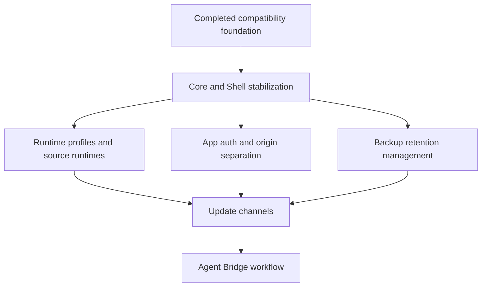

# Roadmap

## Purpose

This roadmap is the high-level planning entry point for Hosty. It summarizes the active product direction, links to detailed planning documents, and records sequencing constraints so feature work does not conflict with existing runtime, Shell, authentication, backup, and legacy module behavior.

Detailed implementation tasks remain in `docs/planning/*.md`. Small ideas that are not ready for a dedicated plan remain in [Future Work](todo.md).

## Current Direction

- Hosty is moving from a Docker-first Host application toward a local-first Core, a Core-managed Shell runtime app, and user-installed runtime apps.
- Existing Docker module compatibility remains supported during the migration.
- The active branch should prioritize Core/Shell stabilization before channel generation, pull request channels, or agent-driven app editing.
- Source and local command runtimes should replace the old developer harness model. They must use normal installed apps, existing Host users, and trusted CLI identity helpers.

## Roadmap Stages

### Stage 0 - Completed compatibility foundation

Status: Completed.

Primary plan:

- [Hosty Runtime App Platform](planning/hosty-runtime-app-platform.md)

Outcome:

- `hosty` CLI naming and compatibility behavior are established.
- `app.0.1` manifests can be mapped into the legacy Docker module engine.
- Runtime apps, system apps, app registry records, selected runtime state, app data directories, manual backups, pre-update backups, and restore behavior have a documented compatibility foundation.

Follow-up source of truth:

- [Hosty runtime app platform](features/hosty-runtime-app-platform.md)
- [Final Hosty architecture boundaries](features/final-hosty-architecture.md)

### Stage 1 - Stabilize Core and Shell management

Status: Active.

Primary plan:

- [Core Shell Stabilization](planning/core-shell-stabilization.md)

Key outcomes:

- Reliable split-process local development for Core and Shell.
- Shell lifecycle management for system apps and runtime apps.
- Simpler install and update review screens.
- Stabilized Core/Shell authentication behavior.
- Restored user management in Shell.
- Backup management controls after Shell and auth are usable.

Existing behavior that must keep working:

- Legacy Docker module install, update, start, stop, restart, configure, remove, recovery, and backup flows.
- CLI/control lifecycle routes used by existing scripts and local diagnostics.
- User assignments, role boundaries, disabled-user handling, account switching, and app identity helpers.
- Direct-origin runtime app UI embedding and Hosty identity checks through Core-managed app lifecycle.

Conflicts and constraints:

- Do not implement update channel generation, product channel publishing, runtime channel UI, pull request channels, or Agent Bridge in this stage.
- Shell must hide self-stop and remove actions for the active `hosty.shell` app, while CLI/Core APIs may still stop Shell.
- Install and update review simplification must keep advanced diagnostics available for administrators when conflicts need investigation.

### Stage 2 - Complete runtime profiles and source runtimes

Status: Partially complete, with active demo migration work.

Primary plan:

- [Runtime Profiles And Source Runtimes](planning/runtime-profiles-and-source-runtimes.md)

Completed foundation:

- Installed app records store selected runtime profile state.
- App-native lifecycle state can live in `apps.json`.
- Legacy `modules.json` remains a compatibility fallback.

Next outcomes:

- Split local-first Core and optional Shell runtime app boundaries.
- Add source repository state and local source overrides.
- Add a local command runtime adapter for installed apps.
- Add existing-user CLI identity and open helpers.
- Migrate the repository demo from legacy Demo Module workflows to an installed Demo App workflow.
- Add runtime switching plans, starting with Docker-to-Docker and then Docker-to-source/local command switching.

Existing behavior that must keep working:

- Docker-only runtime apps with no source repository.
- Existing app data paths, backup/restore behavior, storage mappings, settings, dependency URLs, and published ports.
- First-party and legacy demo fixtures until they are intentionally migrated.

Conflicts and constraints:

- Do not rebuild the removed developer harness as a new dev-only manifest mode.
- Do not seed deterministic development users for source runtime workflows.
- Local command runtimes depend on a trustworthy Core/CLI supervision boundary; Core cannot safely complete its own replacement after it exits.
- Multi-repository apps are out of scope for the first source runtime implementation.

### Stage 3 - Harden app auth and origin separation

Status: Planned, with split-origin work in progress.

Primary plan:

- [App Auth And Origin Separation](planning/app-auth-and-origin-separation.md)

Key outcomes:

- App-scoped authorization contract for Hosty-aware runtime apps.
- Core-owned app authorize and token exchange endpoints.
- Shell launch-code issuance and standalone app auth redirect.
- Explicit Core and Shell public origins with migration support for the existing combined `HOST_PUBLIC_ORIGIN`.
- SDK or middleware guidance for Hosty-aware apps.

Existing behavior that must keep working:

- Same-origin deployments during migration.
- Core-owned login/logout flows, OIDC callback behavior, CSRF expectations, and account switching.
- Existing Host users and app assignments for identity checks.

Conflicts and constraints:

- Runtime apps must not receive Hosty browser session cookies directly.
- Gateway/proxy wrapping for arbitrary third-party browser apps is deferred and should not be treated as the fallback auth model.
- Split-origin deployments must validate CORS, credentials, cookies, logout, and trusted forwarded-header behavior before being considered complete.

### Stage 4 - Finish backup retention management

Status: Partially implemented.

Primary plan:

- [App Data Backup Retention](planning/app-data-backup-retention.md)

Key outcomes:

- Retention policy model for manual, pre-update, pre-restore, scheduled, and pre-runtime-switch backups.
- Cleanup preview and apply APIs with digest/path verification.
- Scheduled cleanup through a Host-owned scheduler or maintenance hook.
- Shell and CLI controls for backup deletion and retention preview.

Existing behavior that must keep working:

- Manual backup creation.
- Pre-update and pre-restore backups.
- ZIP metadata, digest verification, CRC validation, and stop-before-restore behavior.
- Conservative behavior that avoids deleting the only known backup unless explicitly configured.

Conflicts and constraints:

- Retention cleanup must not delete external mount data.
- Destructive backup actions need confirmation.
- Manual filesystem cleanup should remain a documented fallback, not the primary workflow.

### Stage 5 - Add update channels

Status: Deferred.

Primary plan:

- [Update Channels](planning/update-channels.md)

Key outcomes:

- Product channel index for Hosty Core, Hosty Shell, and optional CLI delivery.
- Runtime app channel indexes that resolve to concrete manifest or source snapshots.
- Product and runtime channel selection through reviewed update plans.
- Pull request channels and cleanup for validation builds.

Prerequisites:

- Stable Core/Shell management experience.
- App-oriented runtime lifecycle state.
- Source repository state for repository-backed apps.
- App auth and open flows that can validate channel builds with realistic users and app data.

Conflicts and constraints:

- Generated channel indexes are release artifacts and should not be committed as live repository JSON.
- Channel switching should resolve to a concrete manifest/source snapshot before planning.
- Runtime profile switching and channel switching are separate axes unless a reviewed plan explicitly combines them.
- A `stable` channel is intentionally deferred until there is a promotion process separate from `main`.

### Stage 6 - Add Agent Bridge workflows

Status: Deferred.

Primary plan:

- [Agent Bridge Workflow](planning/agent-bridge-workflow.md)

Key outcomes:

- Shell annotation payloads for user-requested app changes.
- Core-owned agent bridge service contract.
- Repository-aware branch or pull request creation.
- Pull request channel validation against existing app data.
- Shell UI for request status, cancellation, cleanup, audit, and diagnostics.

Prerequisites:

- Repository-backed source support.
- Pull request channel generation and consumption.
- Clear permissions for who can request code changes.

Conflicts and constraints:

- Agent Bridge should not edit live app data directly.
- Agent actions should only appear for apps with source metadata and permissions.
- Credentials and repository tokens must not be exposed in Shell-visible state.

## Planning Documents

- [Core Shell Stabilization](planning/core-shell-stabilization.md) - active implementation plan for Core/Shell local development, lifecycle UI, install/update review, auth, users, and backups.
- [Runtime Profiles And Source Runtimes](planning/runtime-profiles-and-source-runtimes.md) - runtime profile state, app-native lifecycle records, Core/Shell split, source checkouts, local command runtimes, and runtime switching.
- [App Auth And Origin Separation](planning/app-auth-and-origin-separation.md) - app-scoped auth, standalone app launch, Shell launch, and Core/Shell public origin split.
- [App Data Backup Retention](planning/app-data-backup-retention.md) - retention policy, cleanup previews, scheduled cleanup, and Shell/CLI backup management controls.
- [Update Channels](planning/update-channels.md) - generated channel indexes, product/runtime channel selection, pull request channels, and channel cleanup.
- [Agent Bridge Workflow](planning/agent-bridge-workflow.md) - Shell annotation, agent request lifecycle, repository changes, branch/PR workflow, and PR channel validation.
- [Hosty Runtime App Platform](planning/hosty-runtime-app-platform.md) - completed compatibility foundation and accepted target model decisions.

## Regression Focus

Before completing a roadmap stage, validate the old features that interact with the new work:

- Legacy Docker module lifecycle and update flows.
- `app.0.1` manifest installation through the compatibility adapter.
- CLI app/module commands and Core control APIs.
- Shell navigation, embedded app routes, direct-origin app UI, and identity token delivery or replacement flows.
- User management, app assignment, account switching, disabled-user behavior, and role checks.
- App data directories, backup creation, backup restore, delete-data behavior, and external mount exclusion.
- Settings, dependency resolution, published ports, update plan digest checks, and failed operation retry.

## Open Questions And Recommendations

- Question: What should be implemented immediately after Core/Shell stabilization?
  Answer: The planning docs point to runtime profiles/source runtimes, app auth hardening, and backup retention as the next practical workstreams.
  Recommendation: Finish Shell lifecycle, auth, users, and backup controls first, then split follow-up work by subsystem instead of mixing channels or Agent Bridge into the stabilization branch.

- Question: When should update channels move from deferred to active?
  Answer: After Core/Shell management is stable and repository/source runtime state exists for apps that need branch or pull request validation.
  Recommendation: Start with generated `main` product channel validation before exposing user-facing runtime app channel switching.

- Question: When should small ideas from `docs/todo.md` become planning documents?
  Answer: When an idea starts affecting lifecycle, auth, storage, runtime, Shell UX, or release behavior across more than one component.
  Recommendation: Promote each such idea into `docs/planning/{feature-name}.md` before implementation, then link it from this roadmap.
