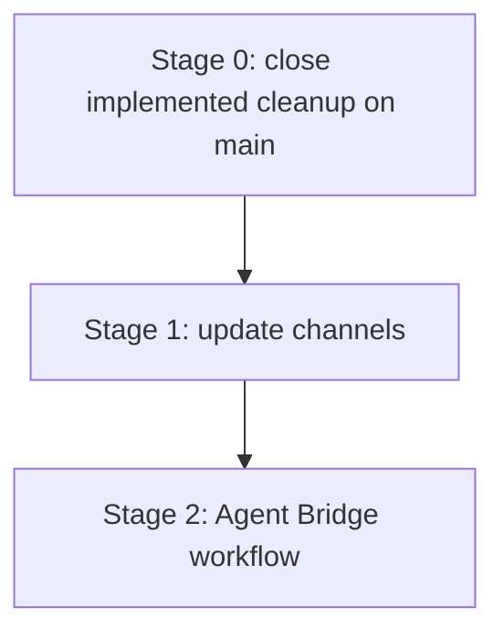

# Roadmap

## Purpose

This roadmap is the high-level planning entry point for Hosty. Implemented stages are removed from active sequencing; only release gates and deferred product stages remain.

## Current Direction

- Hosty is moving from a Docker-first app toward local-first Core, a Core-managed Shell runtime app, and user-installed runtime apps.
- New development uses `app.0.1` manifests and `hosty apps`.
- The repository Demo App is installed directly from `apps/demo-app/manifest.json`.
- Update channels are the next product stage after the current cleanup lands on `main`.
- Agent Bridge workflows remain deferred until update channels exist.

## Stage 0 - Close implemented cleanup on main

Status: Pending merge and published Demo App image smoke.

Scope:

- The cleanup work is implemented locally, but cannot be marked complete until it lands on `main`.
- The current first-party Demo App workflow uses direct `apps/demo-app/manifest.json` installation through Core-managed lifecycle.
- No new feature work should be added to this stage beyond merge, release workflow, GHCR package visibility, or smoke-test fixes.

Completion checklist:

- Merge the branch or pull request containing this cleanup into `main`.
- Ensure `.github/workflows/demo-app-image.yml` exists and runs on `main`.
- Ensure obsolete first-party image publishing is no longer active on the default branch.
- Ensure the GHCR package for `ghcr.io/alex-de-haas/demo-app` is public.
- Verify `docker pull ghcr.io/alex-de-haas/demo-app:latest` succeeds.

Follow-up source of truth:

- [Demo App](features/demo-app.md)
- [Repository and release model](features/repository-release-model.md)

## Stage 1 - Add update channels

Status: Deferred.

Primary plan:

- [Update Channels](planning/update-channels.md)

Key outcomes:

- Product channel index for Hosty Core, Hosty Shell, and optional CLI delivery.
- Runtime app channel indexes that resolve to concrete manifest or source snapshots.
- Product and runtime channel selection through reviewed update plans.
- Pull request channels and cleanup for validation builds.

Prerequisites:

- Stage 0 merge and published Demo App image smoke.
- Stable Core/Shell management experience.
- App-oriented runtime lifecycle state.
- Source repository state for repository-backed apps.
- App auth and open flows that can validate channel builds with realistic users and app data.

## Stage 2 - Add Agent Bridge workflows

Status: Deferred.

Primary plan:

- [Agent Bridge Workflow](planning/agent-bridge-workflow.md)

Key outcomes:

- Shell annotation payloads for user-requested app changes.
- Core-owned agent bridge service contract.
- Repository-aware branch or pull request creation.
- Pull request channel validation against existing app data.
- Shell UI for request status, cancellation, cleanup, audit, and diagnostics.

Prerequisites:

- Repository-backed source support.
- Pull request channel generation and consumption.
- Clear permissions for who can request code changes.

## Open Questions And Recommendations

- Question: What blocks Stage 0 completion?
  Answer: The cleanup is implemented locally, but it still needs to be merged into `main`, published through `demo-app-image.yml`, and verified with a public `docker pull ghcr.io/alex-de-haas/demo-app:latest`.
  Recommendation: Treat merge, workflow execution, GHCR package visibility, and published-image smoke as release-gate work.

- Question: When should update channels move from deferred to active?
  Answer: After Stage 0 is complete.
  Recommendation: Start Stage 1 before Agent Bridge so pull request channels build on a stable product-channel model.

- Question: When should Agent Bridge work start?
  Answer: After Stage 1 defines channel generation, pull request channels, and cleanup behavior.
  Recommendation: Keep Agent Bridge deferred until there is a concrete validation channel model.
