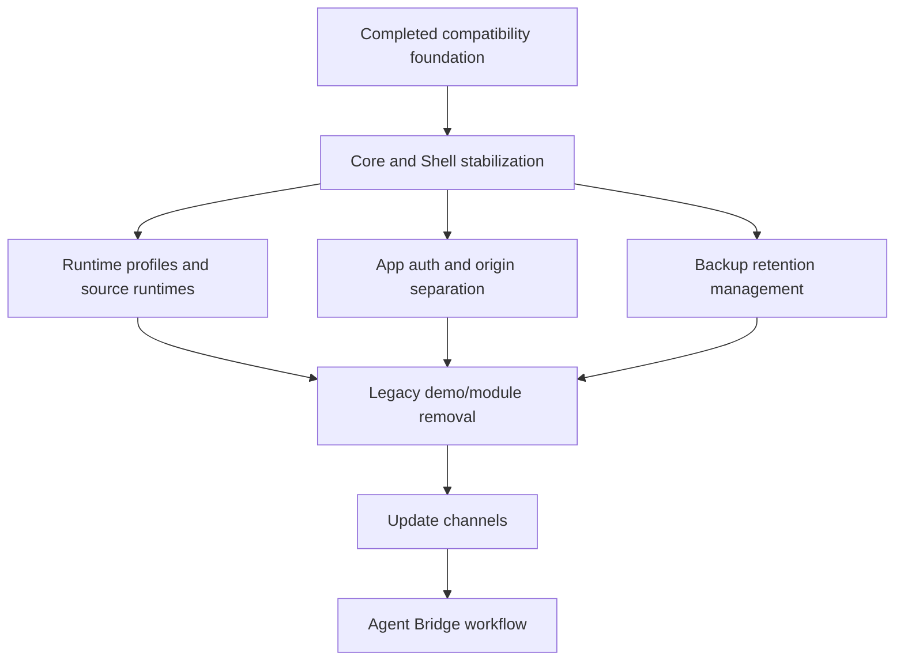

# Roadmap

## Purpose

This roadmap is the high-level planning entry point for Hosty. It summarizes the active product direction, links to detailed planning documents, and records sequencing constraints so feature work does not conflict with existing runtime, Shell, authentication, backup, and legacy module behavior.

Detailed implementation tasks remain in `docs/planning/*.md`. Small ideas that are not ready for a dedicated plan remain in [Future Work](todo.md).

## Current Direction

- Hosty is moving from a Docker-first Host application toward a local-first Core, a Core-managed Shell runtime app, and user-installed runtime apps.
- Existing Docker module compatibility remains supported during the migration.
- The active branch should prioritize Core/Shell stabilization before channel generation, pull request channels, or agent-driven app editing.
- Source and local command runtimes should replace the old developer harness model. They must use normal installed apps, existing Host users, and trusted CLI identity helpers.

## Roadmap Stages

### Stage 0 - Completed compatibility foundation

Status: Completed.

Primary plan:

- [Hosty Runtime App Platform](planning/hosty-runtime-app-platform.md)

Outcome:

- `hosty` CLI naming and compatibility behavior are established.
- `app.0.1` manifests can be mapped into the legacy Docker module engine.
- Runtime apps, system apps, app registry records, selected runtime state, app data directories, manual backups, pre-update backups, and restore behavior have a documented compatibility foundation.

Follow-up source of truth:

- [Hosty runtime app platform](features/hosty-runtime-app-platform.md)
- [Final Hosty architecture boundaries](features/final-hosty-architecture.md)

### Stage 1 - Stabilize Core and Shell management

Status: Completed.

Primary plan:

- [Core Shell Stabilization](planning/core-shell-stabilization.md)

Key outcomes:

- Reliable split-process local development for Core and Shell.
- Shell lifecycle management for system apps and runtime apps.
- Simpler install and update review screens.
- Stabilized Core/Shell authentication behavior.
- Restored user management in Shell.
- Backup management controls after Shell and auth are usable.

Implemented slice:

- Phase 1 local Core/Shell development is complete: Core starts locally, Shell origin defaults and overrides are documented and browser-smoked, Shell session loading works before and after Core login, and authenticated Shell app loading reaches `/api/apps`.
- Core has a development-only login helper for local browser smoke tests against existing enabled Host users; production authentication remains deferred to the auth stabilization phase.
- Shell Next.js development config allows loopback dev resources for `127.0.0.1` and `localhost`, matching the local Core/Shell cookie and CORS workflow.
- Phase 2 Shell lifecycle management is complete: Shell can call Core public browser endpoints to start, stop, restart, open, update, configure, inspect logs, create/list/restore/delete backups, and remove manageable runtime apps.
- Core app summaries are authenticated and principal-filtered before Shell renders lifecycle controls.
- Public lifecycle mutations require Core session authentication, `host.admin`, and CSRF validation, while read-only diagnostics still require an admin Core session.
- The active `hosty.shell` app hides self-start/self-stop/self-restart/self-remove controls, while CLI/local control APIs keep the full Shell management surface.
- Browser smoke verified a Core control-installed runtime app, Shell configure/update/logs/backups/remove panels, manual backup creation, and local command start/stop state transitions.
- Phase 3 install/update review simplification is complete: Shell now has an admin install review panel backed by Core install-plan/apply endpoints, and update review uses a concise version/runtime/digest/change surface.
- Phase 4 authentication stabilization is complete in implementation: Core owns auth pages/sessions/invitation acceptance, Shell opens Core-owned auth surfaces, browser app launch codes use the active Core session user only, redirect URIs are checked against installed app endpoint origins, and local runtime browser endpoints use a separate `app.localhost` host so default Core cookies on `127.0.0.1` are not sent to runtime apps.
- Phase 5 user management is complete in implementation: Shell exposes an admin Users view for users, invitations, role changes, disabled-user state, and app assignments, backed by Core authoritative user-management APIs and audit records.
- Phase 6 backup management controls are complete in implementation: Shell exposes backup list/create/restore/delete controls with confirmation and clear retention behavior, while Core/control backup APIs remain available.
- Combined browser smoke verified Core login, authenticated Shell loading, Users view, invitation generation, app assignment save, backup list/create controls, launch-code app open, and runtime cookie isolation on `app.localhost`.

Existing behavior that must keep working:

- Legacy Docker module install, update, start, stop, restart, configure, remove, recovery, and backup flows.
- CLI/control lifecycle routes used by existing scripts and local diagnostics.
- User assignments, role boundaries, disabled-user handling, account switching, and app identity helpers.
- Direct-origin runtime app UI embedding and Hosty identity checks through Core-managed app lifecycle.

Conflicts and constraints:

- Do not implement update channel generation, product channel publishing, runtime channel UI, pull request channels, or Agent Bridge in this stage.
- Shell must hide self-stop and remove actions for the active `hosty.shell` app, while CLI/Core APIs may still stop Shell.
- Install and update review simplification must keep advanced diagnostics available for administrators when conflicts need investigation.
- Authentication must remain Core-owned. Browser, desktop, mobile, and future Shells should redirect or open Core-owned login/authorize surfaces instead of embedding provider-specific auth logic.

### Stage 2 - Complete runtime profiles and source runtimes

Status: Completed.

Primary plan:

- [Runtime Profiles And Source Runtimes](planning/runtime-profiles-and-source-runtimes.md)

Feature source of truth:

- [Hosty runtime app platform](features/hosty-runtime-app-platform.md)
- [Final Hosty architecture boundaries](features/final-hosty-architecture.md)
- [Runtime source workflows](features/runtime-source-workflows.md)
- [Local development and testing](features/local-development.md)
- [CLI app and module commands](features/cli-module-commands.md)
- [Docker Host domain model](features/domain-model.md)
- [Demo App](features/demo-app.md)

Completed outcomes:

- Installed app records store selected runtime profile state and app-native lifecycle fields in app-owned records.
- Legacy `modules.json` remains readable only as a compatibility fallback for already-installed legacy module records.
- Hosty Core is a local-first ASP.NET Core process, Hosty Shell is a Core-managed runtime app, and the CLI is the Core bootstrap/API client.
- Runtime apps can declare app-level source metadata; Core stores managed checkout state, immutable resolved commits, and administrator-selected local source overrides.
- Local command runtime profiles run under Core supervision from a managed checkout, local override, or app root fallback.
- Trusted CLI helpers can list existing Host users, issue app identity tokens, and create Shell or standalone app open links while enforcing normal access checks.
- The primary repository demo workflow is `apps/demo-app` with an `app.0.1` manifest, Docker runtime profile, and `dev` local command runtime profile.
- Runtime switching has reviewed plan/apply endpoints and CLI commands for Docker-to-Docker, Docker-to-localCommand, and localCommand-to-Docker switching.
- Runtime switch apply preserves reviewed digest semantics, creates `pre-runtime-switch` backups when primary app data exists, and restores selected runtime state if restart fails.

Existing behavior that must keep working:

- Docker-only runtime apps with no source repository.
- Existing app data paths, backup/restore behavior, storage mappings, settings, dependency URLs, and published ports.
- Legacy Demo Module and `modules.json` compatibility fixtures until the dedicated cleanup stage removes them.

Conflicts and constraints:

- Do not rebuild the removed developer harness as a new dev-only manifest mode.
- Do not seed deterministic development users for source runtime workflows.
- Local command runtimes depend on a trustworthy Core/CLI supervision boundary; Core cannot safely complete its own replacement after it exits.
- Multi-repository apps are out of scope for the first source runtime implementation.
- Removing `modules/demo-module` and reducing `modules.json` compatibility are not Stage 2 blockers; they moved to Stage 5 after auth/origin and backup validation.

### Stage 3 - Harden app auth and origin separation

Status: Completed in implementation and documentation.

Primary plan:

- [App Auth And Origin Separation](planning/app-auth-and-origin-separation.md)

Key outcomes:

- App-scoped authorization contract for Hosty-aware runtime apps.
- Core-owned app authorize and token exchange endpoints.
- Shell launch-code issuance and standalone app auth redirect.
- Explicit Core and Shell public origins with migration support for the existing combined `HOST_PUBLIC_ORIGIN`.
- SDK or middleware guidance for Hosty-aware apps.

Completed notes:

- Core issues one-time app auth/launch codes, exchanges them for app-scoped identity tokens, and revalidates app sessions against current user/app access state.
- Demo App now implements a Next.js app-code exchange route and app-local session revalidation example.
- CLI launch config exposes explicit Core/Shell public origins and still supports `HOST_PUBLIC_ORIGIN` as a combined-deployment alias.
- Core status, Shell status, and `hosty core status` surface public-origin warnings for invalid values and insecure non-loopback HTTP.
- Gateway/proxy browser wrapping remains deferred and is documented as separate future scope.

Existing behavior that must keep working:

- Same-origin deployments during migration.
- Core-owned login/logout flows, OIDC callback behavior, CSRF expectations, and account switching.
- Existing Host users and app assignments for identity checks.

Conflicts and constraints:

- Runtime apps must not receive Hosty browser session cookies directly.
- Gateway/proxy wrapping for arbitrary third-party browser apps is deferred and should not be treated as the fallback auth model.
- Split-origin deployments must validate CORS, credentials, cookies, logout, and trusted forwarded-header behavior before being considered complete.

### Stage 4 - Finish backup retention management

Status: Completed.

Primary feature:

- [App Data Backup Retention](features/app-data-backup-retention.md)

Key outcomes:

- Retention policy model for manual, pre-update, pre-restore, scheduled, and pre-runtime-switch backups is implemented.
- Cleanup preview and apply APIs use plan digest and path verification.
- Scheduled cleanup runs through a Host-owned maintenance service.
- Shell and CLI controls cover backup deletion, retention preview, and confirmed prune apply.

Existing behavior that must keep working:

- Manual backup creation.
- Pre-update and pre-restore backups.
- ZIP metadata, digest verification, CRC validation, and stop-before-restore behavior.
- Conservative behavior that avoids deleting the only known backup unless explicitly configured.

Conflicts and constraints:

- Retention cleanup must not delete external mount data.
- Destructive backup actions need confirmation.
- Manual filesystem cleanup should remain a documented fallback, not the primary workflow.

### Stage 5 - Retire legacy demo/module compatibility

Status: Planned.

Primary plan:

- [Legacy Demo Module Removal](planning/legacy-demo-module-removal.md)

Key outcomes:

- Remove `modules/demo-module` as the first-party legacy schema `0.3` compatibility fixture.
- Remove Demo Module CI/image publishing and fixture routes after Demo App published image workflows are live-smoked.
- Reduce `modules.json` from a required app lifecycle store to an explicit migration/import compatibility input where still needed.
- Update feature docs so Demo App and `app.0.1` manifests are the only first-party runtime app workflow.

Prerequisites:

- Stage 2 runtime/source workflows completed.
- Stage 3 app auth and split-origin validation no longer depends on legacy Demo Module identity behavior.
- Stage 4 backup retention validation no longer depends on legacy module storage layout.
- Live Docker daemon smoke tests pass for published Demo App image workflows.

Conflicts and constraints:

- Do not delete compatibility behavior that is still needed for existing installations without an explicit migration/import path.
- Do not keep Demo Module as a parallel first-party workflow after the cleanup starts.

### Stage 6 - Add update channels

Status: Deferred.

Primary plan:

- [Update Channels](planning/update-channels.md)

Key outcomes:

- Product channel index for Hosty Core, Hosty Shell, and optional CLI delivery.
- Runtime app channel indexes that resolve to concrete manifest or source snapshots.
- Product and runtime channel selection through reviewed update plans.
- Pull request channels and cleanup for validation builds.

Prerequisites:

- Stable Core/Shell management experience.
- App-oriented runtime lifecycle state.
- Source repository state for repository-backed apps.
- App auth and open flows that can validate channel builds with realistic users and app data.

Conflicts and constraints:

- Generated channel indexes are release artifacts and should not be committed as live repository JSON.
- Channel switching should resolve to a concrete manifest/source snapshot before planning.
- Runtime profile switching and channel switching are separate axes unless a reviewed plan explicitly combines them.
- A `stable` channel is intentionally deferred until there is a promotion process separate from `main`.

### Stage 7 - Add Agent Bridge workflows

Status: Deferred.

Primary plan:

- [Agent Bridge Workflow](planning/agent-bridge-workflow.md)

Key outcomes:

- Shell annotation payloads for user-requested app changes.
- Core-owned agent bridge service contract.
- Repository-aware branch or pull request creation.
- Pull request channel validation against existing app data.
- Shell UI for request status, cancellation, cleanup, audit, and diagnostics.

Prerequisites:

- Repository-backed source support.
- Pull request channel generation and consumption.
- Clear permissions for who can request code changes.

Conflicts and constraints:

- Agent Bridge should not edit live app data directly.
- Agent actions should only appear for apps with source metadata and permissions.
- Credentials and repository tokens must not be exposed in Shell-visible state.

## Planning Documents

- [Core Shell Stabilization](planning/core-shell-stabilization.md) - active implementation plan for Core/Shell local development, lifecycle UI, install/update review, auth, users, and backups.
- [Runtime Profiles And Source Runtimes](planning/runtime-profiles-and-source-runtimes.md) - runtime profile state, app-native lifecycle records, Core/Shell split, source checkouts, local command runtimes, and runtime switching.
- [App Auth And Origin Separation](planning/app-auth-and-origin-separation.md) - app-scoped auth, standalone app launch, Shell launch, and Core/Shell public origin split.
- [Legacy Demo Module Removal](planning/legacy-demo-module-removal.md) - post-validation cleanup for Demo Module, legacy fixture CI, and `modules.json` lifecycle compatibility.
- [Update Channels](planning/update-channels.md) - generated channel indexes, product/runtime channel selection, pull request channels, and channel cleanup.
- [Agent Bridge Workflow](planning/agent-bridge-workflow.md) - Shell annotation, agent request lifecycle, repository changes, branch/PR workflow, and PR channel validation.
- [Hosty Runtime App Platform](planning/hosty-runtime-app-platform.md) - completed compatibility foundation and accepted target model decisions.

## Regression Focus

Before completing a roadmap stage, validate the old features that interact with the new work:

- Legacy Docker module lifecycle and update flows.
- `app.0.1` manifest installation through the compatibility adapter.
- CLI app/module commands and Core control APIs.
- Shell navigation, embedded app routes, direct-origin app UI, and identity token delivery or replacement flows.
- User management, app assignment, account switching, disabled-user behavior, and role checks.
- App data directories, backup creation, backup restore, delete-data behavior, and external mount exclusion.
- Settings, dependency resolution, published ports, update plan digest checks, and failed operation retry.

## Open Questions And Recommendations

- Question: What should be implemented immediately after Core/Shell stabilization?
  Answer: Runtime profiles/source runtimes, app auth/origin hardening, and backup retention are complete. The next practical workstream is legacy Demo Module compatibility retirement.
  Recommendation: Start Stage 5 before update channels so update-channel validation no longer depends on legacy module fixtures.

- Question: When should update channels move from deferred to active?
  Answer: After Core/Shell management is stable, repository/source runtime state exists, app auth/open flows are validated, backup behavior is stable, and legacy Demo Module compatibility has been retired or explicitly isolated.
  Recommendation: Start with generated `main` product channel validation before exposing user-facing runtime app channel switching.

- Question: When should small ideas from `docs/todo.md` become planning documents?
  Answer: When an idea starts affecting lifecycle, auth, storage, runtime, Shell UX, or release behavior across more than one component.
  Recommendation: Promote each such idea into `docs/planning/{feature-name}.md` before implementation, then link it from this roadmap.
