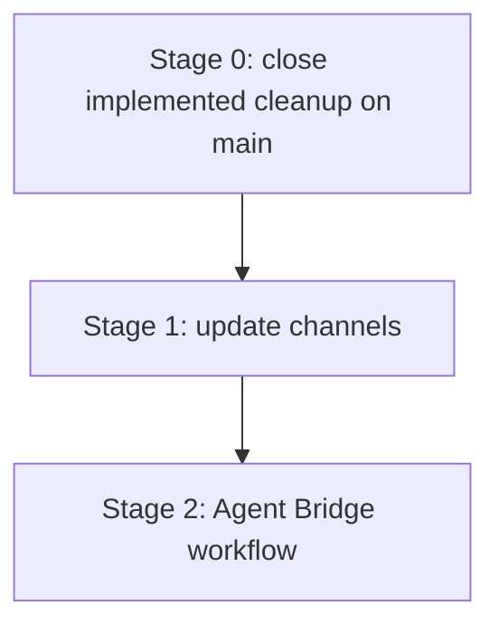

# Roadmap

## Purpose

This roadmap is the high-level planning entry point for Hosty. It summarizes the active product direction, links to detailed planning documents, and records sequencing constraints so feature work does not conflict with existing runtime, Shell, authentication, backup, and legacy module behavior.

Detailed implementation tasks remain in `docs/planning/*.md`. Small ideas that are not ready for a dedicated plan remain in [Future Work](todo.md).

## Current Direction

- Hosty is moving from a Docker-first Host application toward a local-first Core, a Core-managed Shell runtime app, and user-installed runtime apps.
- Existing Docker module compatibility remains supported only for already-installed legacy records and explicit compatibility imports.
- Core/Shell stabilization, runtime profiles/source runtimes, app auth/origin separation, backup retention, and legacy Demo Module retirement are implemented in the current workstream.
- Before new feature work starts, merge the implemented cleanup branch into `main`, publish the Demo App image from `main`, and verify public GHCR image access.
- After that release gate, update channels are the next product stage. Agent Bridge workflows remain deferred until update channels exist.

## Roadmap Stages

### Stage 0 - Close implemented cleanup on main

Status: Pending merge and published Demo App image smoke.

Scope:

- The legacy Demo Module retirement work is implemented in the current branch, but cannot be marked complete until it lands on `main`.
- The current first-party Demo App workflow uses direct `apps/demo-app/manifest.json` installation through Core-managed app lifecycle. The removed Legacy Host fixture route at `/fixtures/apps/demo-app` is not part of the current workflow.
- No new feature work should be added to this stage beyond merge, release workflow, GHCR package visibility, or smoke-test fixes.

Completion checklist:

- Merge the branch or pull request containing the implemented legacy cleanup into `main`.
- Ensure `.github/workflows/demo-app-image.yml` exists and runs on `main`.
- Ensure obsolete Demo Module image publishing is no longer active on the default branch.
- Ensure the GHCR package for `ghcr.io/alex-de-haas/demo-app` is public.
- Verify `docker pull ghcr.io/alex-de-haas/demo-app:latest` succeeds.

Follow-up source of truth:

- [Demo App](features/demo-app.md)
- [Legacy compatibility](features/legacy-compatibility.md)
- [Repository and release model](features/repository-release-model.md)

### Stage 1 - Add update channels

Status: Deferred.

Primary plan:

- [Update Channels](planning/update-channels.md)

Key outcomes:

- Product channel index for Hosty Core, Hosty Shell, and optional CLI delivery.
- Runtime app channel indexes that resolve to concrete manifest or source snapshots.
- Product and runtime channel selection through reviewed update plans.
- Pull request channels and cleanup for validation builds.

Prerequisites:

- Stage 0 merge and published Demo App image smoke.
- Stable Core/Shell management experience.
- App-oriented runtime lifecycle state.
- Source repository state for repository-backed apps.
- App auth and open flows that can validate channel builds with realistic users and app data.

Conflicts and constraints:

- Generated channel indexes are release artifacts and should not be committed as live repository JSON.
- Channel switching should resolve to a concrete manifest/source snapshot before planning.
- Runtime profile switching and channel switching are separate axes unless a reviewed plan explicitly combines them.
- A `stable` channel is intentionally deferred until there is a promotion process separate from `main`.

### Stage 2 - Add Agent Bridge workflows

Status: Deferred.

Primary plan:

- [Agent Bridge Workflow](planning/agent-bridge-workflow.md)

Key outcomes:

- Shell annotation payloads for user-requested app changes.
- Core-owned agent bridge service contract.
- Repository-aware branch or pull request creation.
- Pull request channel validation against existing app data.
- Shell UI for request status, cancellation, cleanup, audit, and diagnostics.

Prerequisites:

- Repository-backed source support.
- Pull request channel generation and consumption.
- Clear permissions for who can request code changes.

Conflicts and constraints:

- Agent Bridge should not edit live app data directly.
- Agent actions should only appear for apps with source metadata and permissions.
- Credentials and repository tokens must not be exposed in Shell-visible state.

## Planning Documents

Active and deferred plans:

- [Update Channels](planning/update-channels.md) - generated channel indexes, product/runtime channel selection, pull request channels, and channel cleanup.
- [Agent Bridge Workflow](planning/agent-bridge-workflow.md) - Shell annotation, agent request lifecycle, repository changes, branch/PR workflow, and PR channel validation.

Implemented reference plans and feature docs:

- [Hosty Runtime App Platform](planning/hosty-runtime-app-platform.md) - completed compatibility foundation and accepted target model decisions.
- [Core Shell Stabilization](planning/core-shell-stabilization.md) - completed Core/Shell local development, lifecycle UI, install/update review, auth, users, and backups.
- [Runtime Profiles And Source Runtimes](planning/runtime-profiles-and-source-runtimes.md) - completed runtime profile state, app-native lifecycle records, Core/Shell split, source checkouts, local command runtimes, and runtime switching.
- [App Auth And Origin Separation](planning/app-auth-and-origin-separation.md) - completed app-scoped auth, standalone app launch, Shell launch, and Core/Shell public origin split.
- [Demo App](features/demo-app.md), [Legacy compatibility](features/legacy-compatibility.md), and [Repository and release model](features/repository-release-model.md) - implemented Demo Module retirement and current Demo App release workflow.

## Regression Focus

Before completing a roadmap stage, validate the old features that interact with the new work:

- Legacy Docker module lifecycle and update flows.
- `app.0.1` manifest installation through the compatibility adapter.
- CLI app/module commands and Core control APIs.
- Shell navigation, embedded app routes, direct-origin app UI, and identity token delivery or replacement flows.
- User management, app assignment, account switching, disabled-user behavior, and role checks.
- App data directories, backup creation, backup restore, delete-data behavior, and external mount exclusion.
- Settings, dependency resolution, published ports, update plan digest checks, and failed operation retry.

## Open Questions And Recommendations

- Question: What blocks Stage 0 completion?
  Answer: The cleanup is implemented locally, but it still needs to be merged into `main`, published through `demo-app-image.yml`, and verified with a public `docker pull ghcr.io/alex-de-haas/demo-app:latest`.
  Recommendation: Treat merge, workflow execution, GHCR package visibility, and published-image smoke as release-gate work rather than new feature scope.

- Question: When should update channels move from deferred to active?
  Answer: After Stage 0 is complete. Core/Shell management is stable, repository/source runtime state exists, app auth/open flows are validated, backup behavior is stable, and legacy Demo Module compatibility has been retired to an explicit compatibility boundary.
  Recommendation: Start Stage 1 before Agent Bridge so pull request channels build on a stable product-channel model.

- Question: When should Agent Bridge work start?
  Answer: After Stage 1 defines channel generation, pull request channels, and cleanup behavior.
  Recommendation: Keep Agent Bridge deferred until there is a concrete channel model for validating agent-created branches or pull requests against existing app data.

- Question: When should small ideas from `docs/todo.md` become planning documents?
  Answer: When an idea starts affecting lifecycle, auth, storage, runtime, Shell UX, or release behavior across more than one component.
  Recommendation: Promote each such idea into `docs/planning/{feature-name}.md` before implementation, then link it from this roadmap.
