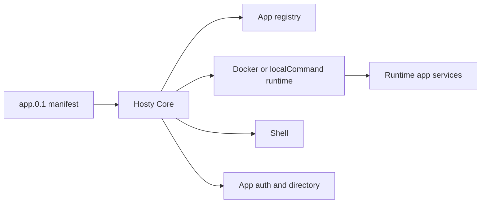

# Documentation

## Overview

Hosty is a local application orchestrator with a headless Core API, Core-managed Shell and Marketplace system apps, and user runtime apps. New local development and testing use runtime apps installed from `app.0.1` manifests.

The direction it is built toward — a tightly integrated pair of a hosting platform and an agent harness,
where installing an app is what extends the agent's tool environment — is recorded in
[Hosty platform vision](features/hosty-platform-vision/plan.md), the umbrella that individual
feature decisions are judged against.

## Current Feature Documents

- [Core app shell](features/core-app-shell/feature.md) - Shell foundation: what it is, how it authenticates, and how it embeds app UIs.
- [Shell navigation](features/shell-navigation/feature.md) - the three destinations (Dashboard, Settings, Apps), the route table, and the sidebar.
- [Shell access and system apps](features/shell-access-and-system-apps/feature.md) - administrator-only management views and system app visibility.
- [Hosty runtime app platform](features/hosty-runtime-app-platform.md) - current runtime app lifecycle platform.
- [Runtime app manifest](features/runtime-app-manifest.md) - `app.0.1` manifest contract.
- [Automatic runtime app ports](features/automatic-runtime-app-ports/feature.md) - host ports reserved at install so a stopped app has durable endpoints, `HOSTY_PORT_*` / `PORT` compatibility, conflict preflight, and operator reassignment or pinning.
- [Raw L4 ports](features/raw-ports.md) - opt-in `expose: host` / `transport` publishing of a docker port on all interfaces over TCP/UDP.
- [Host networking](features/host-networking.md) - opt-in `network: host` for a docker service (full host namespace, no NAT) for high-churn peer-to-peer workloads; WSL2 mirrored-networking advisory.
- [Cloudflare ingress](features/cloudflare-ingress/feature.md) - opt-in `cloudflared` provider that renders an operator-run Cloudflare Tunnel's config from the running-app set and derives `HOSTY_PUBLIC_ORIGIN_*`, plus an API-token connection that publishes one endpoint at a time under a chosen label; `none` (default) keeps operator-owned exposure.
- [Container capabilities & devices](features/container-capabilities.md) - opt-in `capabilities` (`--cap-add`) and `devices` (`--device`) for a docker service, e.g. `NET_ADMIN` + `/dev/net/tun` for an in-container VPN; no blanket `--privileged`.
- [External host-path mounts](features/external-mounts.md) - operator-configured external folders (`externalMounts`) injected as `HOSTY_MOUNT_{KEY}`.
- [Global (shared) host-path mounts](features/global-mounts/feature.md) - host-level shared-mounts library registered once (`hosty storage`) and attached to apps by reference; extends external mounts (the manifest slot stays the opt-in point).
- [Cross-app dependencies](features/cross-app-dependencies/feature.md) - declare a dependency on another installed app; Core wires `HOSTY_DEPENDENCY_{ALIAS}_URL` and reports each dependency's installed/running state on the app summary, which the Shell renders as problem icons (no auth, no auto-install).
- [Runtime app update](features/runtime-app-update/feature.md) - update plan and apply behavior.
- [Runtime source workflows](features/runtime-source-workflows/feature.md) - source checkout, local override, and runtime switching.
- [Runtime artifact & storage model](features/runtime-artifact-model.md) - design: execution × artifact-kind (image/prebuilt/source) axes plus the `development` flag, per-runtime storage, and the compiled-artifact (`prebuilt`) path. Phased; Phases 0, 1a, 2 (prebuilt folder delivery), and 3 (Shell Live/Locked badges) shipped, plus the 2026-07-02 operator-toggled Development Mode revision. Remaining: git-release/URL prebuilt delivery and per-runtime update-available state.
- [Multi-service runtime apps](features/multi-service-runtime-apps.md) - multiple services per app.
- [Runtime app compact view](features/runtime-app-compact-view.md) - compact Shell view of installed app services and assigned endpoints.
- [Direct origin runtime app UI](features/direct-origin-runtime-app-ui.md) - app-origin UI and auth code exchange.
- [App Auth And Origin Separation](features/app-auth-origin-separation.md) - Core-owned app auth and app-local sessions.
- [Auth And Gateway Model](features/auth-gateway/feature.md) - current app auth, assignments, and scoped app directory.
- [User Management](features/user-management.md) - users, invitations, roles, and app access assignment.
- [Local Password Login](features/local-password-login.md) - Core-owned local password setup, recovery, invitations, and login.
- [Auth session lifecycle and recovery](features/auth-session-lifecycle/feature.md) - the identity error contract (401 recoverable / 403 terminal), opaque server-side app session grants, sliding idle + absolute lifetimes for grants and Core sessions, and standalone/embedded session recovery through app-open with a login continuation.
- [App Data Backup Retention](features/app-data-backup-retention/feature.md) - backup cleanup and retention.
- [Notifications](features/notifications/feature.md) - Core-owned user-targeted notification stream: opt-in app producers scoped to their directory, in-process Core producers, a client-agnostic session consumer, live delivery over the unified event stream, retention, and the Shell bell. Remaining surfaces (interface registration, the MCP facade, app read-back, delivery channels): [plan](features/notifications/plan.md).
- [App Secrets Store](features/app-secrets-store.md) - Core-managed keychain for runtime-acquired app secrets (OAuth tokens and the like): service-token API, `apps/<id>/secrets.json` beside `state.json` and therefore outside backup scope, removal following the operator's keep-data choice, and SDK clients in both packages.
- [Observability](features/observability/feature.md) - OpenTelemetry from runtime apps → OTel collector → telemetry backend (embedded SQLite store + query API) → telemetry UI system app (metrics, structured logs, traces); Core contributes only the host-privileged signals (`docker stats` exposition, on-demand `docker logs`). Ingest/query auth, realtime tail, and the fleet heat-map remain — see the [plan](features/observability/plan.md).
- [Marketplace System App](features/runtime-app-marketplace/feature.md) - optional first-party storefront that owns one catalog source and hands app-owned feed URLs to Shell without lifecycle authority.
- [Runtime App Repository Feeds](features/catalog-hosted-app-feeds.md) - `app-feeds.0.1`, digest-bound feed installs, stored followed-feed state, and Core-owned update resolution.
- [CLI bootstrap](features/cli-bootstrap/feature.md) - `hosty` command setup and Core control discovery.
- [CLI app commands](features/cli-app-commands.md) - runtime app CLI commands.
- [Core API](features/core-api/feature.md) - current Core browser and control APIs.
- [Domain model](features/domain-model/feature.md) - shared app-oriented vocabulary.
- [Repository and release model](features/repository-release-model/feature.md) - monorepo and release workflows.
- [Hosty Shell Docker Image](features/hosty-shell-image.md) - implemented Shell image publishing and Core-managed bootstrap behavior.
- [Demo App](features/demo-app.md) - repository-local runtime app used for validation.
- [Local development and testing](features/local-development.md) - Core-managed local workflows.
- [Hosty App Skill](features/hosty-app-skill.md) - repository-shipped agent skill.
- [Hosty App SDK](features/hosty-app-sdk/feature.md) - the shared app-side Host integration published as `@hosty-sdk/app` (npmjs) and `HostySdk.App` (NuGet): session state machine with a `misconfigured` class, silent embedded recovery, standalone redirect recovery, the embedder contract for shells, launch-mode awareness, app secrets and delegated-token clients, and the no-version-sync compatibility policy. Second-wave extraction: [plan](features/hosty-app-sdk/plan.md).
- [AI Agent Bridge](features/ai-agent-bridge/feature.md) - the umbrella model for development agents and runtime app action agents: component boundaries, execution profiles, the interface registry, token mechanics, and the decision log. Remaining rollout steps: [plan](features/ai-agent-bridge/plan.md).
- [Final Hosty architecture boundaries](features/final-hosty-architecture.md) - Core/Shell/CLI ownership boundaries.

## Planning

- [Marketplace System App - Vertical Slice](planning/marketplace-system-app.md) - approved replacement of the Core-owned catalog with a Marketplace system app and generic Core feed lifecycle.
- [App Secrets Store](planning/app-secrets-store.md) - Implemented plan (shipped in #266-#267) for the Core-managed runtime-secrets keychain; the behavior now lives in [features/app-secrets-store.md](features/app-secrets-store.md).

## Ideas

Draft, exploratory, or backlog items that are not current implementation commitments:

- [Runtime App Repository Feeds](ideas/runtime-app-repository-feeds.md) - promoted design that moved the feed contract from inline catalog data to app-owned `feeds.json` resolved by Core.
- [On-Demand System App Updates](ideas/system-app-updates.md) - concept for explicit Shell/system-app update discovery, reviewed apply, self-reload, and rollback without restarting Core.
- [Marketplace As A System App](ideas/marketplace-system-app.md) - read-only catalog data, API, and UI in an optional first-party system app while Core retains all feed and lifecycle decisions.
- [System App Pages](ideas/system-app-pages.md) - separate administrator-only Shell pages for UI-capable system apps using the existing app UI contract.
- [Agent Bridge Workflow](ideas/agent-bridge-workflow.md) - concept for Shell annotation, agent request lifecycle, repository changes, branch/PR workflow, and an unresolved isolated-validation boundary.
- [Browser account switching](ideas/account-switching.md) - retired behavior and future restoration boundary.
- [Gateway and app wrapping ideas](ideas/gateway-and-app-wrapping.md) - future gateway, ingress, and third-party app wrapping boundaries.
- [App Secrets Store](ideas/app-secrets-store.md) - promoted design (shipped) for the Core-managed runtime-secrets keychain: ten ratified decisions, including plaintext-0600 parity with existing secret storage and the deferred platform-wide at-rest pass. Implemented behavior: [features/app-secrets-store.md](features/app-secrets-store.md).
- [Replaceable UI Clients](ideas/replaceable-ui-clients.md) - concept for shells as ordinary apps: a `ui-client` provides slot replacing the hardcoded `hosty.shell` lookup, primary-UI selection as pure resolution (setting > sole > earliest-installed), CORS for every installed UI client, and uninstall of the last shell always allowed with the CLI as recovery path.
- [Auth provider extensions](ideas/auth-provider-extensions.md) - future OIDC, trusted-proxy provisioning, password reset, and durable throttling directions.
- [Runtime source extensions](ideas/runtime-source-extensions.md) - future multi-repository source and private repository credential handling.
- [Runtime app repository install](ideas/runtime-app-repository-install.md) - future direct Git repository install flow for runtime apps.
- [Backup retention extensions](ideas/backup-retention-extensions.md) - future age-based and per-app backup retention policy.
- [Future work ideas](ideas/future-work.md) - small backlog items that are not yet planned in detail.

<!-- docs-index:begin -->

_Generated by `scripts/docs-index.mjs --fix` — do not edit this block by hand._

### Features

- **access-tokens** — [feature](features/access-tokens/feature.md)
- **advertised-app-origins** — [plan](features/advertised-app-origins/plan.md): Draft, updated 2026-07-30
- **agent-background-sessions** — [feature](features/agent-background-sessions/feature.md)
- **ai-agent-bridge** — [feature](features/ai-agent-bridge/feature.md) · [plan](features/ai-agent-bridge/plan.md): In Progress, updated 2026-09-06
- **ai-gateway** — [feature](features/ai-gateway/feature.md) · [plan](features/ai-gateway/plan.md): In Progress, updated 2026-08-28
- **app-cache-storage** — [feature](features/app-cache-storage/feature.md)
- **app-data-backup-retention** — [feature](features/app-data-backup-retention/feature.md)
- **app-lifecycle-states** — [feature](features/app-lifecycle-states/feature.md)
- **app-mcp** — [feature](features/app-mcp/feature.md)
- **app-provided-skills** — [feature](features/app-provided-skills/feature.md)
- **app-ui-surfaces** — [feature](features/app-ui-surfaces/feature.md)
- **assistant-approval-rules** — [plan](features/assistant-approval-rules/plan.md): Draft, updated 2026-09-02
- **assistant-attachments** — [feature](features/assistant-attachments/feature.md) · [plan](features/assistant-attachments/plan.md): In Progress, updated 2026-09-03
- **assistant-entry-points** — [feature](features/assistant-entry-points/feature.md) · [plan](features/assistant-entry-points/plan.md): In Progress, updated 2026-08-31
- **audit-log** — [feature](features/audit-log/feature.md)
- **auth-gateway** — [feature](features/auth-gateway/feature.md)
- **auth-session-lifecycle** — [feature](features/auth-session-lifecycle/feature.md)
- **automatic-runtime-app-ports** — [feature](features/automatic-runtime-app-ports/feature.md) · [plan](features/automatic-runtime-app-ports/plan.md): Draft, updated 2026-08-09
- **cardputer-shell** — [plan](features/cardputer-shell/plan.md): In Progress, updated 2026-08-23
- **cli-bootstrap** — [feature](features/cli-bootstrap/feature.md)
- **cloudflare-ingress** — [feature](features/cloudflare-ingress/feature.md) · [plan](features/cloudflare-ingress/plan.md): In Progress, updated 2026-09-01
- **core-api** — [feature](features/core-api/feature.md)
- **core-app-shell** — [feature](features/core-app-shell/feature.md)
- **core-event-bus** — [feature](features/core-event-bus/feature.md)
- **core-extension-model** — [plan](features/core-extension-model/plan.md): Draft, updated 2026-08-19
- **core-lifecycle-parallelism** — [feature](features/core-lifecycle-parallelism/feature.md)
- **core-mcp** — [feature](features/core-mcp/feature.md) · [plan](features/core-mcp/plan.md): In Progress, updated 2026-08-28
- **core-public-origin** — [feature](features/core-public-origin/feature.md)
- **core-read-path-caching** — [feature](features/core-read-path-caching/feature.md)
- **core-runtime-parameters** — [feature](features/core-runtime-parameters/feature.md)
- **core-service-unit** — [plan](features/core-service-unit/plan.md): On Hold, updated 2026-09-01
- **core-single-binary** — [plan](features/core-single-binary/plan.md): On Hold, updated 2026-09-01
- **cross-app-dependencies** — [feature](features/cross-app-dependencies/feature.md) · [plan](features/cross-app-dependencies/plan.md): Draft, updated 2026-08-17
- **delegated-token-exchange** — [feature](features/delegated-token-exchange/feature.md)
- **dependency-ordered-autostart** — [plan](features/dependency-ordered-autostart/plan.md): Draft, updated 2026-08-26
- **domain-model** — [feature](features/domain-model/feature.md)
- **embedded-app-chrome** — [feature](features/embedded-app-chrome/feature.md)
- **global-mounts** — [feature](features/global-mounts/feature.md)
- **hosty-app-sdk** — [feature](features/hosty-app-sdk/feature.md) · [plan](features/hosty-app-sdk/plan.md): Draft, updated 2026-08-15
- **hosty-mcp-connector** — [feature](features/hosty-mcp-connector/feature.md)
- **hosty-platform-vision** — [plan](features/hosty-platform-vision/plan.md): Draft, updated 2026-08-31
- **internal-endpoint-exposure** — [plan](features/internal-endpoint-exposure/plan.md): Draft, updated 2026-09-06
- **local-password-login** — [feature](features/local-password-login/feature.md)
- **manifest-projection-backfill** — [feature](features/manifest-projection-backfill/feature.md)
- **mcp-facade** — [feature](features/mcp-facade/feature.md) · [plan](features/mcp-facade/plan.md): In Progress, updated 2026-09-06
- **mcp-oauth** — [feature](features/mcp-oauth/feature.md)
- **notifications** — [feature](features/notifications/feature.md) · [plan](features/notifications/plan.md): Draft, updated 2026-08-31
- **observability** — [feature](features/observability/feature.md) · [plan](features/observability/plan.md): In Progress, updated 2026-09-06
- **public-origins** — [feature](features/public-origins/feature.md)
- **removable-system-apps** — [feature](features/removable-system-apps/feature.md)
- **repository-release-model** — [feature](features/repository-release-model/feature.md)
- **runtime-app-marketplace** — [feature](features/runtime-app-marketplace/feature.md)
- **runtime-app-update** — [feature](features/runtime-app-update/feature.md)
- **runtime-source-workflows** — [feature](features/runtime-source-workflows/feature.md)
- **scoped-access-tokens** — [feature](features/scoped-access-tokens/feature.md)
- **shell-access-and-system-apps** — [feature](features/shell-access-and-system-apps/feature.md)
- **shell-navigation** — [feature](features/shell-navigation/feature.md)
- **swift-shell** — [feature](features/swift-shell/feature.md)
- **telemetry-mcp** — [feature](features/telemetry-mcp/feature.md)

### Legacy documents (pre-migration)

- [features/app-auth-origin-separation](features/app-auth-origin-separation.md)
- [features/app-secrets-store](features/app-secrets-store.md) — Implemented (Core store + API in Core 0.60.0; SDK clients in `HostySdk.App` 0.3.0 and `@hosty-sdk/app` 0.4.0). Verified against a live Core 2026-07-22.
- [features/catalog-hosted-app-feeds](features/catalog-hosted-app-feeds.md)
- [features/cli-app-commands](features/cli-app-commands.md)
- [features/container-capabilities](features/container-capabilities.md)
- [features/demo-app](features/demo-app.md)
- [features/direct-origin-runtime-app-ui](features/direct-origin-runtime-app-ui.md)
- [features/external-mounts](features/external-mounts.md)
- [features/final-hosty-architecture](features/final-hosty-architecture.md)
- [features/host-networking](features/host-networking.md)
- [features/hosty-app-skill](features/hosty-app-skill.md)
- [features/hosty-runtime-app-platform](features/hosty-runtime-app-platform.md)
- [features/hosty-shell-image](features/hosty-shell-image.md) — Implemented.
- [features/local-development](features/local-development.md)
- [features/manifest-level-app-assets](features/manifest-level-app-assets.md) — **In progress.** Design (Q1–Q13, incl. Q3/D1–D7) confirmed 2026-07-07.
- [features/multi-service-runtime-apps](features/multi-service-runtime-apps.md)
- [features/raw-ports](features/raw-ports.md)
- [features/runtime-app-compact-view](features/runtime-app-compact-view.md)
- [features/runtime-app-manifest](features/runtime-app-manifest.md)
- [features/runtime-artifact-model](features/runtime-artifact-model.md)
- [features/user-management](features/user-management.md)
- [ideas/account-switching](ideas/account-switching.md) — Idea.
- [ideas/agent-bridge-workflow](ideas/agent-bridge-workflow.md) — Idea
- [ideas/app-secrets-store](ideas/app-secrets-store.md) — Promoted (shipped — see [features/app-secrets-store.md](../features/app-secrets-store.md))
- [ideas/auth-provider-extensions](ideas/auth-provider-extensions.md) — Idea.
- [ideas/backup-retention-extensions](ideas/backup-retention-extensions.md) — Idea.
- [ideas/core-dev-target](ideas/core-dev-target.md) — Idea
- [ideas/core-settings](ideas/core-settings.md) — Implemented (v1 — auth lifetimes; v2 — cloudflared ingress)
- [ideas/cross-app-auth](ideas/cross-app-auth.md) — Idea (proposed 2026-07-20 — awaiting owner ratification)
- [ideas/future-work](ideas/future-work.md) — Idea.
- [ideas/gateway-and-app-wrapping](ideas/gateway-and-app-wrapping.md) — Idea.
- [ideas/marketplace-system-app](ideas/marketplace-system-app.md) — Promoted
- [ideas/replaceable-ui-clients](ideas/replaceable-ui-clients.md) — Idea
- [ideas/runtime-app-repository-feeds](ideas/runtime-app-repository-feeds.md) — Promoted
- [ideas/runtime-app-repository-install](ideas/runtime-app-repository-install.md) — Idea
- [ideas/runtime-source-extensions](ideas/runtime-source-extensions.md) — Idea.
- [ideas/system-app-pages](ideas/system-app-pages.md) — Idea
- [ideas/system-app-updates](ideas/system-app-updates.md) — Partially implemented (2026-07-13)
- [planning/app-secrets-store](planning/app-secrets-store.md) — Implemented (Core 0.60.0; `HostySdk.App` 0.3.0, `@hosty-sdk/app` 0.4.0)
- [planning/marketplace-system-app](planning/marketplace-system-app.md) — Implemented
- [planning/plan-first-app-updates](planning/plan-first-app-updates.md) — Implemented

<!-- docs-index:end -->
