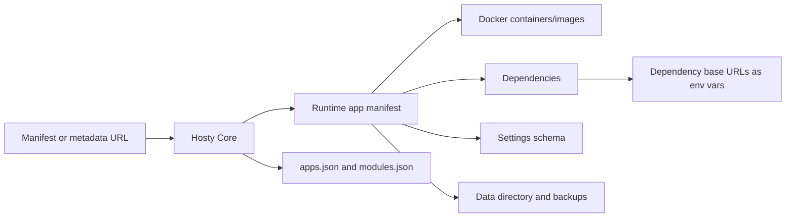

# Documentation

## Overview

Docker Host Manager is evolving into Hosty: a local application orchestrator with a headless Core API, a Core-managed browser Shell runtime app, and user runtime apps. Hosty Core is a local-first ASP.NET Core process, Hosty Shell is a Core-managed runtime app, and the CLI is a Core bootstrap/API client.

A module is a Docker-hosted functional unit. Administrators add a module by providing a direct URL to a JSON metadata file. The Host downloads that JSON file, reads module container/image metadata, then prepares local storage and container configuration.

The Host itself is expected to run as a Docker container in production-like usage. A standalone CLI executable bootstraps and manages the Host container lifecycle. The preferred command is `hosty`; `docker-host` remains a deprecated compatibility alias during migration.

When one module depends on another service module, the consumer declares which dependency endpoint it needs and which target environment variables should receive its base URL. The Host starts the dependency, resolves an internal URL inside one shared Host-managed Docker network, and injects that URL into the requested consumer containers. Network aliases are derived from module ids and container keys, for example `com.modulis.storage` + `api` becomes `mod-com-modulis-storage-api`. This does not require Docker Compose, although Compose could be one possible implementation detail.

## Documents

- [Roadmap](roadmap.md) - high-level product sequence, active and deferred workstreams, dependencies, conflicts, and links to detailed planning documents.
- [Host app shell](features/host-app-shell.md) - implemented admin shell foundation, navigation groups, persistent sidebar behavior, and protected page integration.
- [Hosty runtime app platform](features/hosty-runtime-app-platform.md) - implemented Hosty compatibility foundation: `hosty` CLI alias, `~/.hosty` root selection, system Shell app, app manifests, apps registry, data directory, and backups.
- [Final Hosty architecture boundaries](features/final-hosty-architecture.md) - target Core/Shell/CLI package boundaries, Core API ownership, Shell runtime app contract, final storage layout, backup policy, and legacy paths pending removal.
- [Direct origin module UI](features/direct-origin-module-ui.md) - module UIs embedded from module-owned origins with Host-assigned ports, optional public origins, and identity token bridging.
- [Auth Gateway](features/auth-gateway.md) - Host-owned authentication, authorization, subdomain module gateway, realtime traffic, account switching, and module-owned permissions.
- [Browser account switching](features/account-switching.md) - browser-scoped remembered Host accounts, sidebar switching, account-set persistence, logout behavior, and cookie hygiene.
- [User Management](features/user-management.md) - administrator user directory, local invitation links, role changes, soft-disable, and app access assignment.
- [Local development and testing](features/local-development.md) - local run modes for testing Host changes without pushing an image.
- [Runtime source workflows](features/runtime-source-workflows.md) - Core-managed source checkout and local override commands for installed runtime apps.
- [Runtime profile switching](features/runtime-source-workflows.md#runtime-switch-reviews) - reviewed Docker/local command runtime switching, selected-runtime state, pre-switch backups, and rollback behavior.
- [App Auth And Origin Separation](features/app-auth-origin-separation.md) - Core-owned app auth code exchange, app-local runtime sessions, split Core/Shell public origins, and migration guidance.
- [App Data Backup Retention](features/app-data-backup-retention.md) - completed retention policy, cleanup preview/apply APIs, scheduled cleanup, and Shell/CLI backup deletion and prune controls.
- [Multi-container modules](features/multi-container-modules.md) - module-owned containers, per-container runtime state, endpoint resolution, storage targets, lifecycle behavior, and Web UI service display.
- [Hosty App Skill](features/hosty-app-skill.md) - repository-shipped Codex skill for agents that wrap apps as Hosty runtime apps or update legacy Docker module compatibility manifests.
- [Host launch model](features/host-launch.md) - how the Host container, `docker-host` CLI executable, Web UI, and backend API fit together.
- [Web UI dashboard](features/web-ui-dashboard.md) - installed module dashboard, lifecycle actions, install/update routes, and recovery dialogs.
- [CLI bootstrap](features/cli-bootstrap.md) - `hosty` command surface, compatibility `docker-host` alias, launch configuration, and direct Docker Engine lifecycle integration.
- [CLI module commands](features/cli-module-commands.md) - terminal module management commands using the Host local control channel.
- [Docker Host API](features/host-api.md) - Host backend API endpoint catalog for Web UI routes and local control routes.
- [Docker Host domain model](features/domain-model.md) - shared vocabulary for Hosty runtime apps, legacy installed modules, lifecycle state, settings, storage, dependency resolution, and plans.
- [Repository and release model](features/repository-release-model.md) - monorepo layout, artifact boundaries, and independent GitHub Actions builds for Host image and CLI.
- [Module metadata files](features/module-metadata.md) - supported legacy metadata and app manifest contracts for installing Docker-hosted runtime apps.
- [Module update flow](features/module-update.md) - update plan, apply, preservation, and retry behavior.
- [Demo App](features/demo-app.md) - repository-local Hosty runtime app for validating app lifecycle, source, local command, identity, storage, and role flows.
- [Demo Module](features/demo-module.md) - legacy schema `0.3` compatibility fixture for Docker Host module operations.

## Planning

- For the high-level sequence, dependencies, and conflicts across planning documents, see [Roadmap](roadmap.md).
- [Core Shell Stabilization](planning/core-shell-stabilization.md) - completed implementation plan for local Core/Shell development, Shell lifecycle UI, simplified install/update reviews, auth, user management, and backup controls.
- [Hosty Runtime App Platform](planning/hosty-runtime-app-platform.md) - completed compatibility foundation plan for Hosty Core, Shell/system apps, runtime apps, manifest contract, app registry, and backups.
- [Runtime Profiles And Source Runtimes](planning/runtime-profiles-and-source-runtimes.md) - completed Stage 2 plan for runtime profile state, source records, checkout cache, local command runtime execution, and runtime switching.
- [App Auth And Origin Separation](planning/app-auth-and-origin-separation.md) - completed Stage 3 plan for standalone app auth, Hosty-aware app guidance, deferred gateway wrapping, and split Core/Shell public origins.
- [Legacy Demo Module Removal](planning/legacy-demo-module-removal.md) - planned post-validation cleanup for the legacy Demo Module fixture and `modules.json` lifecycle compatibility.
- [Update Channels](planning/update-channels.md) - deferred architecture plan for generated channel indexes, pull request validation channels, and optional CLI update channels.
- [Agent Bridge Workflow](planning/agent-bridge-workflow.md) - deferred Shell annotation to agent, branch/PR, and PR channel validation workflow.
