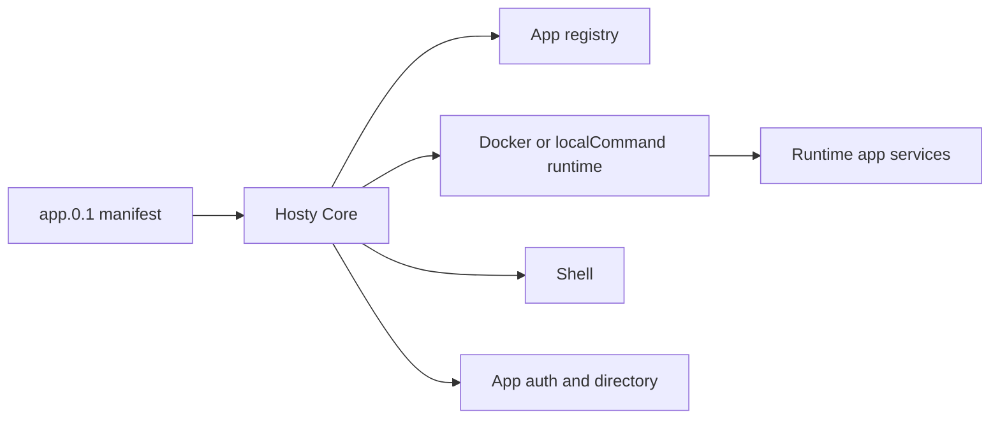

# Documentation

## Overview

Hosty is a local application orchestrator with a headless Core API, Core-managed Shell and Marketplace system apps, and user runtime apps. New local development and testing use runtime apps installed from `app.0.1` manifests.

## Current Feature Documents

- [Core app shell](features/core-app-shell.md) - Shell foundation and navigation.
- [Shell route navigation](features/shell-route-navigation.md) - route-backed Shell sections and embedded workspace deep links.
- [Shell access and system apps](features/shell-access-and-system-apps.md) - administrator-only management views and system app visibility.
- [Hosty runtime app platform](features/hosty-runtime-app-platform.md) - current runtime app lifecycle platform.
- [Runtime app manifest](features/runtime-app-manifest.md) - `app.0.1` manifest contract.
- [Automatic runtime app ports](features/automatic-runtime-app-ports.md) - Core-assigned local ports and `PORT` compatibility behavior.
- [Raw L4 ports](features/raw-ports.md) - opt-in `expose: host` / `transport` publishing of a docker port on all interfaces over TCP/UDP.
- [Host networking](features/host-networking.md) - opt-in `network: host` for a docker service (full host namespace, no NAT) for high-churn peer-to-peer workloads; WSL2 mirrored-networking advisory.
- [Ingress (Cloudflare Tunnel)](features/cloudflared-ingress.md) - opt-in `cloudflared` provider that drives an operator-run Cloudflare Tunnel from the running-app set and auto-derives `HOSTY_PUBLIC_ORIGIN_*`; `none` (default) keeps operator-owned exposure.
- [Container capabilities & devices](features/container-capabilities.md) - opt-in `capabilities` (`--cap-add`) and `devices` (`--device`) for a docker service, e.g. `NET_ADMIN` + `/dev/net/tun` for an in-container VPN; no blanket `--privileged`.
- [External host-path mounts](features/external-mounts.md) - operator-configured external folders (`externalMounts`) injected as `HOSTY_MOUNT_{KEY}`.
- [Global (shared) host-path mounts](features/global-mounts.md) - host-level shared-mounts library registered once (`hosty storage`) and attached to apps by reference; extends external mounts (the manifest slot stays the opt-in point).
- [Cross-app dependencies](features/cross-app-dependencies.md) - declare a dependency on another installed app; Core wires `HOSTY_DEPENDENCY_{ALIAS}_URL` and warns when a dependency is missing/not running (no auth, no auto-install).
- [Runtime app update](features/runtime-app-update.md) - update plan and apply behavior.
- [Runtime source workflows](features/runtime-source-workflows.md) - source checkout, local override, and runtime switching.
- [Runtime artifact & storage model](features/runtime-artifact-model.md) - design: execution × artifact-kind (image/prebuilt/source) axes plus the `development` flag, per-runtime storage, and the compiled-artifact (`prebuilt`) path. Phased; Phases 0, 1a, 2 (prebuilt folder delivery), and 3 (Shell Live/Locked badges) shipped, plus the 2026-07-02 operator-toggled Development Mode revision. Remaining: git-release/URL prebuilt delivery and per-runtime update-available state.
- [Multi-service runtime apps](features/multi-service-runtime-apps.md) - multiple services per app.
- [Runtime app compact view](features/runtime-app-compact-view.md) - compact Shell view of installed app services and assigned endpoints.
- [Direct origin runtime app UI](features/direct-origin-runtime-app-ui.md) - app-origin UI and auth code exchange.
- [App Auth And Origin Separation](features/app-auth-origin-separation.md) - Core-owned app auth and app-local sessions.
- [Auth And Gateway Model](features/auth-gateway.md) - current app auth, assignments, and scoped app directory.
- [User Management](features/user-management.md) - users, invitations, roles, and app access assignment.
- [Local Password Login](features/local-password-login.md) - Core-owned local password setup, recovery, invitations, and login.
- [App Data Backup Retention](features/app-data-backup-retention.md) - backup cleanup and retention.
- [Notifications](features/notifications.md) - Core-owned user-targeted notification stream (v1 backend): opt-in app producers, client-agnostic consumer, SSE live delivery, and retention.
- [App Secrets Store](features/app-secrets-store.md) - Core-managed keychain for runtime-acquired app secrets (OAuth tokens and the like): service-token API, `apps/<id>/secrets.json` beside `state.json` and therefore outside backup scope, removal following the operator's keep-data choice, and SDK clients in both packages.
- [Observability (telemetry collection)](features/observability.md) - OpenTelemetry from runtime apps → OTel collector → Core read boundary → Shell Observability section (metrics, structured logs, traces). Phases P2–P6 shipped.
- [Observability Phase 2 — telemetry backend](features/observability-phase-2-backend.md) - moves the telemetry store and query API out of Core into a dedicated telemetry-backend system app; Core stays a producer (`docker stats`/`docker logs`) and read-proxy. 2a–2c shipped; only SSE realtime (2d) remains.
- [Marketplace System App](features/runtime-app-marketplace.md) - optional first-party storefront that owns one catalog source and hands app-owned feed URLs to Shell without lifecycle authority.
- [Runtime App Repository Feeds](features/catalog-hosted-app-feeds.md) - `app-feeds.0.1`, digest-bound feed installs, stored followed-feed state, and Core-owned update resolution.
- [CLI bootstrap](features/cli-bootstrap.md) - `hosty` command setup and Core control discovery.
- [CLI app commands](features/cli-app-commands.md) - runtime app CLI commands.
- [Core API](features/core-api.md) - current Core browser and control APIs.
- [Domain model](features/domain-model.md) - shared app-oriented vocabulary.
- [Repository and release model](features/repository-release-model.md) - monorepo and release workflows.
- [Hosty Shell Docker Image](features/hosty-shell-image.md) - implemented Shell image publishing and Core-managed bootstrap behavior.
- [Demo App](features/demo-app.md) - repository-local runtime app used for validation.
- [Local development and testing](features/local-development.md) - Core-managed local workflows.
- [Hosty App Skill](features/hosty-app-skill.md) - repository-shipped agent skill.
- [AI Agent Bridge](features/ai-agent-bridge.md) - draft concept for development agents and runtime app action agents.
- [Web UI dashboard](features/web-ui-dashboard.md) - Shell dashboard and app management surface.
- [Final Hosty architecture boundaries](features/final-hosty-architecture.md) - Core/Shell/CLI ownership boundaries.

## Planning

- [Install-Time Runtime Port Reservations](planning/install-time-runtime-port-reservations.md) - Implemented plan (shipped in #187–#191) for persistent service-scoped ports assigned during install, migration, collision handling, and explicit reassignment.
- [One-Click Cloudflare Public Ingress](planning/one-click-cloudflare-public-ingress.md) - Ready implementation plan for API-token-based remote Tunnel adoption, per-app hostname publication, Dashboard-safe reconciliation, diagnostics, and cleanup (phase-0 spike verified against a live account).
- [Marketplace System App - Vertical Slice](planning/marketplace-system-app.md) - approved replacement of the Core-owned catalog with a Marketplace system app and generic Core feed lifecycle.
- [App Secrets Store](planning/app-secrets-store.md) - Implemented plan (shipped in #266-#267) for the Core-managed runtime-secrets keychain; the behavior now lives in [features/app-secrets-store.md](features/app-secrets-store.md).

## Ideas

Draft, exploratory, or backlog items that are not current implementation commitments:

- [One-Click Cloudflare Public Ingress](ideas/one-click-cloudflare-ingress.md) - promoted design for API-token-based adoption of an existing remotely-managed Cloudflare Tunnel with operator-chosen per-app origins and automatic DNS/route synchronization.
- [Install-Time Runtime Port Reservations](ideas/install-time-runtime-port-reservations.md) - promoted design for persistent app/service port assignment during installation so stopped apps have stable endpoints before first start.
- [Runtime App Repository Feeds](ideas/runtime-app-repository-feeds.md) - promoted design that moved the feed contract from inline catalog data to app-owned `feeds.json` resolved by Core.
- [On-Demand System App Updates](ideas/system-app-updates.md) - concept for explicit Shell/system-app update discovery, reviewed apply, self-reload, and rollback without restarting Core.
- [Core Extension Model](ideas/core-extension-model.md) - concept for extending Core through out-of-process apps: contract-free API clients, driver/sink provider contracts with declared cardinality, pull-based event subscriptions, system app pages, "system" as an ownership label rather than a privilege tier, and additional login methods instead of replaceable auth providers.
- [Marketplace As A System App](ideas/marketplace-system-app.md) - read-only catalog data, API, and UI in an optional first-party system app while Core retains all feed and lifecycle decisions.
- [System App Pages](ideas/system-app-pages.md) - separate administrator-only Shell pages for UI-capable system apps using the existing app UI contract.
- [Agent Bridge Workflow](ideas/agent-bridge-workflow.md) - concept for Shell annotation, agent request lifecycle, repository changes, branch/PR workflow, and an unresolved isolated-validation boundary.
- [Browser account switching](ideas/account-switching.md) - retired behavior and future restoration boundary.
- [Gateway and app wrapping ideas](ideas/gateway-and-app-wrapping.md) - future gateway, ingress, and third-party app wrapping boundaries.
- [Auth session lifecycle and recovery](ideas/auth-session-lifecycle.md) - agreed design: split identity error contract (401/403/503), standalone and embedded session recovery through app-open + login continuation, opaque server-side app session grants replacing the browser JWT, and sliding idle+absolute Core sessions.
- [Hosty App SDK](ideas/hosty-app-sdk.md) - agreed design: shared auth/recovery SDK for runtime apps (TypeScript on npmjs + .NET on NuGet) packaging the session state machine with a `misconfigured` class, silent embedded recovery, standalone redirect recovery, the embedder contract for shells, and the no-version-sync compatibility policy.
- [App Secrets Store](ideas/app-secrets-store.md) - promoted design (shipped) for the Core-managed runtime-secrets keychain: ten ratified decisions, including plaintext-0600 parity with existing secret storage and the deferred platform-wide at-rest pass. Implemented behavior: [features/app-secrets-store.md](features/app-secrets-store.md).
- [Replaceable UI Clients](ideas/replaceable-ui-clients.md) - concept for shells as ordinary apps: a `ui-client` provides slot replacing the hardcoded `hosty.shell` lookup, primary-UI selection as pure resolution (setting > sole > earliest-installed), CORS for every installed UI client, and uninstall of the last shell always allowed with the CLI as recovery path.
- [Auth provider extensions](ideas/auth-provider-extensions.md) - future OIDC, trusted-proxy provisioning, password reset, and durable throttling directions.
- [Runtime source extensions](ideas/runtime-source-extensions.md) - future multi-repository source and private repository credential handling.
- [Runtime app repository install](ideas/runtime-app-repository-install.md) - future direct Git repository install flow for runtime apps.
- [Backup retention extensions](ideas/backup-retention-extensions.md) - future age-based and per-app backup retention policy.
- [Future work ideas](ideas/future-work.md) - small backlog items that are not yet planned in detail.
