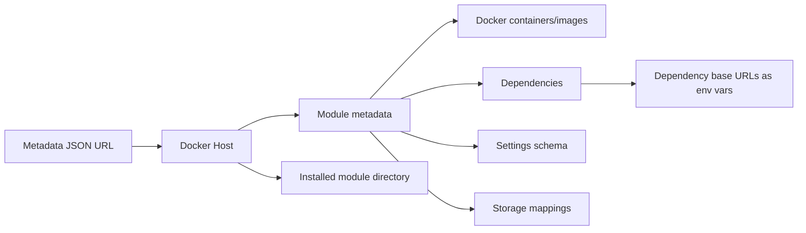

# Documentation

## Overview

Docker Host Manager is a local application for managing Docker containers. The module model extends this from direct container management to logical modules described by JSON metadata files.

A module is a Docker-hosted functional unit. Administrators add a module by providing a direct URL to a JSON metadata file. The Host downloads that JSON file, reads module container/image metadata, then prepares local storage and container configuration.

The Host itself is expected to run as a Docker container in production-like usage. A standalone `docker-host` CLI executable bootstraps and manages the Host container lifecycle, while the Web UI remains the primary interface for daily module management.

When one module depends on another service module, the consumer declares which dependency endpoint it needs and which target environment variables should receive its base URL. The Host starts the dependency, resolves an internal URL inside one shared Host-managed Docker network, and injects that URL into the requested consumer containers. Network aliases are derived from module ids and container keys, for example `com.modulis.storage` + `api` becomes `mod-com-modulis-storage-api`. This does not require Docker Compose, although Compose could be one possible implementation detail.

## Documents

- [Future work](todo.md) - lightweight backlog items and follow-up ideas that are not yet dedicated planning documents.
- [Multi-container modules plan](planning/multi-container-modules.md) - implementation plan for replacing the single-container module manifest with module-owned containers and per-container runtime state.
- [Auth Gateway](features/auth-gateway.md) - Host-owned authentication, authorization, subdomain module gateway, realtime traffic, account switching, and module-owned permissions.
- [Local development and testing](features/local-development.md) - local run modes for testing Host changes without pushing an image.
- [Module developer mode](features/module-developer-mode.md) - local-only module development targets that proxy through the Host gateway without a full install.
- [Host launch model](features/host-launch.md) - how the Host container, `docker-host` CLI executable, Web UI, and backend API fit together.
- [Web UI dashboard](features/web-ui-dashboard.md) - installed module dashboard, lifecycle actions, install/update routes, and recovery dialogs.
- [CLI bootstrap](features/cli-bootstrap.md) - `docker-host` command surface, launch configuration, and direct Docker Engine lifecycle integration.
- [CLI module commands](features/cli-module-commands.md) - terminal module management commands using the Host backend API.
- [Docker Host API](features/host-api.md) - Host backend API endpoint catalog for Web UI and future CLI module commands.
- [Docker Host domain model](features/domain-model.md) - shared vocabulary for installed modules, lifecycle state, settings, storage, dependency resolution, and plans.
- [Repository and release model](features/repository-release-model.md) - monorepo layout, artifact boundaries, and independent GitHub Actions builds for Host image and CLI.
- [Module metadata files](features/module-metadata.md) - detailed draft for installing Docker-hosted modules from JSON metadata URLs.
- [Module update flow](features/module-update.md) - update plan, apply, preservation, and retry behavior.
- [Demo Module](features/demo-module.md) - repository-local Next.js module for validating Docker Host module operations.
