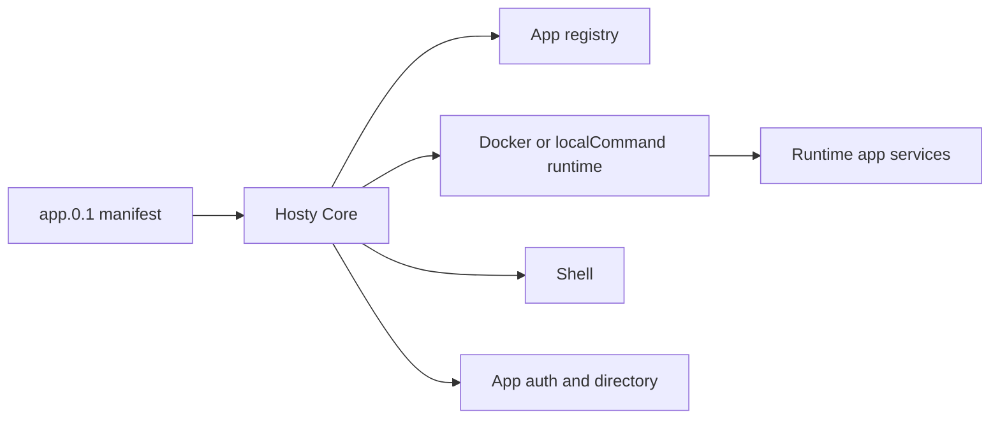

# Documentation

## Overview

Hosty is a local application orchestrator with a headless Core API, a Core-managed Shell runtime app, and user runtime apps. New local development and testing use runtime apps installed from `app.0.1` manifests.

## Current Feature Documents

- [Core app shell](features/core-app-shell.md) - Shell foundation and navigation.
- [Shell route navigation](features/shell-route-navigation.md) - route-backed Shell sections and embedded workspace deep links.
- [Shell access and system apps](features/shell-access-and-system-apps.md) - administrator-only management views and system app visibility.
- [Hosty runtime app platform](features/hosty-runtime-app-platform.md) - current runtime app lifecycle platform.
- [Runtime app manifest](features/runtime-app-manifest.md) - `app.0.1` manifest contract.
- [Automatic runtime app ports](features/automatic-runtime-app-ports.md) - Core-assigned local ports and `PORT` compatibility behavior.
- [Runtime app update](features/runtime-app-update.md) - update plan and apply behavior.
- [Runtime source workflows](features/runtime-source-workflows.md) - source checkout, local override, and runtime switching.
- [Multi-service runtime apps](features/multi-service-runtime-apps.md) - multiple services per app.
- [Runtime app compact view](features/runtime-app-compact-view.md) - compact Shell view of installed app services and assigned endpoints.
- [Direct origin runtime app UI](features/direct-origin-runtime-app-ui.md) - app-origin UI and auth code exchange.
- [App Auth And Origin Separation](features/app-auth-origin-separation.md) - Core-owned app auth and app-local sessions.
- [Auth And Gateway Model](features/auth-gateway.md) - current app auth, assignments, and scoped app directory.
- [User Management](features/user-management.md) - users, invitations, roles, and app access assignment.
- [Local Password Login](features/local-password-login.md) - Core-owned local password setup, recovery, invitations, and login.
- [App Data Backup Retention](features/app-data-backup-retention.md) - backup cleanup and retention.
- [CLI bootstrap](features/cli-bootstrap.md) - `hosty` command setup and Core control discovery.
- [CLI app commands](features/cli-app-commands.md) - runtime app CLI commands.
- [Core API](features/core-api.md) - current Core browser and control APIs.
- [Domain model](features/domain-model.md) - shared app-oriented vocabulary.
- [Repository and release model](features/repository-release-model.md) - monorepo and release workflows.
- [Hosty Shell Docker Image](features/hosty-shell-image.md) - implemented Shell image publishing and Core-managed bootstrap behavior.
- [Demo App](features/demo-app.md) - repository-local runtime app used for validation.
- [Local development and testing](features/local-development.md) - Core-managed local workflows.
- [Hosty App Skill](features/hosty-app-skill.md) - repository-shipped agent skill.
- [Web UI dashboard](features/web-ui-dashboard.md) - Shell dashboard and app management surface.
- [Final Hosty architecture boundaries](features/final-hosty-architecture.md) - Core/Shell/CLI ownership boundaries.

## Ideas

Draft, exploratory, or backlog items that are not current implementation commitments:

- [Update Channels](ideas/update-channels.md) - concept for generated channel indexes, product/runtime channel selection, pull request channels, and channel cleanup.
- [Agent Bridge Workflow](ideas/agent-bridge-workflow.md) - concept for Shell annotation, agent request lifecycle, repository changes, branch/PR workflow, and PR channel validation.
- [Browser account switching](ideas/account-switching.md) - retired behavior and future restoration boundary.
- [Gateway and app wrapping ideas](ideas/gateway-and-app-wrapping.md) - future gateway, ingress, and third-party app wrapping boundaries.
- [Auth provider extensions](ideas/auth-provider-extensions.md) - future OIDC, trusted-proxy provisioning, password reset, and durable throttling directions.
- [Runtime source extensions](ideas/runtime-source-extensions.md) - future multi-repository source and private repository credential handling.
- [Runtime app repository install](ideas/runtime-app-repository-install.md) - future direct Git repository install flow for runtime apps.
- [Backup retention extensions](ideas/backup-retention-extensions.md) - future age-based and per-app backup retention policy.
- [Future work ideas](ideas/future-work.md) - small backlog items that are not yet planned in detail.
