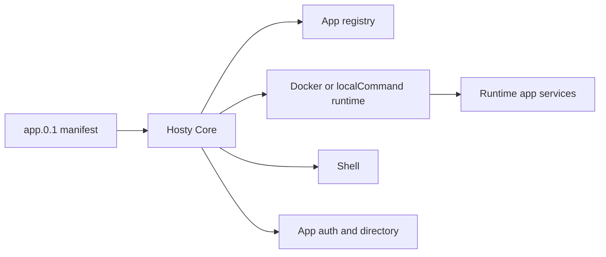

# Documentation

## Overview

Hosty is a local application orchestrator with a headless Core API, Core-managed Shell and Marketplace system apps, and user runtime apps. New local development and testing use runtime apps installed from `app.0.1` manifests.

The direction it is built toward — a tightly integrated pair of a hosting platform and an agent harness,
where installing an app is what extends the agent's tool environment — is recorded in
[Hosty platform vision](vision.md), the umbrella that individual
feature decisions are judged against.

```mermaid
flowchart LR
  A["app.0.1 manifest"] --> B["Hosty Core"]
  B --> C["App registry"]
  B --> D["Docker or localCommand runtime"]
  B --> E["Shell"]
  B --> F["App auth and directory"]
  D --> G["Runtime app services"]
```

## Documents

Every feature folder is listed below with its summary and, where it has a plan, the plan's status,
deliverable progress and last update. The list is generated from each document's frontmatter;
the format and the rules for writing documents are in the Documentation section of
[AGENTS.md](../AGENTS.md).

<!-- docs-index:begin -->

_Generated by `scripts/docs-index.mjs --fix` — do not edit this block by hand._

### Features

Plans: 10 In Progress · 1 Ready · 2 Blocked · 35 Draft · 6 On Hold.

- [Access Tokens — Credentials For Clients Without A Browser](features/access-tokens/feature.md) — Device-flow access tokens that let clients without a browser engine sign in to Core, plus the page that lists and revokes them.
- [Advertised App Origins — Advertise A Host-Published Endpoint At A Usable Address](features/advertised-app-origins/plan.md) — Advertise endpoints already published beyond loopback at one host-wide address that other devices can use. · Draft, 0/8, updated 2026-07-30
- [Synthetic Agent App Evaluations](features/agent-app-evaluations/plan.md) — Use agents as bounded exploratory app testers whose findings are reproduced and triaged independently. · Draft, 0/3, updated 2026-09-26
- [Agent Background Sessions](features/agent-background-sessions/feature.md) — Assistant sessions that keep working after the tab closes and notify the operator when they wait for a person.
- [Agent MCP Directory](features/agent-mcp-directory/feature.md) — Core-owned policy for which MCP targets Hosty assistants may reach, configured in Harness and administered in Shell.
- [AI Agent Bridge](features/ai-agent-bridge/feature.md) — The umbrella model for Hosty's AI integration, covering component boundaries, execution profiles, token mechanics and the decision log. · [plan](features/ai-agent-bridge/plan.md): In Progress, 8/12, updated 2026-10-05
- [Hosty Harness](features/ai-gateway/feature.md) — Hosty Harness, the optional administrator assistant app hosting operator chat sessions on a host-resident agent harness.
- [Hosty Harness Chat Components](features/ai-gateway-chat-ui/feature.md) — The chat components Harness uses for messages, code blocks, attachments, the composer and collapsible activity.
- [Hosty Harness Provider Connections](features/ai-gateway-providers/feature.md) — Named Claude and Codex agent connections that administrators manage in the Harness Providers settings.
- [App Activity Window](features/app-activity-window/feature.md) — App grants keep identity after their privileged activity window expires, and activity never adds a permission.
- [App Authoring In Hosty](features/app-authoring/plan.md) — Epic for prompt-driven app creation, live iteration, integration with installed apps and optional publication. · Draft, 0/8, updated 2026-10-05
- [Feature: App Cache Storage](features/app-cache-storage/feature.md) — A Core-managed per-app cache directory that persists across restarts and updates but is never backed up.
- [App Code Exchange](features/app-code-exchange/feature.md) — Authorization codes require target-app service identity and private S256 proof, with browser-origin and nonce-bound sign-in attempts. · [plan](features/app-code-exchange/plan.md): Blocked, 16/20, updated 2026-10-06
- [Feature: App Data Backup Retention](features/app-data-backup-retention/feature.md) — Retention and cleanup of app data backups, which cover only each app's primary data directory. · [plan](features/app-data-backup-retention/plan.md): Draft, 0/2, updated 2026-10-05
- [App Development Controls](features/app-development-controls/plan.md) — Typed inspect, enter, run and leave operations for app development, with runtime verification and authority checks. · Draft, 0/7, updated 2026-09-27
- [App Embedding Restrictions — Only Operator-Designated Embedders May Frame An App](features/app-embedding-restrictions/plan.md) — Restrict app framing to operator-designated embedders while preserving the assistant browser runner. · On Hold, 0/7, updated 2026-10-06
- [App Feedback Inbox](features/app-feedback-inbox/plan.md) — An inbox where users submit app observations and administrators send reviewed batches to assistant sessions. · Draft, 0/4, updated 2026-09-26
- [Runtime App Feeds](features/app-feeds/feature.md) — Apps publish named update sources in an app-owned feeds.json that Core validates and follows without a catalog or Marketplace.
- [App Installation SDK And Core Confirmation](features/app-installation-sdk/feature.md) — A shared install dialog for Marketplace and Shell, with final authorization on a separate Core-origin confirmation page. · [plan](features/app-installation-sdk/plan.md): In Progress, 0/5, updated 2026-09-18
- [App Lifecycle States — Intermediate `starting` And `stopping`](features/app-lifecycle-states/feature.md) — Intermediate starting and stopping runtime states, so every client sees a lifecycle action while it is in flight.
- [App-Owned MCP](features/app-mcp/feature.md) — Runtime apps expose domain actions through an MCP endpoint they own, and Core tells agent clients which apps have one.
- [App Permission Management](features/app-permission-management/feature.md) — The Permissions tab where administrators review an app's declared, accepted and effective Core permissions.
- [App Prototype Workspaces — Create, View, Change](features/app-prototype-workspaces/plan.md) — Durable no-Git app creation from a prompt, with bootstrap, development guide and assisted initial Git setup. · Draft, 0/18, updated 2026-09-29
- [App-Provided Skills](features/app-provided-skills/feature.md) — Apps ship an agent skill file that explains how their tools are meant to be used.
- [App Publication](features/app-publication/plan.md) — Repository provisioning, installable releases and feeds, and catalog promotion for apps built in Hosty. · Draft, 0/7, updated 2026-09-29
- [App Readiness — Readiness Is Health](features/app-readiness/feature.md) — Readiness is per-service health, probed by default and read by every consumer before it uses an endpoint.
- [App Sandbox Runtimes And Agent Testing](features/app-sandbox-runtimes/plan.md) — Isolated runtime instances for testing session worktrees with synthetic data and scoped browser automation. · On Hold, 0/9, updated 2026-10-01
- [App Secrets Store](features/app-secrets-store/feature.md) — A Core-managed keychain for secrets an app obtains at runtime, stored outside backups, with clients in both SDKs. · [plan](features/app-secrets-store/plan.md): Draft, 0/5, updated 2026-09-06
- [App UI Surfaces](features/app-ui-surfaces/feature.md) — Apps declare where their pages belong, such as settings, panels or navigation, and Shell places them. · [plan](features/app-ui-surfaces/plan.md): Draft, 0/4, updated 2026-09-27
- [Assistant Action Summary](features/assistant-action-summary/plan.md) — A readable summary of the tools and MCP calls an agent used during a session. · Draft, 0/3, updated 2026-09-26
- [AHP Client Interface For Hosty Sessions](features/assistant-ahp/plan.md) — Evaluate AHP as a replaceable external client interface over Hosty's existing session implementation. · Draft, 0/5, updated 2026-09-29
- [Assistant App Context](features/assistant-app-context/feature.md) — Administrators attach up to 16 installed apps to an assistant session as shared context for Claude and Codex.
- [Assistant MCP Approval Rules](features/assistant-approval-rules/feature.md) — A shared per-tool MCP policy for Claude and Codex with Ask, Run unprompted and Disabled controls. · [plan](features/assistant-approval-rules/plan.md): Draft, 0/16, updated 2026-10-05
- [Assistant Attachments](features/assistant-attachments/feature.md) — Files attached in the assistant composer land in the session's working directory and are recorded in the transcript.
- [Shared Assistant Development Sessions](features/assistant-development-sessions/plan.md) — Umbrella for assistant sessions that own a conversation, its source workspaces, tests and pull requests. · Draft, 0/3, updated 2026-09-29
- [Assistant Entry Points](features/assistant-entry-points/feature.md) — The assistant docks as a Shell panel reachable from every page, and apps can hand it context without driving it. · [plan](features/assistant-entry-points/plan.md): In Progress, 4/6, updated 2026-09-27
- [External Agent Session Context](features/assistant-external-session-context/plan.md) — Let an authenticated local external agent read a Hosty session, work in its registered folders and save a report back. · Draft, 0/3, updated 2026-10-07
- [Assistant Pull Request Lifecycle](features/assistant-pr-lifecycle/feature.md) — GitHub pull request publication, review, merge and completion for assistant session workspaces.
- [Azure DevOps Pull Request Lifecycle](features/assistant-pr-lifecycle-azure/plan.md) — Extend the assistant pull request lifecycle to Azure DevOps Services. · Draft, 0/4, updated 2026-09-29
- [Assistant Provider Permissions](features/assistant-provider-permissions/feature.md) — Apps request the assistant role with provides, and Core records administrator-confirmed roles.
- [Assistant Runtime Containment](features/assistant-runtime-containment/plan.md) — Run the assistant's agent harness in a container by default so approved commands reach only what it is given. · On Hold, 0/7, updated 2026-09-27
- [Assistant Session Autonomy](features/assistant-session-autonomy/feature.md) — A per-chat Normal or Autonomous mode that controls whether native commands and file changes ask for approval.
- [Assistant Session Workspaces](features/assistant-session-workspaces/feature.md) — Core-owned Git worktrees per assistant session, with managed Git operations, observation and cleanup.
- [Shared Assistant History And Provider Switching](features/assistant-shared-history/plan.md) — Durable session events and cross-provider context so one conversation can switch between Claude and Codex. · Draft, 0/6, updated 2026-09-26
- [Assistant Timeline And Tool Analysis](features/assistant-timeline-analysis/plan.md) — A session timeline for analysing how agents work and which MCP tools would help them. · Draft, 0/3, updated 2026-09-26
- [Audit Log — A Bounded, Append-Ordered Trail](features/audit-log/feature.md) — Core's bounded, append-ordered audit trail of security-relevant events, read backwards from the end.
- [Auth And Gateway Model](features/auth-gateway/feature.md) — Core owns user authentication, app assignments, identity issuance and scoped directory access, while apps own their sessions.
- [Auth Provider Extensions](features/auth-provider-extensions/plan.md) — External identity providers, password reset and durable login throttling beyond local password login. · Draft, 0/5, updated 2026-10-05
- [Auth Session Lifecycle And Recovery](features/auth-session-lifecycle/feature.md) — The identity error contract, opaque app session grants, sliding lifetimes and session recovery through Core login.
- [Feature: Automatic Runtime App Ports](features/automatic-runtime-app-ports/feature.md) — Core reserves host ports at install, injects them into the environment and lets operators reassign or pin them. · [plan](features/automatic-runtime-app-ports/plan.md): Draft, 0/10, updated 2026-09-09
- [Cardputer Operator Shell](features/cardputer-shell/plan.md) — Firmware that turns an M5Stack Cardputer ADV into a pocket Hosty operator console. · In Progress, 26/33, updated 2026-08-23
- [CLI Bootstrap](features/cli-bootstrap/feature.md) — The hosty CLI installs itself and Core, discovers the Core control API and manages runtime apps.
- [Feature: Cloudflare Ingress](features/cloudflare-ingress/feature.md) — An opt-in Cloudflare Tunnel provider that publishes app endpoints and derives their public origins.
- [Container Capabilities And Devices](features/container-capabilities/feature.md) — A docker service can add named Linux capabilities and device nodes under /dev, opt-in per service and never as --privileged.
- [Core API](features/core-api/feature.md) — Core's browser and control APIs and the serialization rules every endpoint must follow.
- [Core App Shell](features/core-app-shell/feature.md) — Shell is the Core-managed browser UI app that authenticates users and embeds app pages.
- [Core Development Mode](features/core-dev-target/feature.md) — Run Core from source in Debug, restart into isolated build generations and switch back to the installed release. · [plan](features/core-dev-target/plan.md): In Progress, 0/3, updated 2026-09-18
- [Core Event Bus — Ephemeral Domain Events Over A Unified SSE Stream](features/core-event-bus/feature.md) — An in-process event bus that tells session clients over one SSE stream that something changed.
- [Core Extension Model](features/core-extension-model/plan.md) — Exploratory model for delivering platform capabilities as swappable apps through named contribution points. · Draft, 0/6, updated 2026-10-06
- [Core Lifecycle Parallelism](features/core-lifecycle-parallelism/feature.md) — Core runs per-app lifecycle work concurrently and queries Docker in batches.
- [Core MCP](features/core-mcp/feature.md) — An embedded MCP endpoint on Core with typed tools for apps, their state and their logs. · [plan](features/core-mcp/plan.md): In Progress, 3/10, updated 2026-08-28
- [Core's Own Public Origin](features/core-public-origin/feature.md) — Core's public origin is a live setting, editable in Shell and publishable through the Cloudflare provider.
- [Core Read-Path Caching](features/core-read-path-caching/feature.md) — Core serves hot reads from in-memory caches guarded by on-disk file stamps.
- [Core Runtime Parameters — Two Launch Flags, Everything Else Lives Inside](features/core-runtime-parameters/feature.md) — Core launches with only a data root and a port, and everything else lives in the instance's settings store.
- [Core Service Unit — Surviving A Reboot](features/core-service-unit/plan.md) — Parked idea for an OS service unit that starts Core again after a host reboot. · On Hold, 0/1, updated 2026-09-01
- [Core Single Binary — One Executable For Server And Terminal](features/core-single-binary/plan.md) — Parked decision on whether the CLI and Core merge into one executable. · On Hold, 0/1, updated 2026-09-01
- [Core Source Inspection](features/core-source-inspection/feature.md) — The development-mode Core row shows branch and changed-file statistics through a read-only Core API.
- [Cross-App Auth — Identifying the Caller on App-to-App Control APIs](features/cross-app-auth/plan.md) — Providers learn which installed app is calling their control API by introspecting the caller's service token against Core. · Draft, 0/6, updated 2026-10-05
- [Cross-App Dependencies — Declared Providers, Injected URLs, And Reported State](features/cross-app-dependencies/feature.md) — Apps declare dependencies on other installed apps, Core injects their URLs and reports their state. · [plan](features/cross-app-dependencies/plan.md): Draft, 0/6, updated 2026-08-17
- [Cross-Port Session Capture — A Captured Core Cookie Must Not Carry Core Authority](features/cross-port-session-capture/plan.md) — Prevent captured Core browser cookies from authorizing requests replayed by an app on another port. · Draft, 0/10, updated 2026-10-06
- [Assistant MCP Delegation](features/delegated-token-exchange/feature.md) — Core grants individual assistants access to selected MCP targets through administrator-configured delegation.
- [Demo App](features/demo-app/feature.md) — The repository-local reference app used to validate lifecycle, identity, directory access and app roles.
- [Dependency-Ordered Autostart — Start Providers First, And Say So With `waiting`](features/dependency-ordered-autostart/plan.md) — Start providers before their consumers and report a held-back app as waiting rather than stopped. · Draft, 0/6, updated 2026-09-21
- [Documentation Workflow](features/documentation-workflow/feature.md) — Workflow documents carry YAML frontmatter and stable deliverable IDs, checked by one validator shared by every Hosty repository.
- [Feature: Domain Model](features/domain-model/feature.md) — The shared vocabulary for Core, Shell, the CLI and runtime apps.
- [Embedded App Chrome](features/embedded-app-chrome/feature.md) — Embedded apps drop the name and navigation their shell already renders, and keep them when opened standalone.
- [Embedded App Sign-In](features/embedded-app-sign-in/feature.md) — Embedded apps keep their own per-tab sign-in grant and sign in silently through Core without Shell handling their codes.
- [External Development Workspaces](features/external-development-workspaces/plan.md) — Let local external assistants prepare Core-owned worktrees through authorized MCP and expose their changes in Plans. · Ready, 0/6, updated 2026-10-07
- [External Host-Path Mounts](features/external-mounts/feature.md) — Apps declare external mount slots and operators bind host folders to them, injected as HOSTY_MOUNT_{KEY} and never backed up or deleted.
- [Global (Shared) Host-Path Mounts](features/global-mounts/feature.md) — A host-level library of shared host folders that apps attach by reference.
- [Host Networking](features/host-networking/feature.md) — A docker service can run with network host to share the host network namespace, for peer-to-peer workloads the bridge NAT throttles.
- [Hosty App SDK](features/hosty-app-sdk/feature.md) — The shared app-side Host integration published as an npm package and a NuGet package. · [plan](features/hosty-app-sdk/plan.md): In Progress, 1/7, updated 2026-09-18
- [Hosty App Skill](features/hosty-app-skill/feature.md) — The repository ships hosty-app-skill, an agent skill for creating, wrapping, updating and validating Hosty runtime apps.
- [Hosty Harness Integration](features/hosty-harness-rename/feature.md) — Hosty Harness replaces the former AI Gateway as the administrator assistant and MCP facade app.
- [Hosty Harness Swift Client](features/hosty-harness-swift/plan.md) — A native Swift client for Hosty Harness sessions, approvals and changes, aimed at phone use. · Draft, 0/8, updated 2026-09-29
- [Hosty MCP Connector](features/hosty-mcp-connector/feature.md) — hosty mcp, a stdio MCP server in the CLI that presents every app on one host as a single server.
- [Internal Endpoint Exposure — Keep Machine-Only Routes Off The Published Origin](features/internal-endpoint-exposure/plan.md) — Keep machine-only internal routes off the published ingress origin. · Draft, 0/4, updated 2026-09-06
- [Local Browser Origins](features/local-browser-origins/feature.md) — Core derives local browser addresses under hosty.localhost without stored public origins or DNS. · [plan](features/local-browser-origins/plan.md): In Progress, 30/39, updated 2026-10-07
- [Local Development And Testing](features/local-development/feature.md) — The Core-managed local development and test loops for Core, Shell and runtime apps.
- [Local Password Login](features/local-password-login/feature.md) — Core-owned email and password setup, recovery, invitations and login.
- [Manifest-Level App Assets](features/manifest-level-app-assets/feature.md) — An app's icon, screenshots and markdown description live in its own repository and Core serves them for installed apps. · [plan](features/manifest-level-app-assets/plan.md): Draft, 0/3, updated 2026-10-05
- [Manifest Projection Backfill](features/manifest-projection-backfill/feature.md) — A Core upgrade re-projects installed app records from their manifests without operator action.
- [MCP Facade — One Remote Endpoint For The Whole Fleet](features/mcp-facade/feature.md) — A Harness MCP endpoint that exposes Core and every enabled app's tools through one remote entry. · [plan](features/mcp-facade/plan.md): On Hold, 0/5, updated 2026-09-26
- [MCP OAuth — Automated Issuance For Scoped Tokens](features/mcp-oauth/feature.md) — Core acts as an OAuth 2.1 authorization server so MCP clients obtain and rotate scoped tokens themselves.
- [Mixed Development Runtimes](features/mixed-development-runtimes/feature.md) — Development profiles can combine Docker and local-command services and run editable source inside Docker. · [plan](features/mixed-development-runtimes/plan.md): In Progress, 10/13, updated 2026-09-17
- [Notifications](features/notifications/feature.md) — A Core-owned per-user notification inbox with app and Core producers and live delivery to any client. · [plan](features/notifications/plan.md): Draft, 0/5, updated 2026-08-31
- [OAuth Core Control Scopes](features/oauth-core-control-scopes/feature.md) — OAuth consent can grant Core MCP lifecycle and update scopes in addition to read.
- [Feature: Observability (telemetry collection, storage, and UI)](features/observability/feature.md) — OpenTelemetry from apps flows to a collector, an SQLite-backed telemetry backend and the telemetry UI app. · [plan](features/observability/plan.md): In Progress, 7/11, updated 2026-09-25
- [Plan Tracking](features/plan-tracking/feature.md) — Administrator plan overview across installed source repositories and unreleased development workspaces, backed by bounded Core document reads.
- [Private App Sources](features/private-app-sources/feature.md) — Core reads private repository manifests and sources through explicitly selected personal provider connections.
- [Private Distribution Access](features/private-distribution-access/plan.md) — Authenticate private feeds, release assets and container registries independently of source access. · Draft, 0/4, updated 2026-09-28
- [Provider Consumption And Speech Recognition](features/provider-consumption/feature.md) — Apps discover and call confirmed speech-to-text and assistant providers with short-lived Core credentials. · [plan](features/provider-consumption/plan.md): Blocked, 0/3, updated 2026-09-29
- [Feature: Public Origins](features/public-origins/feature.md) — An endpoint's public origin is a durable property of the endpoint that exists before the app first starts.
- [Raw L4 Port Publishing](features/raw-ports/feature.md) — A docker service port can opt into publishing on all interfaces over TCP and UDP with expose and transport.
- [Removable System Apps — Distribution Catalog and One Lifecycle](features/removable-system-apps/feature.md) — First-party apps are ordinary runtime apps, seeded once from a distribution catalog and removable like any other.
- [Replaceable UI Clients — The `ui-client` Role And Primary Selection](features/replaceable-ui-clients/plan.md) — Treat shells as ordinary apps that provide a ui-client role, with Core resolving the primary UI by role instead of by app id. · Draft, 0/5, updated 2026-10-05
- [Repository And Release Model](features/repository-release-model/feature.md) — The repository layout, release artifacts and versioning rules for every component.
- [Runtime App Manifest](features/runtime-app-manifest/feature.md) — The app.0.1 manifest contract for installing and running runtime apps.
- [Marketplace System App](features/runtime-app-marketplace/feature.md) — The optional Marketplace app that owns catalog discovery and requests Core-confirmed installations. · [plan](features/runtime-app-marketplace/plan.md): Draft, 0/6, updated 2026-09-26
- [Runtime App Update](features/runtime-app-update/feature.md) — Reviewed update plans and their apply behavior, including permission changes and routine updates. · [plan](features/runtime-app-update/plan.md): Draft, 0/5, updated 2026-10-05
- [Runtime Artifact Model](features/runtime-artifact-model/feature.md) — Runtime profiles pair a command recipe with an execution type and deliver immutable prebuilt folders. · [plan](features/runtime-artifact-model/plan.md): Draft, 0/6, updated 2026-09-26
- [Unified runtime resource usage](features/runtime-resource-usage/feature.md) — One Core resource sampler for containers, local process trees and Core itself, shared by Dashboard and Telemetry.
- [Runtime Source Workflows](features/runtime-source-workflows/feature.md) — Source checkouts, local overrides and runtime switching for installed apps, with Git inspection.
- [Scoped Access Tokens — Audience-Bound Credentials For External Clients](features/scoped-access-tokens/feature.md) — Access tokens can be bound to one audience and a set of scopes, validated against live state on every call.
- [Shell Access And System Apps](features/shell-access-and-system-apps/feature.md) — Assignments apply equally to system and ordinary apps, and management views are administrator-only.
- [Shell Navigation](features/shell-navigation/feature.md) — Shell's three destinations, Dashboard, Settings and Apps, with the route table and the sidebar.
- [Shell operation feedback](features/shell-operation-feedback/feature.md) — Shell separates confirmations, transient operation results and persistent diagnostics.
- [Resizable Shell Panel](features/shell-panel-resize/feature.md) — Shell's right panel is resizable by pointer and keyboard and remembers its width.
- [Source Providers](features/source-providers/feature.md) — Core owns a typed source-provider registry with built-in GitHub, owner-scoped connections and Shell account management.
- [Swift Shell](features/swift-shell/feature.md) — A native SwiftUI client for iOS, iPadOS and macOS that manages a host's installed apps.
- [System App Pages](features/system-app-pages/plan.md) — Reconcile the original administrator-only system-page proposal with current navigation, access and availability behavior. · Draft, 0/5, updated 2026-10-06
- [Telemetry Over MCP](features/telemetry-mcp/feature.md) — Stored logs, traces and resource metrics exposed as an MCP interface behind a scoped credential.
- [User Management](features/user-management/feature.md) — Administrators invite, disable, delete and assign app access to Host users from the Shell User Management view.
- [User Profile And Provider Connections](features/user-profile-connections/feature.md) — Shell manages personal GitHub accounts and Git identity through Core-owned connections and narrow app permissions.

<!-- docs-index:end -->
